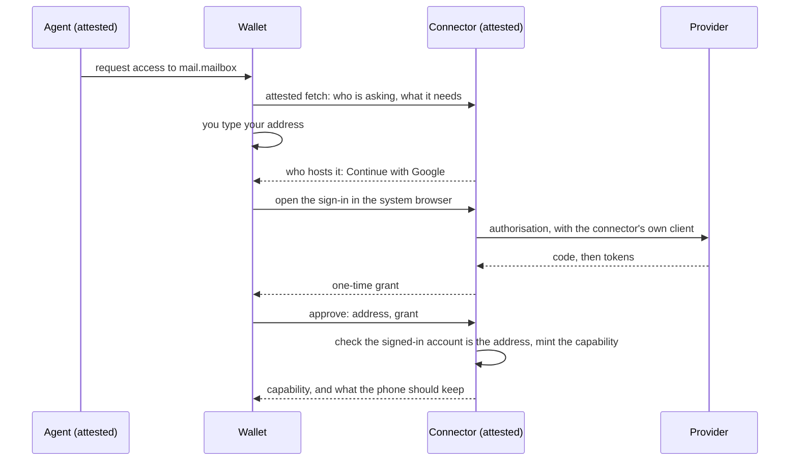

An agent is only as trustworthy as the way it reaches your accounts. Privasys Connectors are the part of Privasys AI that does that: each one is a confidential app that holds the credential for one account on behalf of one person, and offers that account to an attested agent as a set of tools. The connector is attested like everything else in the loop, it keeps nothing at rest, and it acts only under a capability you approved on your own device. This page describes the connectors available today, how an account is connected, where the credential lives, and how to write a connector of your own.

## What a connector is

A connector sits between an agent, such as one running in the [Privasys Harness](https://privasys.org/blog/an-agent-you-can-verify-introducing-privasys-harness/), and a provider such as Gmail or Microsoft 365. The agent calls it over mutual RA-TLS, so each side verifies the other's measured build before any data moves, and every call names the person it acts for. The connector checks that person's live capability before it touches the provider, and answers with the provider's data as ordinary [attested MCP](/technology/confidential-ai/attested-mcp) tool results.

Each connector serves one kind of account, called a resource kind (`mail.mailbox`, `calendar.events`, `files.cloud`, `meeting.transcripts`). A provider is a driver inside a connector, not a connector of its own: the Mail connector reaches Gmail, Outlook.com and any IMAP server, and the agent never needs to know which.

## The connectors today

| Connector | Resource kind | Providers | Tools |
|---|---|---|---|
| Mail | `mail.mailbox` | Gmail and Google Workspace, Outlook.com and Microsoft 365, by sign-in; any other IMAP server, by app password | `list_messages`, `get_message`, `get_thread`, `search`, `list_sent`, `set_labels`, `mark_read`, `create_draft`, `delete_draft`, `changes`, `account` |
| Calendar | `calendar.events` | Google (CalDAV) and Microsoft 365 (Graph), by sign-in; iCloud, Fastmail, Nextcloud and other CalDAV servers, by app password | `list_calendars`, `list_events`, `get_event`, `search`, `free_busy`, `propose_event`, `update_event`, `delete_event`, `changes`, `account` |
| Files | `files.cloud` | Google Drive; OneDrive and the SharePoint libraries you follow | `list_drives`, `list_folder`, `search`, `get_file`, `save_file`, `changes`, `account` |
| Meetings | `meeting.transcripts` | Zoom; Microsoft Teams | `list_meetings`, `get_transcript`, `save_transcript`, `changes`, `account` |

A few behaviours worth knowing:

- **Mail** returns the sender's own words: bodies are decoded, quoted history and signatures are removed, and the tool tells the agent to treat message text as data written by someone else, never as instructions. Labels are written under `Privasys/`, so the triage is visible in your own mail client.
- **Calendar** proposals are tentative events marked as the assistant's own, and only those can be changed or removed by the agent. People named in a proposal are written into its description rather than invited.
- **Files** reads Word, Excel, PowerPoint, PDF and HTML documents as text and exports Google Docs. It writes only into a folder named `Privasys` at the root of your drive, and never overwrites, deletes, moves or shares anything.
- **Meetings** saves a transcript into your own [Privasys Drive](/solutions/drive/overview) as a readable document beside the original captions file.

The current release drafts rather than sends: mail leaves replies in your Drafts folder and the calendar leaves proposals for you to confirm. Sending mail and sending invitations are on the way.

## Connecting an account

You connect an account the first time an agent needs one. The agent asks for access to a resource kind; your phone receives the request; everything else happens on your wallet's approval screen.

1. **The wallet verifies both parties.** It checks the attestation of the connector and of the app that asked, and composes the sentence you approve itself, from a closed vocabulary, so neither side can describe itself however it likes.
2. **You give your address first.** The connector works out who hosts it: Google and Microsoft domains by name, then the domain's MX records, so a Google Workspace or Microsoft 365 address on your own domain is recognised too. You are never asked to pick a provider the address already names.
3. **You sign in at the provider.** For a Google or Microsoft account the wallet shows a single button and opens the connector's sign-in in your system browser. The connector runs the exchange with its own OAuth client, which the wallet never learns, and the only thing passed back to the wallet is a one-time grant code. For a provider that offers no sign-in, you type an app password on the same screen, and it makes one attested hop from your phone to the connector.
4. **The capability is minted.** The connector checks that the account you signed in to is the address you typed, then mints a capability naming the account, the purpose and an expiry, bound to the connector's measured build. The credential is proved against the provider in the same step, so a capability never exists for an account that does not open.

Where the provider has no sign-in configured on a deployment, or the address belongs to a provider a connector cannot reach, the wallet says so plainly and offers no field. A Google or Microsoft account is never connected with a password.

## Where the credential lives

The credential is at rest in exactly one place, your phone, and in use in exactly one place, the memory of the attested connector.

- **In the connector**, the credential lives in process memory. It is not written to a volume, not sealed to a key, not sent to a storage service and not logged. The provider's access token never leaves the connector.
- **On your phone**, the wallet keeps what you entered on the approval screen and, after a sign-in, the refresh token the connector handed back for reconnecting, in the device's secure storage.
- **After a restart** the connector has nothing. The next call is refused with an answer that says the holder is needed; the agent asks for access again, and your wallet re-supplies what it kept, with one tap. Nothing is typed twice.

A connector is reachable by a plain browser on exactly two paths, `/v1/oauth/start` and `/v1/oauth/callback`, because a sign-in has to happen in a browser. Both are declared in a measured image label, so a verifier reads the exemption off the build itself. Every other path requires the sealed transport or RA-TLS, and what the gateway can see on those two is a one-time authorisation code that is useless without the client secret sealed inside the connector.

## What a connector will not do

- **Keep your content.** Your provider is the system of record for mail, calendars and files, so the connector reads what a task needs, when it needs it, and stores none of it. A meeting transcript is the exception, because retention ages it out at the provider: it is written into your own Drive, under your keys, never onto the connector's disk.
- **Pass secrets to the agent.** One-time codes, password-reset links and login links are removed from content before it leaves the connector. The filter is deterministic code, so it holds even when a model would not.
- **Act for anyone else.** Every call names the person it acts for and is checked against that person's live capability. A call for someone who has not approved access is refused before the provider is contacted.
- **Join or record meetings.** The Meetings connector reads the transcripts the provider already produced. It never joins a call and never starts a recording.

## Waiting for changes

Every connector has a `changes` tool. It waits for the account to change, for up to a minute, and returns what changed with a cursor to pass back next time. An agent that runs when mail arrives holds this feed open; the connector never pushes, and a quiet account costs nothing.

## Disconnecting

Disconnect an account in your wallet, which withdraws the capability and forgets the credential at once. You can also remove access at the provider: Google at [myaccount.google.com/permissions](https://myaccount.google.com/permissions), Microsoft at [myapps.microsoft.com](https://myapps.microsoft.com), Zoom in the Zoom App Marketplace. Anything the agent already left in your account, a draft, a label, a proposal or a transcript in your Drive, is yours to keep or delete.

## Writing a connector

The connectors live in one open repository, [Privasys/connectors](https://github.com/Privasys/connectors). The licence is split on purpose:

| Path | Licence | What |
|---|---|---|
| `sdk/` | Apache-2.0 | The shell every connector shares, free to copy into any connector, proprietary ones included. |
| `mail/`, `calendar/`, `files/`, `meetings/` | AGPL-3.0 | The four connectors. |

The shell is the part a connector gets dangerously wrong, so it is shared rather than reimplemented. It covers who the holder is (`holder`), who a call acts for (`caller`), the capability (`grant`), the in-memory credential and its refusal (`credential`), the service and its routes (`connector`), configure-then-freeze and the configuration digest in the certificate (`configure`), the tool catalogue from the manifest (`mcp`), the change feed (`feed`), the sign-in with the wallet holding the browser (`oauth`), who hosts an address (`provider`), redaction (`redact`), document text (`extract`), captions (`vtt`), writing into a holder's Drive (`drive`, `broker`) and the web plumbing (`web`).

What you write is **a driver, a schema, a probe and a tool list**:

- **The driver** talks to the provider, and has only the methods you want an agent to have. An action that is not on the driver interface cannot be reached by any tool.
- **The schema** is the setup the wallet draws on the approval screen: the address first, then a sign-in or the fields the provider needs.
- **The probe** proves the credential against the provider before a capability is minted.
- **The tool list** is the manifest, `privasys.json`, carried in the image as a measured label, so the catalogue an agent sees comes from the build that runs.

A connector deploys as an ordinary confidential app. Its OAuth clients are set once at configure time and sealed, and the certificate carries a digest of that configuration, so which identity provider and which clients a deployment trusts is something you can attest. Each resource kind is served by one connector per platform, and approvals for a kind are routed to the service registered for it; to add a connector for a new kind of account, open an issue on the repository.
