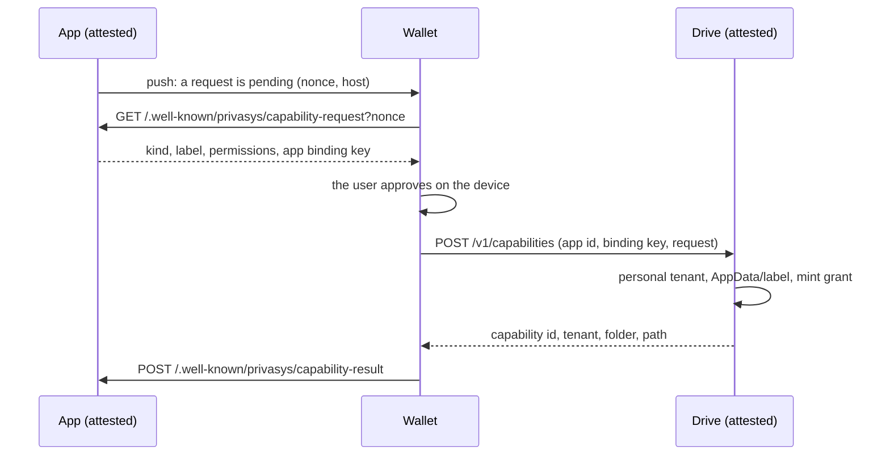

A confidential app that needs to keep something for a user already has a durable, confidential place for it: its own encrypted volume, sealed to the enclave and preserved across upgrades and redeploys. What that place lacks is the user, who cannot see what was kept, reach it from elsewhere, or take it away. Privasys Drive gives an app a folder in the user's own Drive instead. The app asks for a folder by name, the user approves on their wallet, and the app receives a grant to that folder and nothing else. This page describes the consent flow, the grant, and what the user sees.

## The consent flow

Consent is a three-party exchange between the app, the user's wallet and Drive. The wallet talks to the app over an attested channel, so what the user approves is learned from the app itself, never from a push notification or a link.

The ask names a label, permissions, and the app's **binding key**, an Ed25519 public key whose private half the app (or, for apps on the Privasys runtime, the runtime on the app's behalf) keeps sealed. The wallet shows the label and the permissions in the user's language and composes the wording itself, so an app cannot describe itself however it likes. On approval the wallet calls Drive; on refusal it tells the app, and the app stops asking until the user reopens the question.

Apps running on the Privasys runtime do not implement any of this. They declare a resource in their manifest and ask the runtime's loopback API for the folder; the runtime holds the binding key, pushes the wallet, serves the wallet's fetch on the app's own hostname and remembers the outcome. The [Drive for apps](https://github.com/Privasys/drive/blob/main/docs/apps.md) guide has the endpoints.

## What Drive does on approval

Drive resolves the **user's personal tenant** from the wallet's authenticated call and never from the request, so an app cannot name a boundary it does not own. It places the folder under `AppData/<label>/`. The label is the one the user approved; if another app already holds a folder of that name, the new one is suffixed with part of the app's id, and a folder the user made themselves is never handed to an app. Re-approval by the same app reuses its folder.

Drive then mints the **AppGrant**: a compact signed token naming the tenant, the folder, the scope and the app's binding public key, with the app's platform id as its subject. The answer to the wallet carries the grant and the folder's coordinates, including the path Drive chose, which the app reads back rather than assumes.

## What the grant is bound to

Two things, and both are checked on every call.

- **The key.** A grant is only usable by whoever holds the binding key it names. A leaked token is inert.
- **The attested caller.** When an app calls Drive over an attested channel, the runtime in front of Drive verifies the caller's evidence and republishes its verified app id. Drive requires that id to equal the grant's subject. A token presented from anywhere else, even with the key, is refused.

The grant carries a scope (`read`, `write`) and an optional expiry. Everything the app does with it is confined to the granted folder's subtree.

## Working with the folder

The granted folder is reachable through Drive's [filesystem API](/solutions/drive/filesystem-api): addressing by path, revisions with conditional writes, appends, byte ranges, a change feed, and search that runs inside the enclave. A new instance of an app, on a fresh volume or a second host, calls `GET /v1/grants/mine` with its grant and finds its folders again without asking the user.

For a working tree (a repository, a build, a data directory) the app keeps the files on its own volume and saves **workspace snapshots** to the folder: a manifest beside content-addressed blobs, stored as one item. The format is on the same page.

## What the user sees

The user's mental model is a drive, and the app is a folder in it.

- **An ordinary folder.** `AppData/<app>/` is browsable, shareable and deletable like any other. Deleting it is the user's way of wiping the app's data; the app's next request goes through consent again.
- **One storage gauge.** Everything an app stores counts against the user's single quota (1 GiB today). The gauge breaks usage down by folder and by app.
- **Apps with access.** A settings view lists every app holding a grant: its name, its folder, its permissions, its expiry, and Revoke. Revoking keeps the files with the user; the app's next call fails and it has to ask again.
- **Workspace snapshots as one item.** A snapshot renders with its size and when it was saved, opens read-only from its manifest, exports as a ZIP, and deletes in one gesture.

## Limits

- Grants live in the user's personal tenant. An enterprise app wanting a folder in an enterprise tenant needs an owner-approved resource, which is not yet available.
- The wallet learns of a pending request through a push notification or the app's own interface. A lost push delays consent; it never weakens it.
- Consent is per user and per app. There is no "grant to all my apps" and no transitive grant from one app to another.
