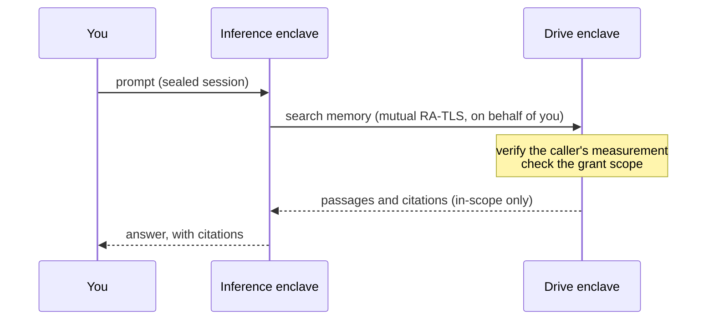

Once files are sealed to an enclave only you can unlock (see the [Overview](/solutions/drive/overview)), the Drive can serve as an AI's memory without giving that property up. In Privasys Chat the Drive holds the conversation and everything the assistant remembers, and the assistant reaches it as an attested tool under a scope you set. This page describes that integration: how files are exposed, the memory tree, the data views, and how the same drive gives you a personal or a project-scoped brain.

## Everything is a file

A chat is a folder. Its transcript, its attachments, and the digest it distils into when you finish are ordinary Drive files, separated only by folder and by whether they are indexed. Durable memories, the notes the assistant keeps about you or a project, live in a top-level `Memory/` folder you can open, edit, and delete like anything else.

Holding memory as files rather than as rows in an assistant database keeps it portable, inspectable, and deletable by you, and puts the storage layer's guarantees (sealing, sovereign keys, attestation, identity-free sharing) under the assistant's recollection exactly as they sit under a document.

## Files as an attested tool

The Drive exposes a small, read-only tool surface: semantic search, read a section, read a file, walk the folder tree, and fetch memory. Retrieval runs inside the enclave against an index that lives on the same sealed volume as the files, so embeddings never leave. The confidential-AI enclave that answers your prompts calls these tools on your behalf.

The call runs over a mutually attested channel. The Drive verifies that the caller is a genuine, measured inference enclave presenting the workload identity it expects, and refuses anything it cannot measure, so a copied bearer token cannot impersonate the caller. What the assistant may see is bounded by a grant you set: `Memory/` is in scope by default, and past conversations, specific folders, or the whole Drive are opt-in and off by default. A folder left out of scope cannot be searched and does not appear.

The only reader of the assistant's memory is an attested program, acting under a grant you control, over a channel that refuses to talk to anything it cannot verify.

## The memory tree, and context quality

A vector index answers "what is most like this query?" and never "what is there?". That is fine for searching documents and wrong for a memory: an assistant deciding what it knows must not miss an entry because the wording did not match. Memory needs enumeration.

So `Memory/` is served as a tree. The assistant receives either the whole thing inline, when it fits a token budget, or a tree of titles and one-line descriptions with lazy drill-down into the entries that prove relevant. It sees a complete index of what it knows before it decides what to read in full. Nothing hides behind a similarity threshold.

Documents you ask about are where search earns its place, and there the effort is context quality. Each file is given a deterministic section tree with stable anchors, rebuilt identically on each reindex. Text is chunked along those sections into 1,600-character windows with 200 of overlap, embedded with Qwen3-Embedding at 1,024 dimensions, and each chunk records its absolute character range. A retrieved passage therefore resolves to a real span in a real file, so citations point at sources rather than at a paraphrase. This pairs with [reproducible, verifiable inference](https://privasys.org/blog/reproducible-inference-and-the-accountability-gap): a checkable answer needs checkable sources.

## Data views

The Drive offers several views onto the same sealed bytes, each generated inside the enclave under the same grants and the same attestation, never a second copy:

- **Folder tree.** Files and directories you browse and share.
- **Memory tree.** The enumerable index the assistant reasons from.
- **Knowledge graph.** Typed links (citations, wiki-style references, containment) extracted as documents are indexed and memories written, so the drive is a connected structure to traverse.
- **Conversations and digests.** Each chat is a folder that finalises into a cited digest, leaving a durable searchable note.

## A brain, personal or per project

Because scope is set by a grant the assistant strictly obeys, one drive yields two shapes of brain.

- **Personal brain.** Scope the assistant to your whole Drive and `Memory/`: it carries your history and standing preferences across every conversation.
- **Project brain.** Scope it to a single folder: an agent sees exactly that project and nothing of your private life. Share the folder and the brain is shared, still sealed to the enclave and still governed by grants.

Switching between them is a scope change, not a migration, because there is one sealed store underneath. For agentic workflows this delivers both quality (enumeration where recall must be guaranteed, anchored and cited retrieval where precision matters) and speed (retrieval next to the data, batched embedding, and a search index scoped to the work in front of the agent).

## Limits

- The passages retrieval returns are read by the inference enclave so it can reason over them, so the trust boundary spans two attested enclaves, not one.
- The enumeration guarantee applies to the memory tree. Search over the wider document corpus is ranked retrieval and can miss a passage that embeds poorly.
- In-enclave retrieval and mutual attestation add overhead a plaintext stack does not carry; scoping keeps it in check.
- The AI integration has not yet had an independent external audit.
