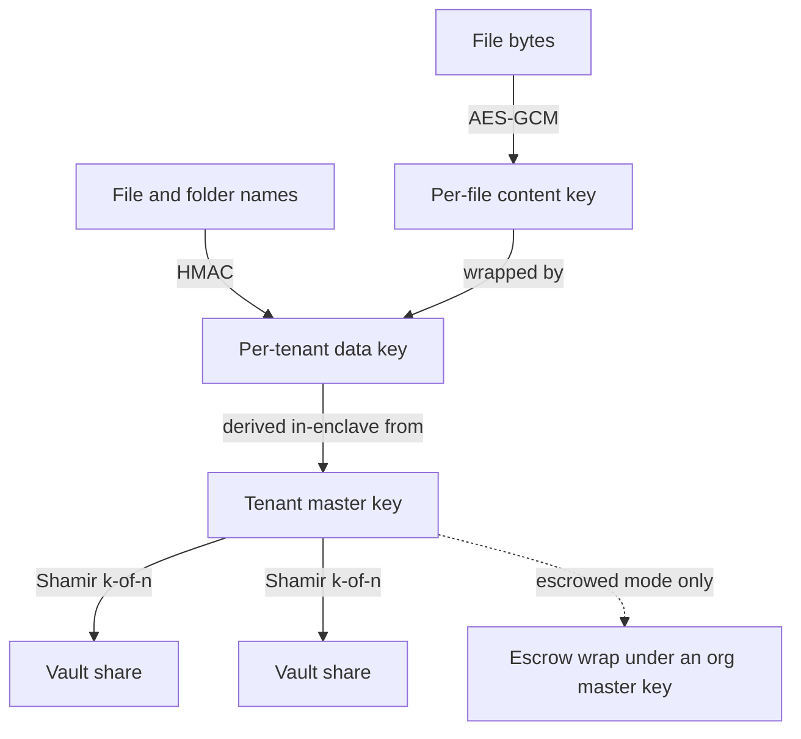

Privasys Drive is a per-tenant, end-to-end encrypted file store that runs inside an attested confidential enclave. Files are sealed from the browser into the enclave, the operator holds no key, and the owner can verify that property by remote attestation rather than take it on trust. This page covers the storage layer: the enclave, the key hierarchy, and the two operating modes. The [Memory for Chat](/solutions/drive/memory-for-chat) page covers what the store becomes once an AI is allowed to use it.

## What "self-sovereign" means here

A store is self-sovereign when the owner is the only party who can cause their data to be decrypted, **and** the owner can verify that property. Both halves are required: exclusive control without verification is only a stronger promise, and verification without exclusive control is an audited back door. Meeting both needs a place to run code where the operator cannot read memory, and a way to check which code runs there.

## The enclave and the sealed channel

Privasys Drive runs in a confidential virtual machine on Intel TDX. The CPU keeps the VM's memory encrypted and isolated from the hypervisor and host, and the platform produces a measurement (a hash chain over firmware, kernel, enclave image, and declared configuration) that any client can verify by remote attestation. The browser opens a session bound to that attestation, so the code holding your bytes is the code you checked; see [Binding attestation to the TLS session](https://privasys.org/blog/binding-attestation-to-the-tls-session). The gateway in front of the enclave only ever forwards ciphertext.

## Key hierarchy

Confidentiality against the operator reduces to who can reconstruct which key. The Drive uses three layers.

- **Per-file content keys.** Each file is encrypted with its own AES-GCM key. Drop the key and the ciphertext is inert.
- **A per-tenant data key.** Content keys are wrapped under a data key derived, inside the enclave, for the tenant. File and folder names are sealed through a name HMAC from the same root, so the index is searchable inside the enclave without leaking names to storage.
- **A tenant master key (MEK).** The data key descends from a master key generated inside the enclave and never written out whole. It is Shamir-split across a constellation of [Enclave Vaults](/solutions/enclave-vaults/overview) and can only be recombined by a principal the vaults recognise.

Which principal the vaults hand shares back to is decided by the operating mode.

## Sovereign and escrowed mode

The mode is set at first configuration, is part of the measured configuration, and is immutable for the life of the instance. A tenant can attest an instance and read back which mode governs their keys.

**Sovereign mode** is the consumer default. The master key's shares are bound so that only the attested Drive enclave, acting for the owner under a wallet-issued grant, can recombine them. There is no operator key and no operator unlock path. The operator cannot produce a tenant's plaintext, and attestation lets the tenant confirm this in advance.

**Escrowed mode** is an enterprise opt-in. Each tenant master key additionally carries an escrow wrap under an organisation master key. Recovery is governed, not a switch: a policy-permitted requester files a request, a quorum of distinct approvers approve it with operation-bound WebAuthn ceremonies (an approval captured for one recovery cannot be replayed for another), and only at quorum does the enclave unwrap the escrowed key and mint a time-bounded grant. Every step is recorded and the audit is disclosed to the affected tenant.

| | Sovereign | Escrowed |
| --- | --- | --- |
| Who can decrypt | The attested enclave, acting for the owner | The owner, plus a governed org recovery path |
| Operator unlock path | None | Quorum-approved, operation-bound, audited |
| Default for | Individuals | Organisations |
| Verifiable | Yes, from the measured config | Yes, from the measured config |

## Sharing without identity

A share link carries a random secret in its URL fragment; the service stores only the secret's hash, so the link never reaches a server log. An **open** link grants read access to anyone who opens it and proves a wallet identity, and that proof is minimal: no name and no email, because a recipient is not opening an account. A **restricted** link can require attributes or the owner's per-recipient approval, and only then are attributes requested, and only the ones the link demands. Proving an attribute without disclosing the underlying document is described in [Prove it without giving it away](https://privasys.org/blog/prove-it-without-giving-it-away).

## Where the ciphertext lives

The default backend is the enclave's own sealed volume. An owner can point the Drive at an object backend of their choice; chunk bodies are encrypted inside the enclave before they are written, so the backend sees opaque blobs. Durability can live on infrastructure you already trust without extending that trust to readability.

## Limits

- Attestation proves which code holds your keys; it does not remove the need to trust that code to behave. The mitigation is that the code is measured and, for the platform, open.
- Escrowed mode is, by design, a governed recovery path an organisation can use under policy. Sovereign mode is the default for exactly that reason.
- The service holds no names, but the existence of a file, its size, and access timing are properties of any online system.
- Sealed transport and in-enclave cryptography carry overhead that plaintext storage does not.
- The Drive has not yet had an independent external audit.

## Next

The [Memory for Chat](/solutions/drive/memory-for-chat) page describes how this sealed store is exposed to an AI as an attested tool, and how it becomes a self-sovereign memory for personal and project-scoped agentic work.
