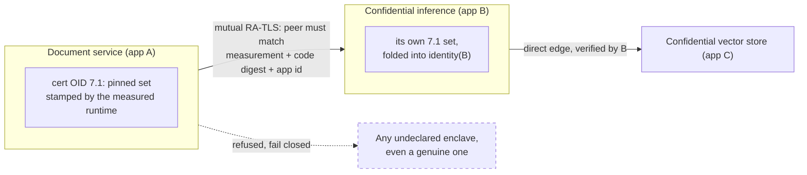

Confidential apps increasingly depend on other confidential apps. A private document service might call a confidential inference enclave; that enclave might call a confidential vector store. When a user consents to the first app, they are implicitly trusting the specific versions of everything it pulls in.

**Attested dependencies** make that trust explicit and enforceable. An app is pinned to a fixed set of dependency identities, carried in its RA-TLS certificate at OID [`1.3.6.1.4.1.65230.7.1`](/solutions/enclave-os/attestation/oids#arc-7-trust-relationships), and the runtime refuses to talk to any dependency that does not match.

## What this gives you

- **Attribution**: the user sees *which* dependency changed, not just "the app changed".
- **Reuse**: approving a dependency once counts for every app that pulls it in.
- **Decoupling**: a dependency can update on its own cadence.

## The dependency set is owned by the runtime

Unlike app-defined extensions (the `5.4.<n>` sub-arc), the `7.1` extension is stamped by the measured runtime; an app **cannot** write it. The advertised set and the enforced set are therefore the same object: an app cannot claim a dependency it is not constrained to use, nor use one it did not advertise. A verifier can trust `7.1` for the same reason it trusts the rest of the certificate: the extensions are stamped by the measured runtime whose quote the [evidence exchange](/solutions/enclave-os/attestation/ra-tls#the-evidence-exchange) returns.

The app owner (or the platform, for auto-update) changes the set through the control plane, which updates the enforced set and re-mints the certificate together. The leaf key is kept across such a re-mint, so a cached deterministic quote for the key stays valid.

## A dependency identity is just an app identity

Each entry pins one dependency by the same tuple used to verify any app:

- the TEE measurement, MRENCLAVE (SGX) or MRTD + RTMRs (TDX), read from the quote the peer serves through the evidence exchange;
- required OID values, read from the peer's leaf certificate, typically the code digest ([`4.2`](/solutions/enclave-os/attestation/oids#arc-4-workload-identity)) and the app id ([`4.1`](/solutions/enclave-os/attestation/oids#arc-4-workload-identity)).

Verification reuses the ordinary app-identity matcher; there is no second verifier.

## Direct edges only, sound at depth

An app declares only its **direct** dependencies. It does not enumerate the whole tree. Soundness at depth comes from an identity fold: each entry commits to its dependency's *own* dependency set.

```
identity(X) = SHA-256(
    "privasys-app-identity-v1"
    || measurements(X)
    || required_oids(X)
    || encode( dependencies(X) )
)
```

Because `dependencies(X)` lists each direct dependency by an identity that already folds in its own `7.1`, `identity(X)` transitively commits to the entire subtree, while every hop still verifies only its direct edge. If something changes deep in the tree, the identity a dependent is pinned to changes, so the dependent fails closed and re-approval is forced. No chain-walking, no trusted-measurement allow-list.



A change in C changes `identity(B)`, which changes the entry A is pinned to: A fails closed until its owner re-approves, even though A never verifies C directly.

## Encoding

The `7.1` value is a deterministic, length-prefixed encoding (big-endian `u32` lengths; entries sorted by app id, measurements and required OIDs sorted). The same logical set always encodes to the same bytes, and the encoding is byte-identical across the [verification libraries](/solutions/platform/verification-libraries), the enclave runtime, and the wallet.

## Enforcement

**Container apps.** The calling container verifies the peer with the RA-TLS SDK before sending any data: the peer's app id (`4.1`, read from its leaf certificate) selects the pinned entry, and the peer must match its measurement (from the quote returned by the evidence exchange) and its required OIDs (from the leaf), or the call fails closed. A genuine but *undeclared* enclave is refused.

**WASM apps (Enclave OS Mini).** The enclave mints `7.1` from its measured config and the egress path fails closed against the pinned set, presenting the app's own attested client identity on the [mutual leg](/solutions/enclave-os/attestation/mutual-ra-tls).

## Managing dependencies

Set an app's dependency set with the CLI:

```bash
privasys apps dependencies <app> --data @deps.json
# or clear them
privasys apps dependencies <app> --clear
```

where each entry pins a dependency by measurement and required OIDs:

```json
{
  "entries": [
    {
      "app_id": "<dependency app-id>",
      "measurements": [
        { "tdx": { "mrtd": "<hex>", "rtmr1": "<hex>", "rtmr2": "<hex>" } }
      ],
      "required_oids": [
        { "OID": "1.3.6.1.4.1.65230.4.2", "ExpectedValue": "<base64 code digest>" }
      ]
    }
  ]
}
```

The equivalent API is `PATCH /api/v1/apps/{id}/dependencies`, gated to the app owner, an app admin, or the platform service-account (auto-update).

## User consent

The wallet decodes an app's advertised dependency set and caches a per-dependency approval keyed by `(app-id, identity)`. Approving a dependency once is reused everywhere it appears; the approval records which parent apps use it, remembers a denial, and stays revocable. Consent granularity is the pinned identity, which transitively covers that dependency's own sub-dependencies.
