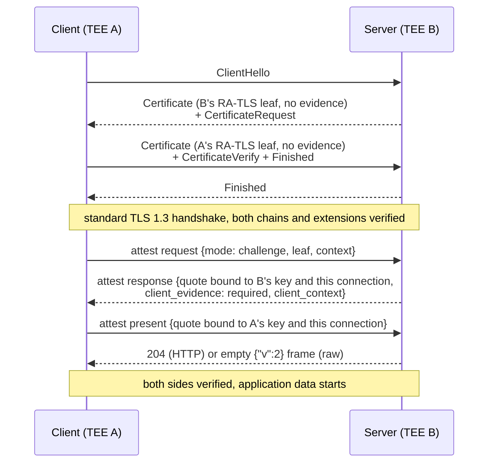

Standard [RA-TLS](/solutions/enclave-os/attestation/ra-tls) is one-directional: the **server** proves it runs inside a TEE while the client is a regular TLS peer (browser, CLI tool, API gateway). Mutual RA-TLS extends this so that **both** sides present an RA-TLS certificate in the handshake, and both sides prove through the evidence exchange that their certificate's key lives inside a TEE.

## When to Use Mutual RA-TLS

| Scenario | Who needs attesting? | Mode |
|----------|---------------------|------|
| Browser querying an enclave API | Server only | Standard RA-TLS |
| CLI tool reading attested data | Server only | Standard RA-TLS |
| TEE retrieving a secret from [Enclave Vaults](/solutions/enclave-vaults/overview) | Both | Mutual RA-TLS |
| TEE calling an [attested dependency](/solutions/enclave-os/attestation/dependencies) | Both | Mutual RA-TLS |
| Enclave forwarding data to another enclave | Both | Mutual RA-TLS |

The primary use cases are **Enclave Vaults** and app-to-app calls: when a TEE calls `GetSecret`, the vault needs to verify that the requesting workload matches the secret's access policy (correct MRENCLAVE, correct configuration OIDs), and a dependent app needs to know the peer is exactly the enclave it is pinned to. The only way to prove this over a network is for the client to present its own attested identity.

## How It Works

Mutual RA-TLS reuses the same certificate format, [OID scheme](/solutions/enclave-os/attestation/oids) and [evidence exchange](/solutions/enclave-os/attestation/ra-tls#the-evidence-exchange) as standard RA-TLS. The differences are that the client also presents an RA-TLS certificate in the handshake, and that the server's attest response asks the client for evidence of its own.

### Flow



1. **Standard TLS 1.3 handshake with client authentication.** The client presents a client certificate of the same shape as a server leaf: leaf key, chain to the same Privasys intermediate, the OID extensions, no evidence. The server verifies the chain and extensions against its policy at the handshake; the client verifies the server's certificate the same way.
2. **Server evidence.** The client sends the evidence request in challenge mode. The server answers with its quote, `client_evidence: "required"` and a fresh 32-byte `client_context`.
3. **Client verifies the server** exactly as in one-way RA-TLS: quote through the attestation server, measurements against policy, `report_data` recomputed from the server's certificate and the connection.
4. **Client evidence.** The client answers with a second request on the same connection:

```json
{ "v": 2, "mode": "present", "context": "<client_context>", "tee": "...",
  "quote": "...", "gpu_evidence": null, "quote_time": "..." }
```

   with

```
hctx_c      = TLS-Exporter("EXPORTER-privasys-ratls-attest-v2-client", client_context, 32)
report_data = SHA-512( SHA-256(SPKI_DER_client) || client_context || hctx_c )
```

5. **Server verifies the client** exactly as a client verifies a server response, with the client's SPKI and its own `hctx_c`. It answers `204` (HTTP) or an empty `{"v":2}` frame (raw binding) and only then serves application traffic; `403` on failure. A server that requires client evidence and receives application data before a verified `present` closes the connection.

The mutual leg is always challenge mode; deterministic client evidence is not defined. On the raw binding the client's `present` frame follows the server's response frame, and the server's acknowledgement frame precedes the protocol.

### Binding in Both Directions

| Direction | Context | Exporter label | Bound into |
|-----------|---------|----------------|------------|
| Client verifies server | client's `context` | `EXPORTER-privasys-ratls-attest-v2` | server quote's `report_data` |
| Server verifies client | server's `client_context` | `EXPORTER-privasys-ratls-attest-v2-client` | client quote's `report_data` |

Both exporter values derive from this connection's `exporter_master_secret`, so neither quote can be relayed from another session. Each side proved possession of its certificate key in the handshake (CertificateVerify), so no further signature travels in the exchange.

## Server-Side Support

### Enclave OS Mini

The enclave's `rustls` TLS server is configured with a permissive client certificate verifier:

- **`offer_client_auth()`** returns `true`, so the server always sends a `CertificateRequest`.
- **`client_auth_mandatory()`** returns `false`, so browsers and standard clients can connect without presenting a certificate.
- When a client *does* present a certificate, its chain and extensions are verified at the handshake and the certificate is kept for the connection. The attest handler then requires the client's `present` step before the application layer (for example the vault module) sees any request.

This design means the same TLS endpoint serves both regular clients and mutual RA-TLS clients. No separate port or configuration is needed.

The `RequestContext` passed to each module's `handle()` method includes the DER-encoded client certificate (`peer_cert_der`, if presented) and the verified client attestation result, so a module can apply an access policy to the caller's measurements and OIDs.

### Enclave OS Virtual

In Virtual, Caddy handles client authentication at the TLS layer. When `client_auth` is enabled on a route, Caddy requests a client certificate during the handshake, verifies its chain and extensions, runs the `present` step on `/__privasys/attest`, and forwards requests to the container only once the client's evidence has verified. The request carries the connection tag `X-Privasys-Attestation`; a container that requires attested callers checks the tag and never trusts the caller's word.

## Client-Side Support

The client certificate is a standing 24-hour leaf minted by the client's own runtime, with the key kept across re-mints; nothing is generated during the handshake. When the server's response says `client_evidence: "required"`, the SDK (Rust `connect_mutual`, the Go `Client` with a client certificate) obtains a fresh quote from its runtime bound to `client_context` and the connection's exporter, and sends the `present` message before any application data.

Because the binding uses the RFC 8446 exporter, upstream Go `crypto/tls` and rustls are sufficient on both ends. Earlier versions needed forks of both libraries to carry a challenge nonce inside the `CertificateRequest` message; version 2 needs none, and those forks are archived.

## Enclave Vaults Integration

[Enclave Vaults](/solutions/enclave-vaults/overview) uses mutual RA-TLS for the `GetSecret` operation. The flow is:

1. The requesting TEE connects to the vault, presenting its own RA-TLS certificate in the handshake.
2. The client verifies the vault's identity (standard RA-TLS); the vault's attest response requires client evidence.
3. The client presents its quote, bound to the vault's `client_context` and the connection.
4. The vault reads the [OID extensions](/solutions/enclave-os/attestation/oids) from the client certificate and the measurements from the client's quote.
5. The vault checks the client's measurements (MRENCLAVE / MRTD) and configuration OIDs against the secret's access policy.
6. If the policy matches, the vault returns the secret share. Otherwise the request is rejected.

This ensures that secrets are only released to workloads that match the policy defined by the secret owner, verified end-to-end through hardware attestation, with no trusted intermediary.

## Security Properties

| Property | Guarantee |
|----------|----------|
| **Bidirectional attestation** | Both sides prove they run inside a TEE with specific code and configuration |
| **Key binding** | Each party's TLS key is bound to its own TEE quote via `report_data` |
| **Session binding in both directions** | Each quote commits to this connection's TLS exporter under a direction-specific label, preventing relay |
| **No trusted intermediary** | Verification happens directly between the two TEEs over the TLS channel |
| **Standard TLS** | The handshake is unmodified; no forked TLS library is needed on either side |
| **Graceful degradation** | The server accepts both mutual RA-TLS clients and standard TLS clients on the same port |
| **Policy enforcement** | The server can enforce fine-grained access policies based on the client's attestation evidence |
