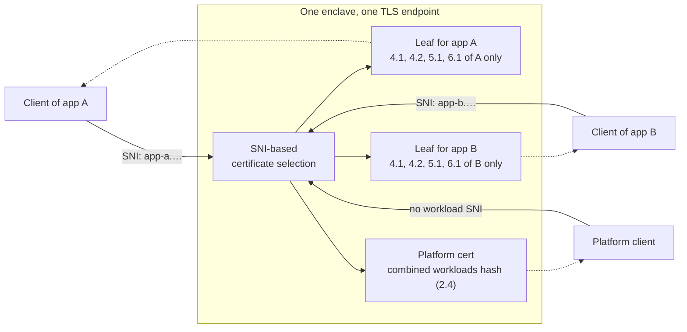

Both Enclave OS editions serve an ordinary X.509 certificate over an ordinary TLS 1.3 handshake, then prove that the certificate's key lives inside a TEE through a small evidence exchange on the same connection. This page covers the shared RA-TLS model (version 2), certificate generation, the evidence exchange, per-workload routing, and verification.

For the full OID reference, see the [X.509 OID scheme](/solutions/enclave-os/attestation/oids). For configuration attestation via Merkle trees, see the [Configuration Merkle Tree](/solutions/enclave-os/attestation/merkle-tree).

## RA-TLS in Brief

Remote Attestation TLS (RA-TLS) ties hardware attestation evidence to the TLS key a client is talking to. In version 2 the handshake stays completely standard, and the evidence moves to an exchange that runs on the connection right after it, before any application data.

The core mechanism:

1. **Key generation inside the TEE.** An ECDSA P-256 key pair is generated within the hardware trust boundary (Intel SGX enclave or Confidential VM).
2. **Certificate issuance.** The public key and the runtime and workload identity (the [OID extensions](/solutions/enclave-os/attestation/oids)) are packaged into an X.509 leaf certificate issued inside the TEE by the Privasys intermediate CA of its environment. The certificate carries no attestation evidence.
3. **Standard TLS handshake.** The chain is served during a TLS 1.3 handshake. The client validates it against the Privasys anchors and reads the extensions. Nothing in the TLS stack is modified.
4. **Evidence exchange.** The client asks the enclave for evidence on the same connection. The enclave answers with a DCAP quote (and GPU evidence when the workload has a GPU) whose `report_data` commits to the leaf key and, in challenge mode, to a value that only the two ends of this connection can derive.
5. **Verification before data.** The client verifies the quote with the attestation service, recomputes `report_data` from the certificate it received (and from the connection, in challenge mode), and only then sends application data.

A client that never asks for evidence gets a normal-sized certificate and a working connection, exactly as a browser would; the server records that connection as `attestation: none` (see [Connection tag](#connection-tag)).

This is one-way (server-side) attestation. For bidirectional attestation where both sides prove they run inside a TEE, see [Mutual RA-TLS](/solutions/enclave-os/attestation/mutual-ra-tls).

### Why after the handshake?

Earlier versions embedded the quote as a certificate extension and, for challenge mode, carried the client's nonce in a custom ClientHello extension, which required patched TLS libraries on both ends. Running the exchange after the handshake lets the evidence commit to the RFC 8446 TLS exporter of the connection. That value exists only once the server Finished has been sent, and it is derived from the same secrets as the application traffic keys, so a quote that commits to it commits to the keys protecting the data. Upstream rustls, Go `crypto/tls` and Caddy expose the exporter, so no fork is needed, and any plain TLS client still gets a working connection.

## The Evidence Exchange

The exchange is two messages, request and response, encoded as JSON. Two bindings carry them.

**HTTP binding.** `POST /__privasys/attest` on the enclave's own HTTP surface, `Content-Type: application/json`. The path is reserved: the runtime answers it before any workload router sees the request, on the platform certificate and on every per-workload certificate. For HTTP/1.1 the client sends it as the first request of the connection. For HTTP/2 it goes on the first stream, and the client opens no other stream until the response has verified. One attestation covers every later request and stream on that TLS connection. On the Privasys platform the endpoint is reachable only on the path the gateway splices through to the enclave; the gateway's own public certificate answers `404`.

**Raw binding.** For legs that carry a non-HTTP protocol over RA-TLS (the KMIP gateway, the cluster peer link), the first application record after the handshake, in each direction, is one frame `u32 big-endian length || JSON` of at most 65536 bytes. The client sends the request frame, the server answers with the response frame, then the protocol starts.

Request:

```json
{ "v": 2, "mode": "deterministic", "leaf": "<SHA-256(SPKI_DER) of the received leaf, base64url>" }
{ "v": 2, "mode": "challenge", "leaf": "<same>", "context": "<32 random bytes, base64url>" }
```

`leaf` names the certificate the client received in the handshake, so the enclave binds the evidence to that key even if it has since rotated the leaf for that name. The enclave answers only for a key it holds (current or previous for the name). `context` is fresh random per request and must be exactly 32 bytes. All base64 in the protocol is base64url without padding.

Response:

```json
{
  "v": 2,
  "mode": "deterministic" | "challenge",
  "tee": "sgx" | "tdx" | "tdx-gpu",
  "quote": "<DCAP quote, base64url>",
  "gpu_evidence": "<NVIDIA CC evidence bundle, base64url>" | null,
  "quote_time": "2026-09-04T10:15Z",
  "client_evidence": "none" | "required",
  "client_context": "<32 bytes, base64url>" | null
}
```

`quote_time` is the minute at which the quote was minted, present in both modes. `client_evidence` and `client_context` drive the [mutual leg](/solutions/enclave-os/attestation/mutual-ra-tls). Errors are `400` (malformed request), `404` (not an RA-TLS version 2 endpoint) and `503` (quote provider unavailable); on the raw binding the response frame carries `{"v":2,"error":"..."}` and the server closes the connection.

## Deterministic vs Challenge Mode

In both modes `SPKI_DER` is the DER-encoded `SubjectPublicKeyInfo` of the leaf certificate the client received in the handshake (91 bytes for P-256, the same structure whose SHA-256 appears as "Public Key SHA-256" in standard certificate viewers). All hashes are over raw bytes and `||` is concatenation.

### Deterministic Mode

```
report_data = SHA-512( SHA-256(SPKI_DER) || quote_time )
```

where `quote_time` is the 17-byte ASCII string from the response (`YYYY-MM-DDTHH:MMZ`). The runtime mints one quote per leaf key, caches it for 24 hours and serves the same `quote_time` with it. A verifier accepts a `quote_time` within the last 24 hours plus 5 minutes of clock skew, and rejects one further in the future than that skew.

Deterministic mode proves that the leaf key was generated inside an enclave with the quoted measurements within the last 24 hours. It has no session binding by design and offers no relay resistance beyond the certificate key. In exchange it is cheap (no quote generation per connection, which takes around 100 ms on SGX hardware) and reproducible by any verifier. Python's `ssl` module and .NET's `SslStream` expose no TLS exporter, so those SDKs use deterministic mode; they verify the same certificate, chain and quote and only lack the per-connection binding.

### Challenge Mode

Challenge mode is the default in the Rust, Go and TypeScript SDKs and in the CLI.

```
hctx        = TLS-Exporter("EXPORTER-privasys-ratls-attest-v2", context, 32)
report_data = SHA-512( SHA-256(SPKI_DER) || context || hctx )
```

`TLS-Exporter` is the RFC 8446 section 7.5 exporter, keyed by the `exporter_master_secret` of this connection, with the request `context` as the exporter context value. Both ends compute `hctx` independently; it never travels. The verifier computes its own `hctx` and its own expected `report_data` and compares them with the quote. It never takes either from the peer.

### Channel binding

`exporter_master_secret` is derived from the master secret and the handshake transcript through the server Finished, exactly as the application traffic secrets are. A quote that commits to `hctx` therefore commits to this connection's application keys, and cannot be relayed onto a different session even if the leaf key were extracted. The handshake has already proved possession of the leaf key (CertificateVerify), so the response carries no further signature. The binding was checked with a ProVerif model, published in [Privasys/security](https://github.com/Privasys/security).

### GPU evidence

When the workload has a GPU, the response carries `gpu_evidence` and the fold is applied after the binding, in both modes:

```
report_data = SHA-512( SHA-256(SPKI_DER) || binding || SHA-256(gpu_evidence) )
```

with `binding` equal to `quote_time` (deterministic) or `context || hctx` (challenge). The GPU evidence's own nonce is the first 32 bytes of the TDX `report_data`, so the two evidence bodies cross-commit.

### Choosing a mode

| Mode | What `report_data` commits to | What it proves | Cost |
|------|-------------------------------|----------------|------|
| **None** | nothing requested | Chain and extensions only | none |
| **Deterministic** | leaf key + `quote_time` | The key was generated in a TEE with these measurements, within 24 hours | cached quote |
| **Challenge** | leaf key + `context` + this connection's exporter | The above, and that the quote belongs to this connection | one quote per attestation |

## Certificate Structure

Both editions generate an X.509 leaf certificate signed by the Privasys intermediate CA of the environment (production or dev). The intermediate CA certificate and private key are provided at deployment time and protected by the TEE: sealed to MRENCLAVE in Mini, stored on the LUKS2-encrypted partition in Virtual. The CA key never leaves the TEE.

| Field | Mini | Virtual |
|-------|------|---------|
| **Subject** | `CN=Enclave OS RA-TLS, O=Privasys` | `CN=<workload>.<hostname>, O=Privasys` |
| **Key** | ECDSA P-256 (generated inside SGX via `ring`) | ECDSA P-256 (generated inside the Confidential VM) |
| **Signature** | ECDSA with SHA-256 | ECDSA with SHA-256 |
| **Validity** | 24 h, renewed by the runtime | 24 h, renewed by the runtime |
| **Extensions** | [OID scheme v2](/solutions/enclave-os/attestation/oids) | [OID scheme v2](/solutions/enclave-os/attestation/oids) |
| **Evidence** | none in the certificate | none in the certificate |
| **TLS version** | 1.3 only (upstream rustls) | 1.3 (Caddy, upstream Go TLS) |
| **ALPN** | `privasys-ratls/1`, used by the platform gateway to splice the connection through to the enclave; no attestation meaning | same |

The leaf key is kept across re-mints that change only extension values (a deploy, a configuration change, a dependency-set change), so a deterministic quote minted for the key stays valid across such a re-mint. There is no per-connection certificate: challenge mode binds the quote to the connection, not the certificate.

A verifier that finds a version 1 quote extension in a leaf treats the certificate as version 1 and fails closed.

Both editions follow the same three-tier hierarchy:

```
Privasys Root CA
 +-- Privasys Intermediate CA (protected by the TEE)
      +-- Leaf RA-TLS certificate (per workload, 24 h)
               |-- Platform identity (OIDs 1.*)
               |-- Platform configuration (2.*), including the Config Merkle root (2.1)
               |-- Platform keys and state (3.*)
               +-- Workload identity, configuration, keys, dependencies (4.*, 5.*, 6.*, 7.*)
```

## Generation Flow

```
1. Generate an ECDSA P-256 key pair inside the TEE
   (kept across re-mints that change only extension values)
         |
         v
2. Build the X.509 certificate:
   - Set subject, 24 h validity, key usage
   - Attach the version 2 extensions (1.*, 2.*, 3.* platform; 4.* to 7.* workload)
   - Sign with the intermediate CA key
         |
         v
3. Serve the chain [leaf, intermediate] in the TLS 1.3 handshake
         |
         v
4. On POST /__privasys/attest (or the raw request frame):
   a. Check that SHA-256(SPKI_DER) of a held leaf matches the request's "leaf"
   b. Deterministic: serve the cached quote for this key, minting it if absent
      with report_data = SHA-512(SHA-256(SPKI_DER) || quote_time)
      Challenge: hctx = TLS-Exporter(label, context, 32),
      report_data = SHA-512(SHA-256(SPKI_DER) || context || hctx),
      request a fresh quote (quoting enclave on SGX, configfs-tsm on TDX)
   c. Fold GPU evidence when the workload has a GPU
   d. Answer, and tag the connection with the mode served
```

## Session Management

### Mini

Each TLS session is managed by the enclave's `RaTlsSession` struct, which:

1. Owns the TLS server connection (via upstream `rustls`).
2. Reads encrypted bytes from the SPSC data channel.
3. Decrypts them to produce plaintext HTTP requests, answering `/__privasys/attest` itself before dispatching to modules.
4. Encrypts HTTP responses and writes ciphertext back to the data channel.

The `rustls` configuration enforces:

- **TLS 1.3 only.** TLS 1.2 and below are disabled.
- **No client certificate required.** A client certificate is offered but not mandatory, so browsers connect and [mutual RA-TLS](/solutions/enclave-os/attestation/mutual-ra-tls) peers can present one.
- **ECDSA P-256 cipher suites.** Matching the key type.
- **Exporter access.** The connection's RFC 8446 exporter feeds `hctx` in challenge mode.

### Virtual

TLS is handled by Caddy with the Privasys RA-TLS issuance module. Caddy terminates TLS, answers `/__privasys/attest` ahead of every workload route, and forwards plaintext to containers on localhost. Certificate selection uses SNI, with each container hostname mapping to its own RA-TLS certificate. Certificates are cached by certmagic and renewed every 24 hours, keeping the key.

### Connection tag

The server records, per TLS connection, `attestation: none | deterministic | challenge`, set when an evidence response is served and left at `none` otherwise. The tag is exposed to the workload as the request header `X-Privasys-Attestation` (set by Caddy on Virtual), and the platform counts connections per tag. A workload that requires attested callers checks the header; it never trusts the caller's word.

### Re-attestation

On long-lived connections (sealed WebSockets, the session relay, drive streams, vault sessions) the client repeats the exchange every 5 minutes by default, on the same connection, with a fresh `context`. On HTTP/2 that is a new stream; on the raw binding a re-attestation frame is not possible and the client reconnects instead. A failure, or a change in the pinned extension values between the handshake certificate and the runtime's current leaf, drops the connection.

## Per-Workload Certificates and SNI Routing

Both editions issue per-workload certificates so that each client only sees the identity and configuration of the specific workload it connects to.

| | Mini | Virtual |
|--|------|---------|
| **Workload type** | WASM app | OCI container |
| **Hostname** | `<app>.enclave.example.com` | `<container>.<machine>.<hostname>` |
| **Per-workload OIDs** | App id (`4.1`), code digest (`4.2`), config root (`5.1`), key source (`6.1`), dependency set (`7.1`) | App id (`4.1`), image digest (`4.2`), image ref (`4.3`), config root (`5.1`), volume key source (`6.1`), dependency set (`7.1`) |
| **Platform cert** | Enclave platform leaf (served when no workload SNI matches) | Management hostname cert |
| **TLS stack** | rustls `ResolvesServerCert` | Caddy certmagic per-hostname |

The platform-level certificate carries the **combined workloads hash** (OID `2.4`) for clients that want a single check covering all loaded workloads without SNI routing. The evidence exchange is answered on every leaf, and the request's `leaf` field ties the quote to the certificate that was actually served.



A client connecting to app A receives a certificate carrying only A's identity and configuration; nothing about B leaks into the handshake.

### Why per-workload certificates?

1. **Tenant isolation.** Each client only sees the code digest and configuration of the workload it connects to. A client connecting to `app-A` learns nothing about `app-B`.
2. **Independent lifecycle.** Adding, removing, or updating one workload does not affect any other workload's certificate.

### Certificate hierarchy (Mini)

In Mini, each WASM app gets its own leaf certificate, issued inside the enclave alongside the platform leaf:

```
Privasys Root CA
 +-- Privasys Intermediate CA (sealed inside the enclave)
      |-- Platform Leaf (no workload SNI)
      |     |-- OID 1.3.6.1.4.1.65230.1.1  Runtime Version Hash
      |     |-- OID 1.3.6.1.4.1.65230.2.1  Config Merkle Root (core config only)
      |     |-- OID 1.3.6.1.4.1.65230.2.4  Combined Workloads Hash
      |     +-- OID 1.3.6.1.4.1.65230.3.2  Authenticated State Root
      |
      |-- App Leaf: "payments-api"
      |     |-- OID 1.3.6.1.4.1.65230.4.1  App Id (MR_APP sealing)
      |     |-- OID 1.3.6.1.4.1.65230.4.2  App Code Digest
      |     |-- OID 1.3.6.1.4.1.65230.5.1  App Config Merkle Root
      |     |-- OID 1.3.6.1.4.1.65230.6.1  App Key Source
      |     |-- OID 1.3.6.1.4.1.65230.7.1  Attested Dependency Set
      |     +-- OID 1.3.6.1.4.1.65230.5.4.<n>  App-defined extensions
      |
      ├── App Leaf: "analytics-api"
      │     ├── OID 1.3.6.1.4.1.65230.4.2  App Code Digest
      │     └── ...
      │
      └── ... (scales to thousands of apps)
```

App leaf certificates are signed inside the enclave using `ring` ECDSA P-256, requiring no round-trip to the quoting enclave. The SGX quote for a leaf is minted on demand by the evidence exchange (once per key in deterministic mode, per attestation in challenge mode) and never lives in the certificate.

### Certificate hierarchy (Virtual)

In Virtual, the RA-TLS module generates a separate RA-TLS certificate for each container hostname:

```
Privasys Root CA
 +-- Privasys Intermediate CA (stored on the LUKS2-encrypted partition)
      +-- Management Cert (platform OIDs)
      |     |-- OID 1.3.6.1.4.1.65230.1.1  Runtime Version Hash
      |     |-- OID 1.3.6.1.4.1.65230.1.2  Image Profile
      |     |-- OID 1.3.6.1.4.1.65230.1.3  Enclave Instance ID
      |     |-- OID 1.3.6.1.4.1.65230.2.1  Config Merkle Root (platform tree)
      |     |-- OID 1.3.6.1.4.1.65230.2.4  Combined Workloads Hash
      |     +-- OID 1.3.6.1.4.1.65230.3.1  Data Encryption Key Origin
      |
      +-- Container Cert: "myapp"
      |     |-- OID 1.3.6.1.4.1.65230.4.1  App Id (MR_APP sealing)
      |     |-- OID 1.3.6.1.4.1.65230.4.2  Image Digest
      |     |-- OID 1.3.6.1.4.1.65230.4.3  Image Ref
      |     |-- OID 1.3.6.1.4.1.65230.5.1  Container Config Root
      |     |-- OID 1.3.6.1.4.1.65230.6.1  Volume Key Source
      |     +-- OID 1.3.6.1.4.1.65230.7.1  Attested Dependency Set
      |
      +-- Container Cert: "db"
            +-- ...
```

Each container certificate carries its own per-container extensions. The TDX quote (obtained via configfs-tsm) is served by the evidence exchange on the connection and bound to that container certificate's key through `report_data`.

## Trust Chain

Both editions produce a trust chain from hardware to application, verifiable on a single TLS connection: the certificate served in the handshake identifies, the quote served by the evidence exchange proves.

### Mini (SGX)

```
Intel CPU Hardware Key
        |
        v
SGX DCAP Quote (served by the evidence exchange)
        |
        |-- MRENCLAVE / MRSIGNER (enclave code identity)
        |
        |-- report_data (binds the leaf key, and the connection in challenge mode)
        |       |
        |       |-- SHA-512(SHA-256(SPKI_DER) || quote_time)          deterministic
        |       +-- SHA-512(SHA-256(SPKI_DER) || context || hctx)     challenge
        |
        +-- RA-TLS Certificate (served in the handshake)
                |
                |-- TLS public key (enclave-generated)
                |
                |-- Runtime Version Hash (OID 65230.1.1)
                |
                |-- Config Merkle Root (OID 65230.2.1)
                |       |
                |       |-- CA cert hash
                |       +-- WASM app code hashes
                |
                |-- Egress CA Bundle Hash (OID 65230.2.2)
                |
                |-- Attestation Servers Hash (OID 65230.2.3)
                |
                |-- Combined Workloads Hash (OID 65230.2.4)
                |
                |-- Authenticated State Root (OID 65230.3.2)
                |
                +-- Per-App Leaf Certs (via SNI)
                        |-- App Id (OID 65230.4.1)
                        |-- App Code Digest (OID 65230.4.2)
                        |-- App Config Root (OID 65230.5.1)
                        |-- App Key Source (OID 65230.6.1)
                        +-- Attested Dependency Set (OID 65230.7.1)
```

### Virtual (TDX)

```
Intel TDX Module
        |
        v
TDX Quote (served by the evidence exchange)
        |
        |-- MRTD (VM firmware measurement)
        |
        |-- RTMR[0-3] (runtime measurements)
        |
        |-- report_data (binds the leaf key, and the connection in challenge mode)
        |       |
        |       |-- SHA-512(SHA-256(SPKI_DER) || quote_time)          deterministic
        |       +-- SHA-512(SHA-256(SPKI_DER) || context || hctx)     challenge
        |
        +-- RA-TLS Certificate (served in the handshake)
                |
                |-- TLS public key (VM-generated)
                |
                |-- Runtime Version Hash (OID 65230.1.1)
                |
                |-- Image Profile (OID 65230.1.2)
                |
                |-- Enclave Instance ID (OID 65230.1.3)
                |
                |-- Config Merkle Root (OID 65230.2.1)
                |       |
                |       |-- CA cert hash
                |       +-- Container image digests
                |
                |-- Attestation Servers Hash (OID 65230.2.3)
                |
                |-- Combined Workloads Hash (OID 65230.2.4)
                |
                |-- Data Encryption Key Origin (OID 65230.3.1)
                |
                +-- Per-Container Certs (via SNI)
                        |-- App Id (OID 65230.4.1)
                        |-- Image Digest (OID 65230.4.2)
                        |-- Image Ref (OID 65230.4.3)
                        |-- Container Config Root (OID 65230.5.1)
                        |-- Volume Key Source (OID 65230.6.1)
                        +-- Attested Dependency Set (OID 65230.7.1)
```

A verifier that has completed the handshake and the evidence exchange knows:

1. **Which hardware** is running (Intel SGX or Intel TDX, specific CPU), from the quote.
2. **Which code** (MRENCLAVE for SGX, MRTD + RTMRs for TDX), from the quote's measurements.
3. **Which TLS key** (bound via `report_data`), and in challenge mode which connection.
4. **Which configuration and workloads** (Merkle roots + platform extensions), stamped by the measured runtime the quote attests.
5. **Which specific workload** (per-workload extensions via SNI routing).

This is full-stack attestation, from silicon to application code, delivered over a standard TLS connection.

## Verification

A relying party verifying an RA-TLS connection follows these steps, after the handshake and before any application data:

1. **Validate the certificate chain** to the Privasys anchors (the intermediates embedded in the SDKs, or a CA you supply). The SDKs check the chain, not the hostname: enclaves are dialled by address, and identity is measurement plus app id.
2. **Read the extensions** against your policy. A leaf that carries a version 1 quote extension is rejected.
3. **Send the evidence request** in the mode you want (`challenge` by default in the SDKs, `deterministic` for the "trust the TEE" tier).
4. **Parse the response**; reject `v != 2` or a mode different from the one requested.
5. **Verify the quote** against the hardware vendor's attestation infrastructure through the [attestation server](/technology/attestation/attestation-server): signature and TCB. Check the measurements (MRENCLAVE or MRTD + RTMRs) against known-good values, and the runtime-measured extensions against the quote's measurements where your policy pins them.
6. **Recompute `report_data`** from the connection's own leaf SPKI, the mode, `quote_time` or your own `context` and `hctx`, and `gpu_evidence` when present, and compare it with the quote. A mismatch fails the connection; never accept a `report_data` you did not predict.
7. **Verify GPU evidence** when present (NVIDIA NRAS or a local verifier), and check its nonce against the TDX `report_data` prefix.
8. **Check the image profile** (Virtual): the Image Profile extension (OID `1.2`) must be `"production"`. Dev-profile images (built with SSH and debug tools) are rejected unless the verifier explicitly opts in.
9. **Check configuration extensions**: the Merkle roots, workload digests, or individual values against expected values.
10. **Complete the mutual leg** when the response says `client_evidence: "required"` (see [Mutual RA-TLS](/solutions/enclave-os/attestation/mutual-ra-tls)).

Only then is the connection handed to the application. A failure closes the connection with an error that names the step.

### Verification Depth

| Strategy | What to check | Trust level |
|----------|---------------|-------------|
| **Code identity only** | Quote measurements and `report_data` | Correct code and a key inside it, but configuration unknown |
| **Code + Merkle root** | + OID `2.1` (and `5.1` on a workload leaf) | Code and full configuration verified |
| **Fast-path OIDs** | + specific extensions (`4.1`, `4.2`, `6.1`, `1.2`, ...) | Individual properties without a full Merkle audit |
| **Full manifest audit** | Request manifest, recompute the root | Complete transparency of all inputs |

The Privasys [verification libraries](/solutions/platform/verification-libraries) implement this flow in Python, Go, Rust, TypeScript, and C#, and the CLI prints the connection tag and the verified fields.

## Security Properties

| Property | Guarantee | Applies to |
|----------|-----------|------------|
| **Key binding** | The TLS public key is cryptographically bound to the hardware quote via `report_data` | Both |
| **Session binding** | In challenge mode the quote commits to this connection's TLS exporter, so it cannot be relayed onto another session | Both |
| **Code identity** | MRENCLAVE (SGX) or MRTD + RTMRs (TDX) prove the exact code running | Both |
| **Config identity** | Merkle roots prove all operator-chosen and module or container-contributed inputs | Both |
| **Freshness** | A fresh `context` per attestation in challenge mode; `quote_time` bounded to 24 hours in deterministic mode | Both |
| **Standard TLS** | The handshake is unmodified; SDKs build on upstream TLS libraries | Both |
| **CA isolation** | The CA private key is sealed to MRENCLAVE (Mini) or stored on LUKS2-encrypted disk (Virtual) | Both |
| **No suppression** | The TEE is an honest reporter and cannot hide its configuration | Both |
| **Per-workload isolation** | Each WASM app (Mini) or OCI container (Virtual) gets its own certificate, Merkle tree, and extensions | Both |
| **Connection tag** | Every connection is tagged with the mode that verified it; workloads check the tag, never the caller's word | Both |

## References

- [X.509 OID Scheme](/solutions/enclave-os/attestation/oids): Full reference of all Privasys OID extensions and evidence types
- [Configuration Merkle Tree](/solutions/enclave-os/attestation/merkle-tree): How configuration inputs are attested via Merkle trees
- [Mutual RA-TLS](/solutions/enclave-os/attestation/mutual-ra-tls): Bidirectional attestation between TEEs
- [Enclave OS Virtual Architecture](/solutions/enclave-os/enclave-os-virtual/architecture): How the RA-TLS module generates certificates in Confidential VMs
- [Verification Libraries](/solutions/platform/verification-libraries): Client libraries for Python, Go, Rust, TypeScript, and C#
