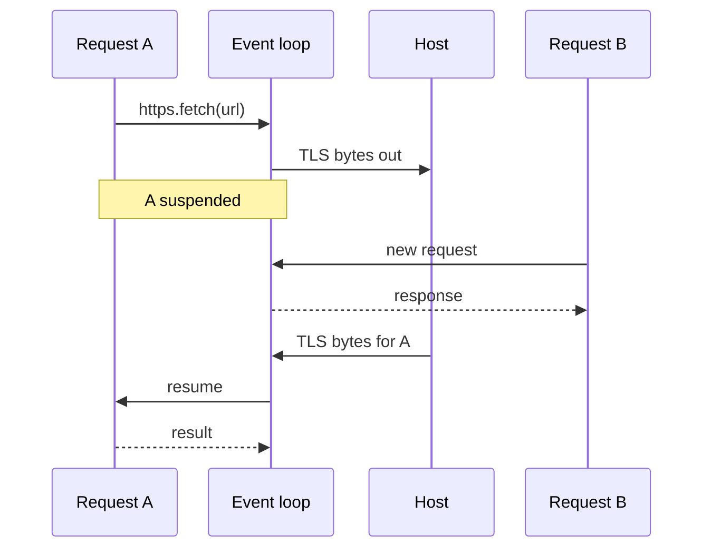

Enclave OS (Mini) runs one event loop on one SGX thread (`ecall_run`) for every application the enclave hosts. Work that has to wait (a guest's outbound HTTPS call, a long guest computation, an NTS quorum) runs inside a **stackful coroutine** that suspends and hands the thread back to the event loop. This page describes the execution model, the primitives, the rules they impose and the SGX-specific parts. It applies to builds with the WASM runtime; builds without it keep the blocking model.

## Execution model

Three layers nest inside the event loop:

| Layer | What runs on it | Implementation |
|-------|-----------------|----------------|
| **Event loop** | Data Channel messages, TLS sessions, request dispatch, task scheduling | The enclave thread's own stack |
| **Request task** | One ingress request's handler, from HTTP parsing to the response | `executor::Task`, a fiber with a 1 MiB stack |
| **Guest call** | One WASM export call, including the host imports it calls into | A wasmtime fiber (`async` feature), 1 MiB stack |

The handler code is synchronous. Because a request task is a stackful coroutine, the whole call chain (routing, module dispatch, the WASM module, wasmtime) stays ordinary Rust; only the points that wait need to know about suspension.

## Request tasks

The ingress server spawns a task for every request except the RA-TLS evidence exchange (`/__privasys/attest`, which needs the TLS session itself), then resumes it at once:

- If the task returns, the response is sent immediately, exactly as without tasks.
- If the task suspends, the server keeps it as the connection's **pending request** and returns to the event loop.

At the top of every event-loop iteration, if any task has been woken, the server resumes the woken tasks (`poll_tasks`). A task that finishes has its response sent on its connection, and the requests the connection buffered meanwhile are then dispatched.

Scheduling rules:

- **One pending request per connection.** HTTP/1.1 answers in order, so while a request is suspended the connection's next requests stay buffered in its TLS session.
- **At most 8 pending requests.** Each holds a task stack, a guest fiber stack and the guest's linear memory in the enclave heap. Past the cap, a request runs to completion inline, blocking the loop as before.
- **Wake-driven.** A task is resumed only after its waker fires; nothing is polled speculatively.
- **Run to completion.** A task is never cancelled. If its connection closes, the task still finishes and its result is discarded. Task stacks are pooled and reused.

## Waiting inside a task

`executor::block_on(future)` is the single primitive for waiting:

| Called from | Behaviour |
|-------------|-----------|
| A request task, at its top level | Polls the future with the task's waker; on `Pending`, suspends the task until the waker fires, then polls again |
| Outside a task (start-up, raft replay) | Polls the future in place until it completes; the future must not depend on the event loop |
| Inside another `block_on`'s poll | Polls in place (see [Rules](#rules)) |

`executor::can_suspend()` reports which case applies. Code that has a choice of transport (for example the NTS client) uses it to pick sockets the event loop drives when it can suspend, and the blocking RPC sockets when it cannot.

## Guest calls

Every guest call and instantiation goes through wasmtime's async entry points (`call_async`, `instantiate_async`) and runs on a wasmtime fiber. A host import declared `async` in the bindings can then return `Pending`: wasmtime suspends the guest's fiber, `call_async` returns `Pending` to the request task's `block_on`, and the task suspends in turn. When the task resumes, wasmtime resumes the guest where it stopped. The guest sees a blocking call; its code, WIT interface and `.cwasm` do not change.

Since wasmtime 48, async is implied by any async import: once one is linked, every entry point must use the async variant.

**Fuel yielding.** Each store is configured with `fuel_async_yield_interval(1_000_000)`: every million fuel units (a few milliseconds of compute) the guest yields, its waker is woken at once, and the event loop serves other work before resuming it. The per-call budget (`max_fuel`, 1,000,000,000 by default) still ends a runaway call.

## Egress

`https.fetch` is an async import. Inside a request task it runs the TLS and HTTP exchange (`egress::client::https_fetch_async`) over a socket the host TCP proxy owns, through `egress::netchan`:

| Message (Data Channel) | Direction | Meaning |
|------------------------|-----------|---------|
| `TcpConnect` | enclave → host | Open a connection. Payload `host:port`, optionally `\n<ms>` for a quiet-period timeout |
| `TcpConnected` | host → enclave | The connect succeeded |
| `TcpData` | both | Bytes on the connection |
| `TcpClose` | both | Close; from the host, also a failed connect or an expired timeout |
| `UdpOpen` | enclave → host | Open a UDP socket to one peer; each `TcpData` is then one datagram |

Egress connections take their ids from `0xC000_0000` up (the raft peer link uses `0x8000_0000` to `0xBFFF_FFFF`). The event loop hands messages for these ids to `netchan`, which buffers the bytes and wakes the task waiting on that connection. A read with nothing buffered returns `Pending`.

The enclave has no clock to time a wait, so the host enforces the bounds: an egress connection is closed 60 seconds after it opened, and a connection or UDP socket opened with a timeout is closed once it has been quiet for that long. The waiting read then sees the close and fails.

Outside a task, `https_fetch` keeps the blocking RPC sockets (`ocall::net_*`): nothing would drive the event loop while such a caller waits.

## Trusted time

The [trusted clock](/solutions/enclave-os/trusted-time) serialises its operations on a single owner, identified per task (a thread-level flag would let another task on the same thread pass as a nested read). An operation started by the clock's own routes (`POST /clock/poll`, `PUT /clock/config`) holds no lock and may suspend: its NTS quorum (NTS-KE over TCP, NTP over `UdpOpen`) and its incident report use `netchan` sockets. While it is suspended:

- another clock route waits for it;
- a time read gets the state as of the last completed operation: `NO_TRUSTED_TIME` while trusted time is failing closed, otherwise the frozen time (the last read or the floor).

A time read never suspends (see [Rules](#rules)); an NTS fetch that a read triggers still blocks.

## Rules

Two invariants keep coroutines on one thread sound:

1. **Never suspend while holding a lock another request may take.** Every task shares the enclave thread: if a suspended task holds a mutex and the next request blocks on it, the thread stops and the holder can never resume. Module dispatch therefore releases the module registry before a module runs, the WASM module releases its registry lock before a guest call, and time reads, which happen under arbitrary locks, never suspend.
2. **Never suspend inside a synchronous host function of a guest call.** The guest's wasmtime frames are on the stack, and wasmtime's per-thread state must not interleave with another guest call. A `block_on` reached from inside another `block_on`'s poll therefore polls in place instead of suspending. Async host imports are fine: they return `Pending` through wasmtime, which saves its state first.

## Fiber stacks in SGX

| Stack | Size | Notes |
|-------|------|-------|
| Request task | 1 MiB | Same as the enclave thread stack (`StackMaxSize`); pooled, up to 8 kept |
| Guest call | 1 MiB | `async_stack_size`; guest frames bounded by `max_wasm_stack` (512 KiB), the rest for host code (a TLS handshake measured 86 KiB) |

Both come from the enclave heap: SGX has no `mmap`, and the wasmtime fork routes its fibers to the heap-backed `nostd` backend. There is no guard page, so the sizes leave wide margins.

The SGX runtime handles a processor exception only if the stack pointer lies inside the thread's own stack; otherwise it marks the enclave crashed (`StackOverRun`). The enclave raises such exceptions routinely (it emulates `CPUID`, which faults inside SGX), and any code on a fiber can trigger one. Every fiber stack is therefore registered with the runtime through `sgx_register_alt_stack` (Privasys Teaclave SGX SDK fork), which makes the exception path build its frame on the registered stack. WASM traps do not use this path: with `signals_based_traps(false)` they are compiled as calls into the runtime.

OCALLs from a fiber need no special handling.

## Performance

Measured on SGX hardware with a `hello` call every 20 ms alongside other work:

| Concurrent work | `hello` latency |
|-----------------|-----------------|
| None | about 15 ms |
| Fetches of a 1.3 MB page, back to back | 15 ms median, 56 ms worst (about 245 ms with blocking egress) |
| A fetch to a server that accepts and never answers | 15 ms median; the fetch fails after 60 s |
| Guest calls computing for 0.35 s each | 15 ms median |
| NTS quorums of 0.1 to 1.5 s from the clock routes | 14 ms median |
