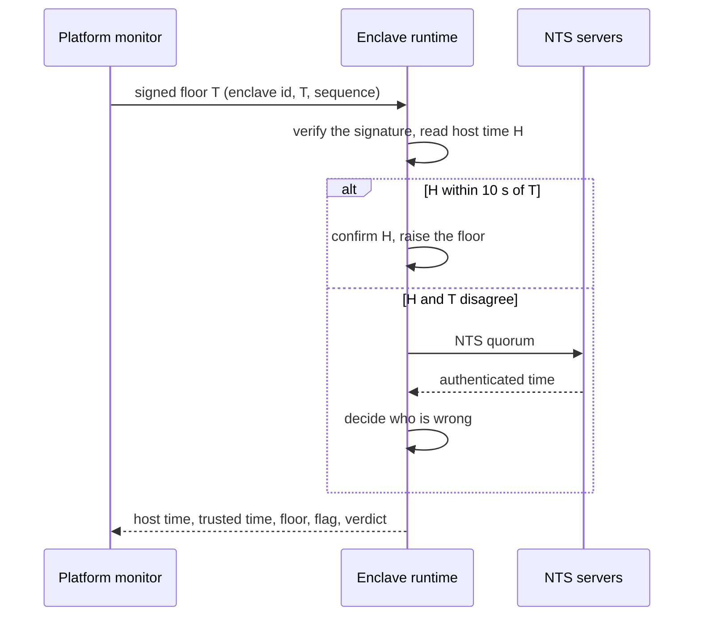

Every "is this still valid" decision an enclave makes rests on the current time: the freshness of an attestation quote, the validity dates of a certificate, the `exp` and `nbf` of a token, the window of an EncAuth voucher, the lifetime of a verified peer. An enclave has no clock of its own. On Intel SGX the time comes from the host through an ocall, and a TDX guest reads a clock the hypervisor steers. A host that can set that time back could get an expired credential accepted.

Both Enclave OS runtimes (the Mini enclave core and the Virtual manager) therefore keep a **trusted time**: the host's time, used only while an independent source confirms it, and replaced by a verified internet time when it cannot be confirmed. Applications keep calling their usual clocks; the checks live in the runtimes.

## Three sources, three roles

| Source | Role |
|--------|------|
| **The host clock** | The time in use, as long as it is confirmed. Reading it is fast and costs nothing. |
| **The platform monitor** | Every 5 minutes, sends each runtime a signed "the time is at least T". It triggers a check. Its time never becomes trusted time on its own. |
| **NTS servers** | Settle any disagreement. [Network Time Security](https://www.rfc-editor.org/rfc/rfc8915) (RFC 8915) authenticates every time reply with keys agreed over TLS 1.3, so a host that carries the packets cannot forge them. |

The monitor is itself a confidential application: Platform monitoring, an instance of the open-source [container-app-service-monitoring](https://github.com/Privasys/container-app-service-monitoring) app, running in a TDX confidential VM. A monitor that is wrong, or lies, can only cause an NTS fetch and a false alarm, because a runtime that disagrees with it asks NTS before it changes anything.

## The monitor's poll

Every 5 minutes the monitor opens an attested connection to each enclave's runtime, verifies the runtime's hardware quote on that connection, and sends it a signed floor. The runtime compares its host time with the floor:



The reply carries one of four verdicts:

| Verdict | Meaning |
|---------|---------|
| `in_sync` | The host and the monitor agree within 10 seconds. The host time is confirmed. |
| `monitor_clock_wrong` | NTS agrees with the host. The host time is confirmed, and the monitor raises an alert about its own clock. |
| `host_clock_wrong` | NTS agrees with the monitor. The runtime freezes its trusted time at the NTS time and flags itself. |
| `ignored_stale` | The floor is older than one the runtime already holds (a replay, or a slow monitor). Nothing changes. |

The reply is authentic through the attested channel it travels on, and the monitor records every reading in its tamper-evident ledger. That record is the fleet view of every host's time, and the source of the monitor's drift alerts.

## When the host clock is wrong

The runtime takes the NTS time and **freezes** it. Trusted time stays at that value until the host clock is fixed and NTS confirms it, or the next poll brings a fresh NTS fetch. It never becomes an offset from the host clock: an offset would still advance at the pace the host chooses, so a host that runs its clock slow, or changes it twice, could produce times that look believable.

A wrong host time is reported rather than treated as a reason to stop. The monitor then asks the platform to **quarantine** the enclave at the gateways, so users are not served answers computed on a frozen clock:

- the platform gateways refuse every application route of that enclave (see [Quarantined applications](/solutions/platform/gateway#quarantined-applications));
- the enclave keeps running, and its manager hostname stays routed, so the monitor can keep checking it;
- the monitor releases the quarantine as soon as a poll comes back clean: attested, `in_sync`, not flagged, with a trusted time, within tolerance.

The monitor also quarantines an enclave whose host clock is more than 10 seconds from its own, one that reports it has no trusted time, and one that misses two polls in a row. The quarantine is per enclave, because the clock belongs to the host: every application on it is paused together.

## Verification fails closed, serving carries on

When a runtime has no trusted time (at boot before the first NTS answer, or when NTS cannot be reached while one is needed), the trusted-time call returns an error, never a zero time. Every **verification decision** that depends on it refuses: quote freshness, token and voucher windows, the certificates the runtime checks, peer verdicts.

**Serving never waits on time.** Presenting the enclave's own certificate, completing a TLS handshake and answering the evidence exchange carry on, stamped with the floor. That keeps the enclave reachable, above all for the signed poll that lets it recover: a poll whose signature verifies retries NTS first.

WASM applications on Enclave OS Mini read trusted time through the WASI `wall-clock` and `monotonic-clock` interfaces. When there is no trusted time, the call traps instead of returning a wrong value. Containers on Enclave OS Virtual keep reading the guest's clock; the manager's own checks on their behalf (tokens, vouchers, attested peers) use trusted time.

## The floor

Each runtime keeps a **floor**: the highest time it has confirmed. It is sealed (Mini) or kept on the encrypted data volume (Virtual), so it survives a restart, and it never starts below a date compiled into the runtime, so a fresh enclave never accepts a time before its own build.

- **Reads never go back.** A read returns at least the previous read and at least the floor.
- **The floor only rises from a confirmed time**: a host time the monitor or NTS agreed with, or an NTS time. A host that jumps forward cannot push the floor past real time.
- **Raises are bounded.** A poll in sync raises the floor by at most one hour (on TDX, by at most the monotonic time elapsed since the last raise plus 10 seconds). A larger jump needs NTS to confirm it, so even the monitor's key together with the host cannot push the floor into the future.
- **A host behind the floor** (by more than one second) is an incident: the runtime reports it to the monitor, waits up to 5 seconds for a receipt signed with the monitor's key, then fetches NTS and freezes. Without a receipt it fails closed.
- **Boot:** the runtime restores the floor and makes one NTS fetch before its first time-sensitive decision. A host that restores an older copy of the sealed state only restores an older, weaker floor, which that fetch corrects.

## NTS in the runtime

The NTS client runs inside the enclave. The key exchange is TLS 1.3 over TCP port 4460 and the time itself is NTPv4 over UDP with the NTS extension fields; a reply counts only if its authenticator verifies and it echoes the request's identifiers.

- **Quorum.** Two servers picked at random must agree within 2 seconds. If they do not, or one does not answer, a third is asked and two that agree win. No agreeing pair means no trusted time.
- **Certificates are checked at the floor**, never at the host's time, which is the time in question.
- **The server list is part of the measurement.** Ten European servers, one per operator, are compiled into each runtime. Changing the list is a runtime release, never configuration, because whoever could change it could point an enclave at servers they run.

| Server | Operator |
|--------|----------|
| `nts.netnod.se` | Netnod, Sweden |
| `ptbtime1.ptb.de` | PTB, Germany |
| `nts.time.nl` | TimeNL (SIDN), Netherlands |
| `time.cloudflare.com` | Cloudflare, Europe |
| `ntp3.fau.de` | FAU Erlangen-Nürnberg, Germany |
| `ntp1.cam.ac.uk` | University of Cambridge, UK |
| `nts2.ntp.hr` | University of Zagreb (FER), Croatia |
| `paris.time.system76.com` | System76, France |
| `ntp1.rdem-systems.com` | RDEM Systems, France |
| `nts.teambelgium.net` | Team Belgium, Belgium |

On TDX the manager measures each round trip on the guest's monotonic clock and refuses replies slower than 2 seconds.

## The monitor's key

The monitor signs floors and incident receipts with an Ed25519 key derived from its sealed master secret. SHA-256 of the public key is published in the monitor's attested RA-TLS certificate at OID `1.3.6.1.4.1.65230.5.4.3` (see the [OID scheme](/solutions/enclave-os/attestation/oids)). The platform accepts a monitor key only after it has verified, over an attested connection, that the monitor's certificate carries that hash, then delivers the key to every runtime, which pins it.

The monitor keeps its own time from the same NTS servers, measured against its monotonic clock, so its host cannot steer the floors it signs either.

## Bounds and limits

- **One poll interval.** While the host clock is wrong, trusted time is frozen between polls, so an expired credential can be accepted for at most about one poll interval, 5 minutes.
- **The monitor watches for blocked polls.** Runtimes act on what a poll or a read shows them and do not check their host on their own between polls. A host that blocks the polls gets its enclave quarantined after two missed polls. While a runtime is flagged, it also refetches NTS every 100 time-sensitive decisions, which bounds how stale the frozen time can grow on requests the host sends it directly.
- **SGX cannot time the NTS wait.** An SGX enclave has no trusted way to measure how long a reply took, so a host could hold a reply back and set its clock back by the same amount. The lag it can hide is the 10-second tolerance plus the 2-second receive timeout. On TDX the round trip is measured and slow replies are refused.
- **A quarantine pauses the application.** Each application hostname maps to one enclave, so a quarantined application is unavailable until the release.
- **Scope.** Trusted time covers the decisions each runtime makes itself. Enclave Vaults adopt it with the runtime release that follows.

## API reference

These routes are part of the open-source runtimes. The monitor reaches them through the enclave's manager hostname, which the gateways keep routing during a quarantine. Keys are Ed25519, times are Unix milliseconds, and base64 is base64url without padding.

| Method | Enclave OS Mini | Enclave OS Virtual | Authentication |
|--------|-----------------|--------------------|----------------|
| `PUT` | `/clock/config` | `/api/v1/clock/config` | Platform bearer, manager role |
| `POST` | `/clock/poll` | `/api/v1/clock/poll` | The monitor's signature |

### PUT clock config

Pins the monitor. Sent by the platform, never by an application.

```json
{
  "enclave_id": "3f0c...-uuid",
  "monitor_key": "<base64url, 32-byte Ed25519 public key>",
  "monitor_key_id": "0123456789abcdef",
  "incident_url": "https://<monitor host>/api/v1/clock/incidents",
  "config_version": 3
}
```

`monitor_key_id` is the first 16 hex characters of SHA-256 over the raw key. A higher `config_version` replaces the configuration, the same version is a successful no-op, and a lower one is refused with `409`.

### POST clock poll

```json
{ "enclave_id": "3f0c...-uuid", "t_ms": 1789000000000, "seq": 42,
  "key_id": "0123456789abcdef", "sig": "<base64url>" }
```

`sig` is the Ed25519 signature over the UTF-8 bytes of these lines joined with `\n`, with no trailing newline: `privasys-clock-floor/v1`, `enclave_id`, `t_ms`, `seq`.

Reply:

```json
{ "enclave_id": "3f0c...-uuid", "runtime": "virtual",
  "host_time_ms": 1789000000123, "trusted_time_ms": 1789000000123,
  "floor_ms": 1789000000123, "flagged": false, "reason": "",
  "verdict": "in_sync",
  "nts": { "time_ms": 0, "servers": [] },
  "config_key_id": "0123456789abcdef" }
```

| Status | When |
|--------|------|
| `200` | The reply above. While the runtime has no trusted time, `reason` names the cause (`nts_unreachable`, `host_behind_floor`) and `trusted_time_ms` is `0`. |
| `400` | Malformed body |
| `401` | Wrong enclave id, unknown key id, or a signature that does not verify |
| `409` | No monitor pinned yet |
| `503` | The poll needs NTS (a disagreement, or a raise larger than the bound) and NTS cannot be reached. The runtime fails closed until NTS answers. |

### Incidents and receipts

A runtime reports what it finds outside a poll (a host behind the floor, a failed boot fetch or refetch) with a `POST` to the pinned `incident_url`:

```json
{ "enclave_id": "...", "reason": "host_behind_floor",
  "host_time_ms": 0, "floor_ms": 0, "nts_time_ms": 0, "nonce": "<base64url, 32 bytes>" }
```

The monitor answers with a receipt, `{ "incident_id", "nonce", "key_id", "sig" }`, signed over `privasys-clock-receipt/v1`, `enclave_id`, `nonce`, `incident_id`. A report decides nothing on its own: anyone can send one, so the monitor polls the enclave at once and acts on the attested answer.

The full contracts, including the Mini host operations for UDP, are in the runtime repositories: [enclave-os-mini](https://github.com/Privasys/enclave-os-mini/blob/main/docs/trusted-time.md), [enclave-os-virtual](https://github.com/Privasys/enclave-os-virtual#trusted-time) and the monitor's [platform clock](https://github.com/Privasys/container-app-service-monitoring/blob/main/docs/platform-clock.md).
