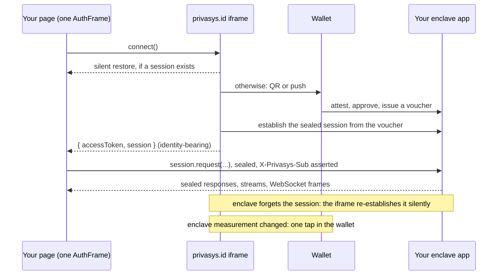

import { Cards, Card } from 'fumadocs-ui/components/card';

This tutorial takes a web front end for an app running on Privasys from nothing to a signed-in user talking to the enclave over a sealed channel. It uses a React provider as the worked example, because that is where most integrations go wrong: not in the first call, but in what the page does when something changes underneath it. By the end you will have a page that signs in, calls the enclave, receives live updates, and recovers from an idle timeout, an app upgrade or a platform upgrade without the user noticing more than one tap.

<Callout type="info">
The SDK reference is on the [Auth SDK page](/solutions/privasys-id/auth-sdk). The protocol and its trust argument are on [Sealed Session](/technology/sealed-session). This page is the how.
</Callout>

## What you are building



Three things to hold on to:

- **The page never holds a secret.** The sign-in UI, the tokens and the sealed session's key all live in an iframe on `privasys.id`. Your code gets a session object that seals on its behalf.
- **The session you get carries the user's identity.** Inside the enclave the relay asserts it to your app as the `X-Privasys-Sub` header, so your app authenticates sealed requests by reading one header and nothing else.
- **The session keeps itself alive.** Your page follows its state; it does not manage it.

## Step 1: Register your app as a relying party

Registration is operator-assisted today: [contact us](mailto:contact@privasys.org) and we register the client during onboarding. You get a `client_id`, and the whitelist of attributes your client may ever ask for is fixed on the client record.

Your enclave app also needs to serve the page itself in the clear. The enclave only serves unsealed responses for the route prefixes you declare on the app (the root document and its assets); every other route must be reached through the sealed session. Keep the page on hash routing or declare each page route.

## Step 2: Load the SDK

Load the hosted client bundle or install the package. The bundle is the usual choice for an app shipped as an image: one reviewed file, no package dependency, and no keys in it.

```html
<script src="https://privasys.id/auth/privasys-auth-client.iife.js"></script>
```

```ts
const { AuthFrame } = window.Privasys;   // or: import { AuthFrame } from '@privasys/auth'
```

## Step 3: One frame, created once

Create a single `AuthFrame` for the life of the page, on first use, and keep it. Everything below runs on that one frame.

```ts
function configuredFrame(container: HTMLElement): AuthFrame {
  return new AuthFrame({
    apiBase: 'https://api.privasys.org',
    authOrigin: 'https://privasys.id',
    rpId: 'privasys.id',
    clientId: 'my-app',
    appName: 'My App',
    brokerUrl: 'wss://relay.privasys.org/relay',
    scope: ['openid', 'offline_access'],
    sessionRelay: { appHost: 'my-app.apps.privasys.org' },
    container,
    presentation: 'page',
    methods: ['wallet'],
    pitch: {
      title: 'Your data, sealed.',
      bullets: ['Requests are sealed end to end to the attested enclave.']
    },
    app: { displayName: 'My App', logoUrl: `${location.origin}/logo.svg` }
  });
}
```

<Callout type="warn">
`sessionRelay.appHost` is the app's **platform** hostname, the one the wallet attests. If your page is served from a custom domain, do not derive the host from `location`; have the app serve its platform hostname to the page (a small config script works well).
</Callout>

Two settings deserve a thought:

- **Ask for the minimum.** `scope: ['openid', 'offline_access']` signs the user in with nothing else. Adding `profile` asks for a name, and a first-time user who has not added one to their wallet is walked through adding it before the sign-in completes. Ask for an attribute only where you use it.
- **`methods: ['wallet']`** because a sealed session needs the wallet ceremony: passkeys and federated sign-in cannot open one. Leave `methods` unset only for apps with no `sessionRelay`.

## Step 4: Connect

```ts
const { accessToken, session } = await frame.connect();
```

That one call is the whole sign-in surface. On a return visit it resolves silently. When the enclave has been upgraded since the last visit it renders a one-tap approval in your container, with the wallet explaining what changed. Otherwise it renders the ceremony: QR code, or a push to a paired wallet, and on a phone a button that opens the wallet app.

It rejects with a `ConnectError`: `cancelled` when the user closed the gate, `timeout` when the approval was not completed in time, `failed` otherwise. The response to all three is the same: offer a retry that calls `connect()` again on the same frame.

The `session` is what your app talks through. The `accessToken` is a Privasys ID JWT; a sealed app rarely needs it, because identity reaches the enclave through the session itself. One use: hand it to your app inside a sealed request when you want the verified name or email the user shared, and verify it there against the IdP's keys.

## Step 5: Talk to your app

```ts
const res = await session.request('GET', '/api/v1/me');
if (res.status === 200) {
  const me = JSON.parse(new TextDecoder().decode(res.body));
}
```

`request()` seals the body and unseals the response. `res.status` is **your app's** status, carried inside the sealed envelope: a 401 or 403 here is your app's decision, and the SDK is right not to interfere with it. A small transport wrapper over `request()` is all most apps need, with one rule worth writing down: an `unsealed` 401 (`res.sealed === false`) is the enclave saying it no longer knows the session. The SDK already handles that case itself; your wrapper only needs to surface it as "try again in a moment".

On the server, inside the enclave, authentication is one header:

```go
sub := r.Header.Get("X-Privasys-Sub")   // asserted by the relay, stripped from anything inbound
if sub == "" { writeError(w, 401, "sign in required"); return }
```

The relay strips that header from every inbound request before asserting it, so nothing outside the enclave can set it.

Streams work the same way through `session.stream(...)`, which yields decrypted plaintext bytes (for server-sent events, parse them yourself).

## Step 6: Live updates over a sealed WebSocket

```ts
const ws = session.openWebSocket('/api/v1/events');
ws.onMessage((bytes) => handle(JSON.parse(new TextDecoder().decode(bytes))));
ws.onClose(({ code, reason }) => scheduleReconnect());
await ws.ready;
```

Every frame in both directions is sealed; your app inside the enclave serves a plain WebSocket on the same path, with the same `X-Privasys-Sub` header on the upgrade. Treat the socket as a notice channel and reconnect with backoff when it closes: a session that is being re-established drops its sockets, and that is normal.

## Step 7: Follow the session, do not manage it

This is the step that makes an integration feel seamless or painful. The enclave forgets an idle session after fifteen minutes and on a restart. The SDK re-establishes it silently from a voucher the wallet issued at sign-in, and it coalesces the requests that notice the loss at the same time into one recovery. What the page must **not** do is react to the first failed request by tearing its frame down and starting a new sign-in.

Instead, follow the session's state:

```ts
session.onState((s) => {
  switch (s.status) {
    case 'ok':                  // requests flow
    case 'recovering':          // silent; show "reconnecting" if you like
      break;
    case 'reapproval-required': // the app or the platform changed: one tap in the wallet
    case 'signed-out':          // the Privasys ID session ended: sign in again
      void frame.connect();     // same frame, same session object afterwards
      break;
  }
});
```

Calling `connect()` again on the same frame renders the approval (or the sign-in) in your container and, when it completes, points the **same** `session` object at the new carrier. Your transport, your open views, your in-memory state all survive. Show the gate over the app while this happens; do not unmount the app.

## A complete provider

The pieces above, as a React context. Signed-in views read `useSession()`; the gate shows over them only while the user is needed.

```tsx
const SessionContext = createContext<{ session: SealedSession; me: Me } | null>(null);

export function SessionProvider({ children }: { children: ReactNode }) {
  const gateRef = useRef<HTMLDivElement>(null);
  const frameRef = useRef<AuthFrame | null>(null);
  const recovering = useRef(false);
  const [session, setSession] = useState<SealedSession | null>(null);
  const [me, setMe] = useState<Me | null>(null);
  const [gateShown, setGateShown] = useState(true);
  const [error, setError] = useState('');

  const frame = () => (frameRef.current ??= configuredFrame(gateRef.current!));

  // First connection.
  useEffect(() => {
    (async () => {
      try {
        const res = await frame().connect();
        if (!res.session) throw new Error('no sealed session');
        setSession(res.session);
        setMe(await fetchMe(res.session));
        setGateShown(false);
      } catch (e) {
        setError((e as Error).message);
      }
    })();
  }, []);

  // Recovery on the same frame: the session object stays the same.
  useEffect(() => {
    if (!session) return;
    return session.onState(async (s) => {
      if (s.status !== 'reapproval-required' && s.status !== 'signed-out') return;
      if (recovering.current) return;
      recovering.current = true;
      setGateShown(true);
      try {
        await frame().connect();
        setMe(await fetchMe(session));
        setGateShown(false);
      } catch (e) {
        setError((e as Error).message);
      } finally {
        recovering.current = false;
      }
    });
  }, [session]);

  return (
    <>
      <div ref={gateRef} className={gateShown ? 'fixed inset-0' : 'hidden'} />
      {error && <Retry message={error} onRetry={() => frame().connect()} />}
      {session && me && <SessionContext.Provider value={{ session, me }}>{children}</SessionContext.Provider>}
    </>
  );
}
```

Sign-out is `frame.clearSession()` followed by a reload: it ends the Privasys ID session for every site that shares it.

## What happens underneath

- **The voucher.** During the ceremony the wallet attests your enclave, approves it, and uploads a signed voucher to the IdP that binds the enclave's identity key and the user's subject. The SDK establishes the sealed session from that voucher, which is why the session carries the identity, and re-establishes it from the same voucher later without the wallet.
- **Idle and restarts.** The enclave keeps a session for fifteen minutes of inactivity. The next request after that gets an unsealed 401; the SDK rebinds from the voucher and replays the request. Requests that hit the 401 together share one rebind, because the enclave budgets rebinds per session.
- **Upgrades.** The voucher pins the enclave's measurement. When your app is updated, or the platform under it, the enclave refuses the voucher and names the reason; the SDK reports `reapproval-required`, and `connect()` asks the wallet for one approval, which re-attests the new measurement and mints a fresh voucher. Nothing is signed out.
- **Renewal.** The Privasys ID access token is renewed in the background with a refresh token, coordinated across every tab and site that shares the session. That coordination is the reason for the one-frame rule.

## Mistakes that cost the most

- **Several frames.** Creating an `AuthFrame` per attempt, or per component, and destroying them around each other. Each runs a renewal; a renewal lost mid-flight signs the user out of every Privasys site. The SDK warns when a second frame is alive.
- **Rebuilding on a 401.** Treating any 401 as "connection lost" and starting over. Read `res.sealed`: an app-level 401 is yours to handle; an unsealed one is already being handled.
- **Your own retry loops.** Resuming in a loop, or asking the wallet again, when the first call did not return what you expected. The SDK's recovery is budgeted against the enclave's limits; a second loop on top of it is how a sign-in ends in a rate limit.
- **Asking for attributes you do not use.** Every attribute asked for is a consent screen for the user and, for a first-time holder, an onboarding step before your page loads.
- **Deriving the app host from the page's own address.** On a custom domain the sealed session would be attested against the wrong name.

<Cards>
  <Card title="Auth SDK reference" href="/solutions/privasys-id/auth-sdk">
    Configuration, the sealed session, states, SSO and the trust scope of the iframe.
  </Card>
  <Card title="Sealed Session" href="/technology/sealed-session">
    The protocol: the binding challenge, what each party sees, silent rebind, and what wakes the user.
  </Card>
</Cards>
