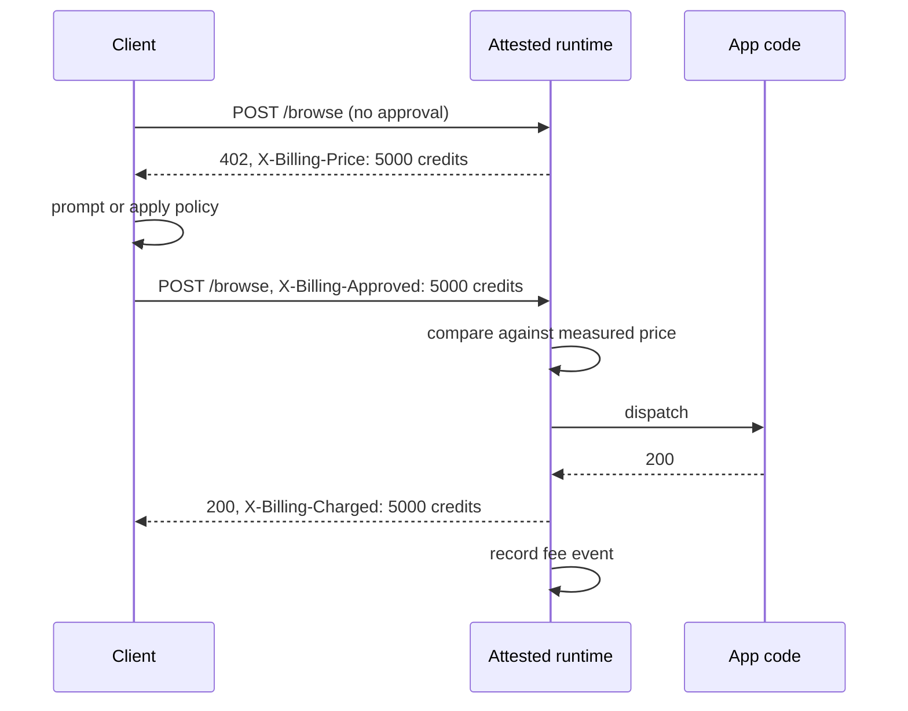

Last week we argued that per-call pricing for AI tools belongs inside the application's measurement, not in the vendor's telemetry: [AI Tools That Charge by the Call](/blog/ai-tools-that-charge-by-the-call). This post describes the implementation now live on the [Privasys developer platform](https://developer.privasys.org): how a developer declares a fee, what the wire contract looks like, where the enforcement runs in each of our two runtimes, and how a consented charge becomes settled credit.

## Declaring a price

Fees are denominated in platform credits: one pound is a million credits, so one credit is a ten-thousandth of a penny. A WebAssembly app declares the fee directly on the export, in the same WIT doc comments that declare its authentication policy:

```wit
/// Verify an identity document and return the extracted fields.
/// @auth authenticated
/// @price {"credits":5000,"payer":"caller"}
export verify-document: func(image: string) -> result<fields, string>;
```

Five thousand credits is half a penny. The build folds the rule into the app's measured configuration, the same hash that already covers [per-function authentication](/blog/per-function-auth-for-wasm-enclaves-from-wit-annotations-to-hardware-enforced-access-control), so changing a price changes the attested identity. The enclave stamps the price onto the schema it serves: whatever fetches the tool description, a developer console, the CLI, or an agent reading the MCP manifest, reads the fee off the same attested surface it reads the types from.

A container app declares the same rule on the tool entry in its manifest:

```json
{
  "tools": [{
    "name": "browse",
    "endpoint": "/browse",
    "x-privasys": { "price": { "credits": 5000, "payer": "caller" } }
  }]
}
```

For the price to be enforceable the manifest must travel inside the image, as the OCI label `org.privasys.manifest`. Labels live in the image config blob, which is covered by the digest the runtime pins and attests, so the enforced price set is measured exactly as the WIT rule is: republishing with a different price produces a different image digest and therefore a different attested identity. An image that advertises a price without carrying the label simply does not charge. Undercharging is the safe failure; overcharging is the one the design makes impossible.

## The wire contract

A priced call must carry the caller's approval of the exact price:

```
POST /rpc/my-app/verify-document
X-Billing-Approved: 5000 credits
```

The runtime compares that literal string against the measured price before dispatch. No header, or the wrong amount, and the call is refused with `402 Payment Required` and a response header, `X-Billing-Price: 5000 credits`, stating the current attested price so the client can prompt and retry. The comparison is an exact match rather than a ceiling: approving 10,000 credits for a 5,000 credit call fails, because the point is proof that the caller knew this price, and a mismatch usually means the client's schema is stale. On success the response carries `X-Billing-Charged: 5000 credits` and the fee is recorded only then; a failed call charges nothing.



The headers cannot be tampered with in transit because the TLS session terminates inside the enclave (RA-TLS, or the sealed browser session that the enclave itself unwraps). No gateway on the path can inject an approval, alter a price, or strip a charge.

## Two runtimes, one gate

In the WebAssembly runtime the gate runs in the SGX enclave, after authentication and before the guest is invoked. A caller-priced function requires an authenticated caller even when its access policy is public, since an anonymous charge cannot be attributed to an account. The refusal is produced by the measured runtime, so the enforcement code is part of what attestation vouches for.

The container runtime applies the same gate in the in-enclave manager, the measured component of the confidential VM where RA-TLS and sealed sessions terminate and every request to the app passes. It reads the price table from the image label at load time, refuses unconsented calls with the same 402 contract and the same refusal wording, stamps the charge header on delivery, and scrubs any billing header the application itself tries to assert. The app behind the proxy never sees the approval header and cannot forge a charge; billing is the runtime's job, in both runtimes.

## From consent to settled credit

Each successful priced call appends a fee event, with a sequence number and a random call identifier, to a bounded ring inside the enclave. The platform pulls these events and settles them against the credit ledger, idempotently on the call identifier, so retries and re-reads can never double-charge. The payer's account is debited the full fee; the developer's account is credited 85 per cent and the platform keeps 15. A call by the app's own account settles to nothing. Earnings accrue in credits, offset the developer's own compute bill, and cash out by invoice: self-serve payouts stay switched off until there is enough volume to justify the payout infrastructure.

## The limits

Pricing is a flat fee per successful call; metered quantities (per token, per megabyte) are not yet expressible, so a tool with highly variable cost either prices at the average or splits into differently priced tools. The declaration format admits a `free_for` exemption class for wallet-authenticated users, but we keep it off production prices for now: the wallet marker on tokens is not yet attestation-grade end to end, and an exemption that can be over-granted is worse than no exemption. And a container image that carries its price only in a repository manifest, without the OCI label, advertises a fee the runtime will not collect; the platform surfaces the price either way, so keep the label and the repository manifest identical.

*Per-call pricing is live on the [Privasys developer platform](https://developer.privasys.org). Declare a price with one annotation, and try a priced call, consent flow included, against any app in the [App Explorer](https://explorer.privasys.org).*
