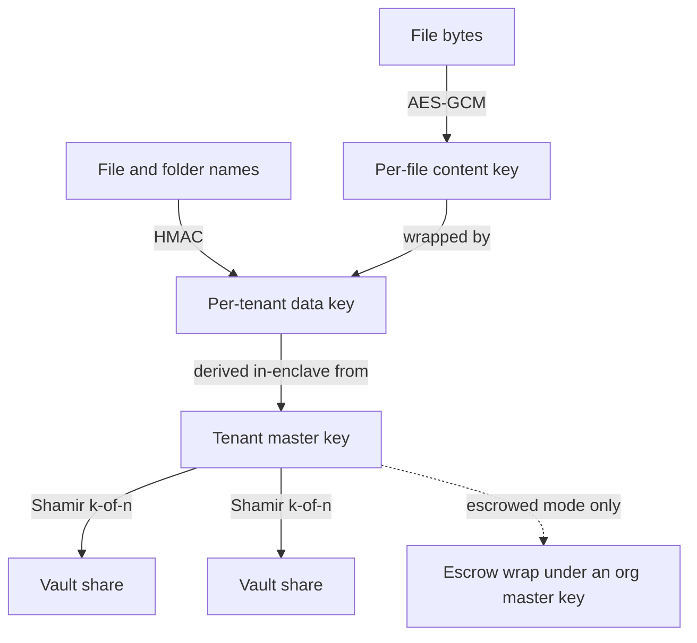

Most cloud storage is encrypted "at rest", and the phrase does less work than it sounds. Encryption at rest means the provider encrypts your files on their disks with a key the provider holds. It protects you if someone steals the disks. It does nothing against the provider itself, or against anyone the provider is compelled, subpoenaed, or persuaded to share with. For a filing cabinet of holiday photos that was a fair trade. For the store an AI assistant will soon read from, learn from, and remember you by, the trade is worth revisiting.

Privasys Drive is our attempt at storage where the provider genuinely cannot read your files, and where you can confirm that yourself. This post is about the mechanism: how files are sealed, what the key hierarchy looks like, and the difference between the two modes an instance can run in, sovereign and escrowed. A companion post covers what this substrate makes possible once an AI is allowed to use it.

## What self-sovereign has to mean

The word gets stretched, so here is the definition we hold ourselves to. A store is self-sovereign if the owner is the only party who can cause their data to be decrypted, and if the owner can verify that property rather than take it on trust. Both halves matter. Exclusive control without verification is just a stronger promise. Verification without exclusive control is a nicely audited back door.

Meeting both halves needs two things that ordinary cloud software does not have: a place to run code where even the operator cannot see memory, and a way for you to check which code is running there.

## The enclave and the sealed channel

Privasys Drive runs inside a confidential virtual machine on Intel TDX. The CPU keeps the VM's memory encrypted and isolated from the hypervisor and the host, so the operator running the machine cannot read what the Drive is working on. More usefully, the platform produces a measurement: a hash chain over the firmware, the kernel, the enclave image, and the declared configuration, which any client can request and check against expected values through remote attestation.

That measurement is only worth something if it is tied to the connection you actually use, otherwise an operator could attest a good enclave and serve you from a bad one. So the browser opens a session bound to the attestation, and the enclave proves possession of the key in the attested certificate before any bytes flow. We described that binding in [Binding Attestation to the TLS Session](/blog/binding-attestation-to-the-tls-session). Files travel sealed from your device into the enclave, and the gateway in front of it only ever forwards ciphertext.

## The key hierarchy

Confidentiality against the operator comes down to who can reconstruct which key. Privasys Drive uses three layers.

- **Per-file content keys.** Every file is encrypted with its own key under AES-GCM. Delete the file, drop the key, and the ciphertext is inert.
- **A per-tenant data key.** The content keys are wrapped under a data key derived, inside the enclave, for your tenant. Your file and folder names are sealed the same way, through a name HMAC derived from the same root, so the index is searchable inside the enclave without leaking names to the storage layer.
- **A tenant master key.** The data key descends from a master key that is generated inside the enclave and never written out whole. It is Shamir-split into shares held across a vault constellation, our [Enclave Vaults](https://github.com/Privasys/enclave-vaults), and can only be recombined by a principal the vaults recognise.

Which principal the vaults will hand shares back to is the whole game, and it is exactly what the mode decides.

## Sovereign mode and escrowed mode

An instance is set to one mode at first configuration, and the mode is part of the measured configuration, so a caller can attest which promise the instance is making. The choice is deliberately permanent for a given instance: the mode is an immutable statement to the tenants who trust it, and letting an operator quietly switch it later would drain the word of meaning. Changing it is refused.

**Sovereign mode** is the consumer default and the strong one. The master key's shares are bound so that only the attested Drive enclave, acting for you under a grant your wallet issued, can recombine them. There is no operator key, and there is no operator unlock path, ever. If every Privasys employee were served a court order tomorrow, the honest answer would be that we cannot produce your plaintext, and the attestation is what lets you confirm that claim in advance rather than discover its truth in a crisis.

**Escrowed mode** exists because organisations have obligations individuals do not: an employee leaves, a regulator asks, a laptop and its wallet fall in a river, and the company still needs its own files. In escrowed mode each tenant's master key additionally carries an escrow wrap under an organisation master key. Recovery is not a switch an admin flips. A recovery is requested by a policy-permitted requester, approved by a quorum of distinct approvers whose approvals are operation-bound WebAuthn ceremonies (a captured approval for one recovery cannot be replayed for another), and only at quorum does the enclave unwrap the escrowed key and mint a time-bounded grant. Every step is recorded, and the audit is disclosed to the affected tenant. The organisation gets a break-glass path; the employee gets a guarantee that it cannot be used quietly.

The important part is that the difference is visible. Because the mode lives in the measured configuration, a tenant can attest an instance and read back which regime governs their keys, so "sovereign" and "escrowed" are properties you can check on a specific instance rather than adjectives on a pricing page.

## Sharing without learning who you are

Sovereignty would be hollow if sharing a file quietly rebuilt a directory of who knows whom. Privasys holds no names and no email addresses. A share link carries a random secret in its URL fragment, and the service stores only the secret's hash, so the link itself never reaches a server log. An open link grants read access to whoever opens it and proves a wallet identity. A restricted link can require attributes for the owner's per-recipient approval. The mechanism behind proving an attribute without handing over the underlying document is described in [Prove It Without Giving It Away](/blog/prove-it-without-giving-it-away).

## Where the encrypted bytes live

Sealing the data lets us be relaxed about where the ciphertext sits. The default is the enclave's own sealed volume, but an owner can point the drive at an object backend they choose, and the chunk bodies are encrypted inside the enclave before they are ever written there. The backend sees opaque blobs and nothing else, which means you can keep your bytes on infrastructure you already trust for durability without extending that trust to their readability.

## What it costs and does not do

Precision matters more than a clean story, so the boundaries.

- **You trust measured code, not no one.** Attestation proves which code holds and enforces your keys. It does not remove the need to trust that code to behave. The mitigation is that the code is measured and, for the platform, open, so the thing you trust is inspectable.
- **Escrowed mode is a real recovery path.** It is quorum-gated, operation-bound, and disclosed to the tenant, but an organisation that runs it has, by design, a way to reach an employee's files under policy. That is the point of the mode, and it is why the consumer default is sovereign.
- **Metadata has shape.** We hold no names, but the existence of a file, its size, and when a link was opened are properties of any online system and are not erased by sealing the contents.
- **Confidentiality costs performance.** Sealed transport and in-enclave cryptography carry overhead that plaintext storage does not. We think it is the right trade for these files. It is a trade all the same.
- **No external audit yet.** The design is ours and the platform code is open, but the Drive has not been through independent review. Read the code, run the attestation, and hold us to both.

A store worth trusting an AI with has to first be a store worth trusting with the files themselves. That is the part this post is about: files sealed to hardware you can verify, keys only you can reconstruct in sovereign mode, and a break-glass path that is visible and governed when an organisation needs one. What changes once you let an assistant read from that store, and how it becomes a memory rather than a filing cabinet, is the subject of the next post.

*Privasys Drive is part of the Privasys confidential-computing platform. The platform code is open source under the AGPL-3.0 licence at [github.com/Privasys](https://github.com/Privasys); see [docs.privasys.org](https://docs.privasys.org) to run or verify an instance yourself.*
