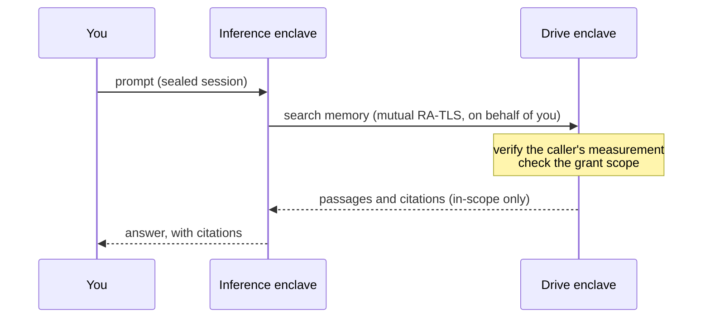

Assistants are growing memory. The useful ones no longer treat each conversation as a blank slate; they remember what you told them last week, what a project decided, which supplier you settled on. The trouble is where that memory lives. Almost universally it lands in infrastructure the user cannot see, on the assistant vendor's servers, under the assistant vendor's keys. The result is an odd inversion: the more an assistant learns about you, the less of that knowledge is yours.

We built Privasys Drive to hold that memory somewhere else. The previous post, [A Drive Only You Can Open](/blog/a-drive-only-you-can-open), covered the storage layer: files sealed to a confidential enclave you can attest, keys only you can reconstruct in sovereign mode. This post is about what happens when you let an AI work from that store, and how a sealed drive becomes a high-quality, high-performing memory for agentic work without giving up the sovereignty that made it worth building.

## From a drive to a memory

In Privasys Chat the Drive holds the conversation itself and everything the assistant remembers. A chat is a folder. Its transcript, its attachments, and the digest it distils into when you finish are all ordinary Drive files, separated only by folder and by whether they are indexed. Your durable memories, the notes the assistant keeps about you or a project, are files too, in a top-level `Memory/` folder you can open, edit, and delete like anything else.

Holding memory as files rather than as rows in an assistant database you cannot inspect buys three concrete things. It is portable, because it is a folder. It is inspectable and deletable by you, because it is files. And every guarantee from the storage layer (sealing, sovereign keys, attestation, identity-free sharing) covers the assistant's recollection exactly as it covers a PDF, because there is one substrate under both.

## Files as an attested AI tool

The hard part is letting the assistant reach that memory without breaking the seal, and the common shortcuts all break it. Uploading your files into a model's context ships them to whoever runs the model. Building a vector database of your documents copies them, in the clear, into a second system with none of the drive's guarantees. Either route spends the sovereignty you paid for at storage the instant the AI wants to be useful.

So we do not move the data to the AI. The Drive exposes a small, read-only tool surface, the shape an agent already understands: semantic search, read a section, read a file, walk the folder tree, fetch memory. Retrieval runs inside the enclave against an index that lives on the same sealed volume as the files, so the embeddings never leave. The confidential-AI enclave that answers your prompts calls those tools on your behalf.

The call is where the guarantee lives. It runs over a mutually attested channel: the Drive verifies that the caller is a genuine, measured inference enclave presenting the workload identity it expects, and refuses anything it cannot measure. A copied bearer token does not impersonate that caller, because the caller authenticates by proving its own code. What the assistant may then see is bounded by a grant you set. `Memory/` is in scope by default, because memory you must remember to switch on would not be dependable. Beyond that you choose: your past conversations, specific folders, or the whole Drive, all off by default. A folder you leave off cannot be searched and does not appear.

The net effect is that the only reader of your assistant's memory is an attested program, acting under a grant you control, over a channel that refuses to talk to anything it cannot verify. That is what makes the memory self-sovereign rather than merely private.

## Why a memory tree, and not only a vector search

It is fashionable to treat retrieval as solved: embed everything, rank by similarity, paste the top matches into the prompt. That works for a document you are searching and fails for a memory you reason from. A vector index answers "what is most like this query?", but doesn't answer "what is there?". If the assistant is deciding what it knows about you or a project, it cannot miss a memory because the wording did not rhyme with the question. Memory needs enumeration, which similarity search alone cannot give.

So `Memory/` is served as a tree. When the assistant opens its memory it receives either the whole thing inline, if it fits within a token budget, or a tree of titles and one-line descriptions with lazy drill-down into the entries that prove relevant. Either way it sees a complete index of what it knows before it decides what to read in full. Nothing hides behind a similarity threshold. A thousand memories become an index the assistant scans rather than a lottery it might lose, cheap enough to hold in context and honest about coverage.

The documents you ask about, rather than the memory you reason from, are where search earns its place, and there the effort goes into context quality. Every file is given a deterministic structure first: a section tree with stable anchors, rebuilt identically on each reindex, so the document's shape exists before a single vector does. Text is chunked along those sections into 1,600-character windows with 200 characters of overlap, embedded with Qwen3-Embedding (1,024 dimensions), and each chunk records the absolute character range it came from. When the assistant retrieves a passage, that passage resolves to a real span in a real file, so a citation points at the source rather than at a paraphrase the model may have invented. Provenance falls out of anchoring retrieval to structure. On [reproducible, verifiable inference](/blog/reproducible-inference-and-the-accountability-gap) this compounds: a checkable answer needs checkable sources.

## Views on one sealed store

A memory is more useful seen from several angles, and much of the Drive is about offering different views onto the same sealed bytes without copying them out. There is the folder tree you browse and share. There is the memory tree the assistant reasons from. There is a knowledge graph: as documents are indexed and memories written, typed links between them (citations, wiki-style references, containment) are extracted, so the drive is a connected structure you and the assistant can traverse. There are conversations, each a folder that finalises into a cited digest, so a finished chat leaves a durable searchable note. Each view is generated inside the enclave from the one encrypted store, under the one set of grants, covered by the one attestation, so a new lens never becomes a second, weaker home for the data.

## A brain, personal or per project

The grant is what turns this from a memory feature into a workspace primitive. Because scope is something you set and the assistant strictly obeys, the same machinery gives you two shapes of brain from one drive.

A **personal brain** scopes the assistant to your whole Drive and your accumulated `Memory/`: it knows your history, your correspondence, your standing preferences, and carries them across every conversation. A **project brain** scopes it to a single folder, the documents and decisions for one piece of work, so an agent running an agentic workflow over that project sees exactly that project and nothing of your private life. Share the folder with a colleague under the same drive, and you have a shared project brain whose contents are still sealed to the enclave and still governed by grants, not a copy sitting in a vendor's account. Switching between them is a scope change, not a migration, because there is only ever the one sealed store underneath.

For agentic work the two properties that matter are quality and speed, and the architecture is built for both. Quality comes from enumeration where recall must be guaranteed and anchored, cited retrieval where precision matters, so an agent making a chain of decisions is working from complete memory and verifiable sources rather than a lucky sample. Speed comes from keeping retrieval next to the data inside the enclave, embedding in batches, and scoping every search to a grant so the index the agent queries is only ever as large as the work in front of it. A tightly scoped project brain is both safer and faster than pointing an agent at everything you own.

## What it costs and does not do

The boundaries, plainly.

- **The inference enclave sees what it retrieves.** Retrieval stays inside the Drive, but the passages it returns are read by the confidential-AI enclave so it can reason over them. That enclave is itself attested and sealed and receives only what your grant allows, but the trust boundary genuinely spans two enclaves. You verify both by attestation; you do not get reasoning over text that no measured code sees.
- **Document search is similarity, with its limits.** The enumeration guarantee applies to the memory tree. Search over the wider document corpus is ranked retrieval and can still miss a passage that embeds poorly, which is why the memory you reason from is enumerated rather than searched.
- **Confidentiality costs performance.** In-enclave retrieval and mutual attestation add overhead a plaintext vector store next to a plaintext model does not carry. Scoping keeps it in check; it does not make it free.
- **No external audit yet.** The design is ours and the platform code is open, but the AI integration has not had independent review. Read the code, run the attestation, and hold us to both.

Assistants are going to keep getting better memories. The question is whose. Privasys Drive puts that memory in a store sealed to hardware you can verify, lets the assistant reach it only as an attested tool under a grant you set, and makes every view of it a lens rather than a leak. What that produces is a brain whose substrate you own: it remembers what you tell it, reasons over what you allow, cites what it uses, and forgets what you delete, with none of it readable by us.

*Privasys Drive is part of the Privasys confidential-computing platform. The platform code is open source under the AGPL-3.0 licence at [github.com/Privasys](https://github.com/Privasys); see [docs.privasys.org](https://docs.privasys.org) to run or verify an instance yourself.*
