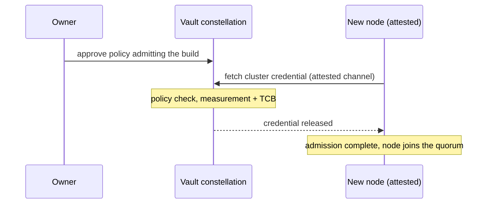

Confidential computing gives a business a strong answer on privacy and a new problem on availability. Once a workload runs in an enclave, its guarantees are anchored to one physical machine, and machines fail, get patched, and get decommissioned. For a service that customers depend on, "the data is safe but the server is down" is not an acceptable operating posture, and neither is a disaster-recovery plan that quietly abandons the guarantees the enclave was chosen for.

The standard tools do not transfer well. Conventional database replication assumes the replicas' operators are trusted, which is the assumption confidential computing exists to remove. Managed high-availability services can restore a replica from backup at will, and a legitimate restore is indistinguishable from the attack that matters most against enclaves: rolling state back to a favourable past. Running two independent enclaves by hand leaves the hardest question unanswered, namely which one is authoritative when they disagree. What a confidential workload needs is replication in which the machines themselves remain untrusted.

[Enclave Cluster](https://docs.privasys.org/solutions/enclave-cluster/overview) is that system: several SGX enclaves, on several machines, operating as one logical enclave. It is built on the [tamper-evident Merkle store](/blog/tamper-evident-state-for-confidential-computing-the-enclave-os-merkle-store) and Raft consensus, and it is engineered end to end for a threat model in which every node's code is measured and honest, and every node's host is an adversary who can crash, delay, partition, and roll back disk.

## What a customer gets

**Continuity without widened trust.** The cluster commits a change once a majority of nodes has accepted it, so losing a machine loses nothing. A replacement node joins, proves its identity by attestation, receives state, and is promoted through a membership change recorded in the replicated log itself. Peer connections are mutually attested TLS between enclaves, using the challenge-bound certificates described in [Binding Attestation to the TLS Session](/blog/binding-attestation-to-the-tls-session), so a machine that cannot prove it is running an approved build cannot even open a connection, let alone vote.

**Membership the data owner controls.** Which enclave builds may participate is written in one place: the policy of a key held by an [Enclave Vaults](/blog/enclave-vaults-rethinking-secrets-management-for-the-age-of-confidential-computing) constellation. Every node must fetch the cluster's credential from the vaults, on every boot, and the vaults release it only to an enclave the policy admits. Fetching the credential is admission. Upgrading a cluster is therefore an owner-approved policy change followed by a rolling restart, the same approval ceremony our platform already uses for [enclave upgrades](/blog/upgrading-an-enclave-without-handing-it-your-data), and revoking a build takes full effect at the affected nodes' next restart, because nodes keep no local copy of the credential.

**Rollback answered in the protocol.** A host restoring last week's disk is the cheap, deniable attack against stateful enclaves, and the cluster treats it as a first-class case rather than an edge case. Voting rights live in the replicated membership, tagged with a per-boot incarnation, so a restarted node cannot vote again until the quorum re-admits it, and the record that prevents double-voting sits in the log the attacker does not control. State continuity is confirmed the same way: every node reports the ledger root it computed for each applied entry, an entry counts as verified only when a quorum agrees on the root, and a node serving rolled-back state diverges visibly, gets attributed, and is repaired or halted.

**Evidence you can hand to an auditor.** Any node will serve a commit certificate: a quorum-signed P-256 attestation of the cluster's state at a given log position, verifiable offline against signing keys registered through the replicated log. Archived over time, the certificates form an append-only history of what the cluster agreed to, checkable years later without trusting any single machine or talking to the cluster at all.

**Business logic with the same guarantees.** Applications run as WebAssembly components against the replicated ledger, in the [component model we use across Enclave OS](/blog/webassembly-inside-enclaves-a-new-model-for-confidential-applications). A transaction executes against a fork of the committed state and commits atomically or not at all. In replay mode the cluster goes further and stops trusting even the proposing node: every replica re-executes each transaction deterministically and applies it only if it reproduces the identical result, so a corrupted or coerced leader cannot smuggle a wrong answer into the ledger.

## Bring your own constellation

Enterprises that must not depend on our control plane can run the cluster entirely on their own infrastructure: their own vault constellation addressed directly in configuration, key-creation grants issued by their own identity provider, and the attestation verifier of their choice. Every admission, upgrade and revocation property above carries over unchanged, because all of them derive from the key policy rather than from our platform. We verified the full lifecycle in both deployment modes, eleven scenario assertions each, on live SGX hardware against a live constellation.

## Costs and limits

Consensus is not free: a write costs a network round trip to a quorum on top of the enclave and storage work, so the cluster suits systems of record rather than caches. Availability follows quorum arithmetic, two of three or three of five machines must be reachable, and a full-cluster outage recovers through a deliberately long leaderless timeout as part of the rollback defence.

Replay mode constrains applications to deterministic behaviour, which is a real engineering discipline, with randomness and clocks supplied by the runtime. Throughput and latency figures on reference hardware will accompany a later post once we have numbers worth publishing, and like the rest of the stack the implementation is reproducible and open but not yet independently audited.

The principle underneath the whole design is short: in a confidential deployment, no machine-local fact should be load-bearing. A vote, a root, a key, a peer identity each has to be confirmed by the quorum, anchored in the vaults, or bound to a fresh attestation. That is what makes several machines one enclave.

*Enclave Cluster is open source under the AGPL-3.0 licence at [github.com/Privasys/enclave-cluster](https://github.com/Privasys/enclave-cluster), with operator runbooks and the full architecture on [docs.privasys.org](https://docs.privasys.org/solutions/enclave-cluster/overview).*
