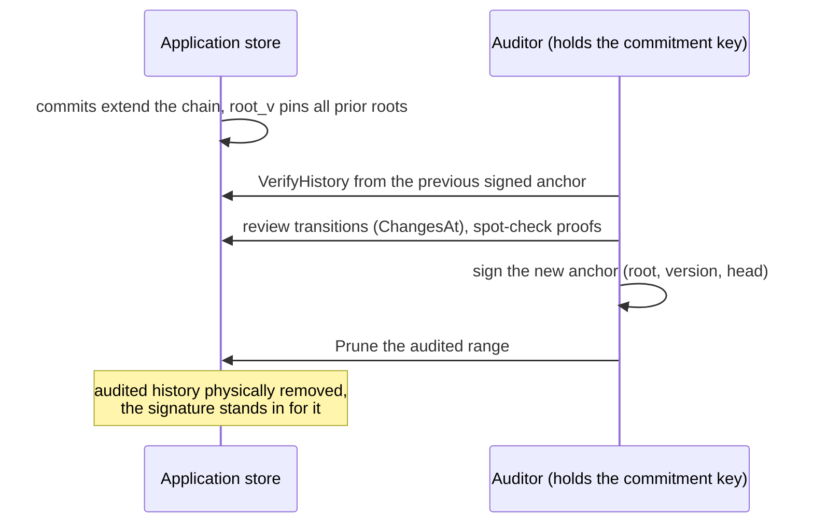

Our last two posts covered tamper-evident state for SGX enclaves: the [Merkle store](/blog/tamper-evident-state-for-confidential-computing-the-enclave-os-merkle-store) that condenses an enclave's entire dataset into one 32-byte root, and [Enclave Cluster](/blog/one-logical-enclave-enclave-cluster), which replicates that root across machines. Most confidential workloads on our platform, though, do not run as SGX enclaves. They run as ordinary containers, written in Go, inside attested confidential VMs, reading and writing a LUKS-encrypted data disk. The disk encryption answers the confidentiality question. It says nothing about whether the bytes coming back are complete and current, and it gives a customer's auditor nothing to check: the database inside the VM is as opaque to them as any other.

Regulated customers ask for two properties at once, and common designs deliver only one. They want state they can verify: proof that a record was present, that a deletion took effect, that the dataset the service acted on last quarter is the one being attested today. And they want data they can genuinely erase, because retention schedules and erasure duties are law, defensible deletion is part of the compliance story, and an append-only ledger that must be replayable from genesis can never honour them. Verifiability is usually built by keeping everything; erasure is usually implemented by giving up verifiability for the deleted range. immutable-ledger is our answer to holding both.

## One root for the whole database

[immutable-ledger](https://github.com/Privasys/immutable-ledger) is an open-source Go library, embedded in the application process, that stores data as a versioned sparse Merkle tree over any key-value backend (a production [Pebble](https://github.com/cockroachdb/pebble) adapter ships with it). Every read is verified against an in-memory root before the application sees it; stale data, dropped keys and resurrected deletes surface as errors. Every commit is one atomic batch that produces a new immutable version. For any key the store emits a compact proof of presence or absence that a pure function can check against just the root, with no access to the store, the VM or Privasys.

The commitment scheme is byte-identical to the Rust implementation inside [Enclave OS (Mini)](https://docs.privasys.org/solutions/enclave-os/enclave-os-mini/merkle-store): a Go store in a confidential VM and an SGX enclave sharing the same commitment key produce the same root for the same logical data, and proofs verify across implementations. The root is independent of encryption at rest by construction, so replicas compare entire datasets as one `(version, root)` pair whatever each side does on disk. By default there is a single key to manage: inside a confidential VM the attested LUKS volume is the confidentiality layer, and the ledger adds integrity on top. Deployments that want defence in depth can enable a second, application-level encryption key without changing a single root or proof.

## SQL, with the root doing the attesting

Applications rarely want a key-value interface for business data, so immutable-ledger runs MySQL-dialect SQL over the ledger, using [go-mysql-server](https://github.com/dolthub/go-mysql-server) (Apache-2.0) as the embedded query engine. Rows and the catalogue are ordinary ledger entries: **the root attests the whole database**, identical SQL histories produce identical roots, and `VerifiedGet` returns any row together with its inclusion proof and the exact `(root, version)` it was read at. Joins, aggregation, window functions, CTEs and secondary indexes are available; ordered scans come from a derived keyspace that is treated strictly as an index, with every returned row re-read and verified through the ledger.

Multi-statement transactions work the way the ledger works. `BEGIN … COMMIT` buffers a transaction in the session, later statements read their own earlier writes through every path, and the commit lands as one atomic ledger version, so the root history only ever contains committed states and a crash mid-transaction needs no recovery. Concurrency is optimistic: a transaction whose touched rows were changed by a concurrent commit fails with a retryable conflict error instead of silently losing an update.

The engine is in-process with no network listener, and for a confidential application this is the required shape, since the privacy layer must be integrated with the data it protects. Confidential computing attests a program; the guarantees a user receives are only as strong as the boundary that program controls. Every request reaches the data through the application's own business logic, under its consent checks and disclosure rules, inside the attested process, and the answers it gives are backed by the same root the attestation pins. A standalone database server with open querying would move the data behind an interface the attested application no longer mediates, and the confidentiality story would end at that port.

On a standard 8-vCPU cloud VM with an SSD, the full stack (SQL engine, ledger, Pebble, synced commits) inserts about 7,500 rows per second in batched statements, serves a point `SELECT` in 281 µs and a `VerifiedGet` with its proof in 224 µs, and scans verified ranges at roughly 6,700 rows per second. Batched writes are CPU-bound on commitment hashing at 5,000 to 7,000 rows per second per core; single-statement commits are bound by the WAL fsync. The [benchmarks](https://github.com/Privasys/immutable-ledger/blob/main/docs/benchmarks.md) document the exact machine, the numbers and how to reproduce them.

## History a government can audit, then erase

The audit model rests on state commitments rather than a replayable operation log, and that choice is what makes erasure possible. With the optional history chain enabled, every commit folds a hash link over the previous root into the state itself, so **the current root commits to the entire sequence of roots before it**. Rewriting or forking history and staying consistent with the live root would require a preimage attack. Versions are retained between audits, and the transitions of any version can be extracted as a structural diff whose cost is proportional to what changed.

The intended workflow is audit, sign, prune. At each audit, the auditor verifies the chain from the previous signed anchor to the live root, reviews the changes as deeply as the engagement requires, signs the new `(root, version, head)`, and prunes the audited range. Pruning physically removes every superseded and deleted value, chain segment included; the signed anchor stands in for the discarded history from then on, exactly as a signed audit report stands in for the working papers behind it. Deleted data therefore persists at most until the next audit, which makes the audit cadence a stated, bounded erasure latency that a data-protection officer can put in a policy.

Audits are owner-side or delegated, since verifying content requires the dataset's commitment key. Third parties without the key can still verify root lineage and detect forks, which is the right split for confidential deployments: the operator proves continuity to the world and content to those entitled to see it. The full model, including the exact link function a second implementation must reproduce, is in the repository's [auditing guide](https://github.com/Privasys/immutable-ledger/blob/main/docs/auditing.md).

## Costs and limits

The store is single-writer: writes serialise behind the owning application, which matches the one-application-one-dataset model but caps write concurrency at the numbers above. Verified range scans pay roughly 150 µs per row because rows are never trusted from the index, which is the price of the property. The SQL surface is a subset: foreign keys, `DECIMAL`, `JSON` and non-binary collations are not yet supported.

The volume is encrypted, so a rollback could only be owner-led: restarting the store from an earlier snapshot of its own disk. Everyone can inspect the root and every commit chains it forward, so someone will hold a newer one, and a rewound store can never verify against it.

When history mode is activated, the audit cadence drives the erasure latency. Any missed audit extends it, which could be problematic for GDPR compliance.

The principle carried over from the rest of the platform is unchanged: a user should be able to verify what a service did with their data, and the service should be able to stop holding data it no longer needs. One 32-byte root now does both jobs for a whole SQL database inside a confidential VM.

*immutable-ledger is open source under the AGPL-3.0 licence at [github.com/Privasys/immutable-ledger](https://github.com/Privasys/immutable-ledger), with the audit model and measured performance documented in the repository.*
