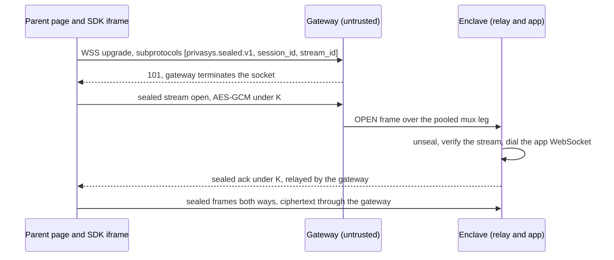

[Session relay](/blog/bringing-attestation-to-the-browser-the-session-relay-pattern) gave a browser a confidential channel into an attested enclave. The user's wallet verifies the quote, the identity provider binds a session key to that verification, and from then on every request body is sealed in the SDK iframe with AES-256-GCM and unsealed inside the enclave. The gateway that terminates the public TLS handshake sees only ciphertext. Sealed request and response work that way today, and so does server-to-client streaming over Server-Sent Events.

Some applications need more than a request at a time. A collaborative editor, an interactive agent that revises its answer while you keep typing, a live dashboard that both pushes and receives: these want a WebSocket, one long-lived connection with frames travelling in both directions whenever either side has something to say. A browser WebSocket has the same blind spot as the rest of the browser. It cannot parse a TDX quote, it will not open a self-signed RA-TLS connection, and it cannot even set an `Authorization` header on the upgrade. The constraint from the session-relay work still holds: the only entity that verifies attestation is the user's own device, and no box in the middle makes a security decision on its behalf.

## Why the obvious answers fall short

The standard way to run a WebSocket through a reverse proxy is to terminate it at the proxy and forward plaintext frames to the backend. That is fine when the proxy is trusted. Ours is not, by design. The gateway never holds the session key, so the application data crossing it stays sealed the whole way, from the browser to the enclave and back, and the gateway only ever relays ciphertext it cannot read.

The other option is to approximate a two-way channel with the primitives we already ship: stream events down over sealed Server-Sent Events, send messages up as sealed POSTs. That works, and for many workloads it is enough. It is not a WebSocket. There is no client-initiated frame on an idle connection, and the round-trip and connection overhead show up in anything latency-sensitive or genuinely interactive.

## Sealing the WebSocket itself

So the WebSocket is sealed at the message layer, the same way requests are. Every application message, in either direction, is one binary frame carrying an AES-256-GCM sealed envelope under the session key. The SDK seals in the `privasys.id` iframe, where the key lives, and bridges the socket to the parent page over `postMessage`. Inside the enclave, the session relay unseals each frame and forwards the plaintext to the application's own WebSocket on the same path, then seals the application's replies on the way back. Plaintext never leaves the enclave, and everything between the iframe and the enclave carries ciphertext it cannot read.

A browser WebSocket cannot present a bearer token, so the session id and a fresh random stream id ride the `Sec-WebSocket-Protocol` subprotocol list. Each stream derives its own pair of nonce prefixes from the session key, with the stream id folded into the derivation and into the authenticated data of every frame. That gives every WebSocket an independent keystream: one session can hold many concurrent sockets, reopen them freely, and no two frames anywhere can ever collide on a nonce or be replayed onto another stream. Frames are counter-ordered in both directions, and a replayed or reordered frame closes the socket. The client's first sealed frame opens the stream and the enclave answers with a sealed acknowledgement, so the channel is proven end-to-end before any application data flows.

## Built for a small enclave and a large audience

An enclave is a deliberately bounded machine, and long-lived connections are exactly the resource that grows with an audience. So the WebSocket transport is multiplexed at the gateway: the gateway terminates each browser's WebSocket, owns the protocol state and the keepalives, and carries every sealed frame over a small pool of long-lived attested connections into the enclave, tagged with the session and stream it belongs to. The enclave demultiplexes, unseals, and talks to the application. A thousand connected browsers cost the enclave a handful of connections, not a thousand.

The division of labour is the point: the gateway does the connection housekeeping, which needs no secrets, and the enclave does the cryptography, which needs no connection sprawl. The routing header the gateway writes is authenticated end-to-end, because the stream open only unseals inside the enclave if the SDK derived the same session, path and stream into its keystream.

For the adopter it is one call on the sealed session, `openWebSocket(path)`, returning an object with `send`, `onMessage`, `onClose` and a `ready` promise. The sealing, the counters, the stream handshake and the multiplexing are handled underneath.

## What it does not do

The channel inherits the whole trust argument of session relay, and its limits too. Attestation is still verified once, by the user's wallet, and the WebSocket is bound to that same session. A WebSocket cannot be silently rebound the way a sealed request can: if the enclave evicts the session, the socket closes and the caller re-establishes it. The application still serves its own plaintext WebSocket inside the enclave, the relay is a sealing intermediary in front of it, and every message pays for one AES-GCM seal and open. None of that changes the property we care about: the sealed frames on the wire are readable only by the enclave the user attested and the iframe that shares its key.

*The Privasys auth SDK ships the sealed WebSocket client; the session-relay design and its trust model are documented at [docs.privasys.org](https://docs.privasys.org/solutions/enclave-os/attestation/ra-tls).*
