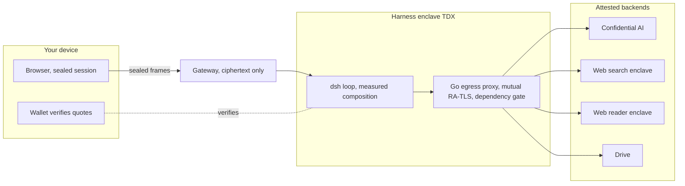

Confidential inference is necessary for a private AI agent, and it is nowhere near sufficient. An agent is a loop: the model proposes, tools execute, results feed back into the context. Run the model inside a sealed enclave and you have protected exactly one leg of that loop. The moment the agent calls a search API, fetches a page, reads a file store, or connects to an MCP server, your context travels to whatever operates that endpoint, under whatever terms it chooses. An agent that connects to all sorts of services without control cannot be confidential, whatever hardware the model runs on. The tools see the queries, the queries carry the context, and the context is the conversation.

So the interesting engineering object is the thing that owns the loop: the harness. It decides which model serves each step, which tools exist, what leaves the machine and where it goes. If you want a sovereign, privacy-preserving agent, the harness is where sovereignty and privacy are either enforced or lost.

## Why the common answers fall short

The hosted agents are genuinely good products. Copilot, Claude and ChatGPT ship polished loops, strong models and growing tool catalogues. Their design couples the agent to the provider: the loop runs on the provider's infrastructure, the transcript accumulates there, and the tool connections are brokered there. You are asked to trust a policy, and you cannot check it. For personal use that is a trade many people accept. For an enterprise whose prompts contain contracts, code and client data, a policy is not an artefact you can audit.

Running an open-source agent on your own machine inverts the problem. Now you hold the transcript, but the model is usually still a remote API, the tool traffic still goes wherever the tools live, and nobody else can verify anything about your setup. Self-hosting gives you control without verifiability, the hosted products give you polish without control, and neither gives you a loop whose privacy properties a third party can check.

## A harness worth building on

[DeepSeek Harness](https://github.com/deepseek-ai/deepseek-harness) (dsh) is a few weeks old, MIT-licensed, and became the fastest-starred repository in GitHub's history. The stars are deserved, and for an architectural reason rather than a branding one: in dsh, everything is a plugin. The agent loop, the tools, the model adapters, the session log, the web UI, all of it composes declaratively at boot from profiles, bundles and config patches, and the composed tree can be printed and inspected. There is no hidden wiring to audit around.

That architecture happens to be exactly what confidential computing needs, even though dsh was not built for it. A declarative composition can be frozen and measured. A plugin roster can be replaced wholesale. A documented seam can be pointed at an attested backend instead of a vendor cloud. We did not have to fork the loop to change whom it trusts.

## What we built

Privasys Harness is dsh running inside an Intel TDX enclave as a confidential platform app, with the attestation substrate of the Privasys platform around and beneath it.

The composition is part of the attested identity. We pin dsh at an exact commit, replace its default roster with an allow-list bundle, and the build fails if upstream moved under any of our patches. The composed tree is asserted at build time: the agent core must be present, and none of the excluded plugins (the vendor-cloud search, the telemetry reporting, the sample content) may reappear. What runs is what was measured, and the measurement is what your wallet verifies.

Attestation authority lives in a small Go proxy. Every outbound leg, the model calls and every tool call, goes through an egress proxy inside the same enclave that speaks [mutual RA-TLS](/blog/binding-attestation-to-the-tls-session) and enforces the app's declared dependency set fail-closed. The model is [Confidential AI](/blog/ai-tools-that-charge-by-the-call), attested per request, with no bearer keys leaving the enclave. Each tool is a separately attested enclave: web search, a web reader, and [Drive](/blog/a-drive-only-you-can-open). The dependency set is itself part of the app's identity and is rendered in your wallet at consent time, so you approve not just an app but the exact set of services it may call.

The browser reaches the harness over the sealed transport: every request and every [WebSocket frame](/blog/a-two-way-sealed-channel-websockets-over-the-session-relay) is sealed with AES-256-GCM under a session key that only your device and the enclave hold. The gateway relays ciphertext it cannot read. And the verification is in the product, not the brochure: a Secure Hardware Attestation panel shows the live quote of the harness enclave with a challenge you can regenerate, and every tool call in the trajectory view carries an Attestation tab that checks the tool's enclave against the measurement pinned in the dependency set.

## What it costs and cannot do yet

dsh is a developer preview that evolves at light speed. We have pinned the alpha-2 release, we will re-pin at the next one, and each upgrade is a new measured image version. A deployment is currently one trust domain: teams sharing an instance share its workspace, and the per-user isolation rails (per-user keys, capability binding to the signed-in session) are yet to be implemented. The tool catalogue is deliberately small, because every tool must be an attested enclave before the agent may call it; you cannot yet point the harness at an arbitrary MCP server, and when external, non-attested services do become composable they will be labelled as such, never green-badged. An enclave costs performance: sealing, attestation handshakes and confidential hardware all tax latency, which we consider well spent.

## The design we believe in

Most AI companies are currently building agents and driving adoption of their agent. We believe the durable shape is the opposite: you own and customise your agent, and your agent connects to and consumes AI services on your terms. That is the open design the internet ran on for decades, clients and services meeting over protocols rather than inside one vendor's walls, and agents should return to it. A harness in an enclave makes that stance verifiable: the loop runs on measured code, the services it consumes are attested, and nobody in the middle, including us, can read what you and your agent are working on.

*Privasys Harness is open source under the AGPL-3.0 licence at [github.com/Privasys/harness](https://github.com/Privasys/harness), building on the MIT-licensed [DeepSeek Harness](https://github.com/deepseek-ai/deepseek-harness). The attestation substrate is documented at [docs.privasys.org](https://docs.privasys.org).*
