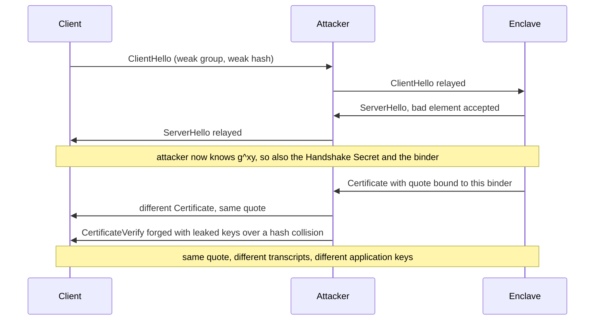

In July we [shipped a fix](/blog/2026-07-09-binding-attestation-to-the-tls-session) for the relay weakness in intra-handshake attested TLS (CVE-2026-33697): a 32-byte binder derived from the TLS 1.3 key schedule, folded into the hardware quote so that a quote produced for one connection cannot be presented on another. The researchers who found the weakness rate such a fix at "Level 2" of their binding hierarchy, and their paper states that Level 3, binding the quote to the key that actually encrypts application data, "may not be possible to achieve in intra-handshake attestation alone without additional assumptions". On that basis they have recommended, on the Confidential Computing Consortium attestation list, that every vendor move to post-handshake attestation, and an [IETF draft published on 1 September](https://www.ietf.org/archive/id/draft-intra-handshake-fail-18.html) raises that to a MUST and announces further CVEs. We ran their own ProVerif model against our implementation to find out what the additional assumption is. It is that TLS 1.3 is TLS 1.3. Against a compliant TLS 1.3 stack, Level 2 and Level 3 do not differ in what an attacker can do, and the model proves it.

## The claim

The paper defines three levels at which attestation evidence can be tied to a TLS connection, seen from the client. Level 1 ties it to the Diffie-Hellman shared secret. Level 2 ties it to the client's handshake traffic key, which depends on the shared secret and the transcript through ServerHello. Level 3 ties it to the client's application traffic key, which additionally depends on Certificate, CertificateVerify and the server's Finished message. The quote travels inside the Certificate, so it is signed before those last three messages exist and cannot commit to them directly. The authors formalise each level as a correlation property in ProVerif: if client and server accept the same evidence, they hold the same key at that level. Their proposed binder proves Level 1 and Level 2. Level 3 comes back false, with an attack trace, and they conclude the ceiling is structural.

The structural half of that argument holds. A quote emitted mid-handshake commits to the Handshake Secret and to nothing later. The question is whether the gap between "committed to the Handshake Secret" and "committed to the application key" is something an attacker can use.

## What the attack trace needs

The published artefacts include the full ProVerif log for the proposed binder, and the trace that refutes Level 3 is in it. For client and server to end up sharing a quote while deriving different application keys, four things have to hold at the same time:
1. The server negotiates a weak Diffie-Hellman group and accepts a bad group element, so the attacker knows the shared secret, hence the Handshake Secret, hence the binder.
2. The server negotiates a weak hash and the attacker forges CertificateVerify over a hash collision.
3. The enclave's TLS private key has leaked.
4. The server's long-term certificate key has leaked as well.

The first two conditions do not exist in TLS 1.3. RFC 8446 defines no weak groups, requires endpoints to validate key shares (sections 4.2.8.1 and 7.4), and has no cipher suite below SHA-256. The model includes them on purpose, to capture two real attacks on older protocol versions: Logjam (2015), which downgraded a TLS 1.2 handshake to 512-bit export-grade Diffie-Hellman groups the attacker could break, and SLOTH (2016), which exploited MD5 and SHA-1 collisions in TLS signatures to forge handshake transcripts. Both are dead in TLS 1.3, and every other agreement property in the same model excludes them on its right-hand side. The three relay properties are the only ones written without those exclusions. [Nathanael Ritz pointed this out](https://lists.confidentialcomputing.io/g/attestation/topic/120068492?msg=326#msg326) on the CCC attestation list on 1 July, after reproducing the artefacts, and was told his demonstration checked only limited traces. So we checked all of them.

## Running their model against our binder

We rebuilt ProVerif 2.05, the version used for the published results, and took the authors' `proposal` model unchanged apart from a few marked lines. First we substituted our binder for theirs. Ours is `HKDF-Expand-Label(client_handshake_traffic_secret, "privasys-ratls-binder-v1", Hash(ClientHello..ServerHello))`, computed by our [rustls](https://github.com/Privasys/rustls) and [Go](https://github.com/Privasys/go) forks at the moment the Certificate is emitted, and folded into the quote as `SHA-512(SHA-256(SPKI) || nonce || binder)`. Their binder is a different HKDF over the same two inputs, the Handshake Secret and the transcript through ServerHello. The results match line for line: Level 1 true, Level 2 true, Level 3 false with the same four-condition trace.

Then we made the modelled endpoints compliant with TLS 1.3. Four guards: the client offers only a strong group and a strong hash, the server accepts only those, and both sides reject a bad group element as a key share. Nothing else changed. The processes that leak the enclave's TLS key, the long-term key and the attestation key all keep running, so the adversary is still the one from the CVE, holding keys extracted from a broken enclave. The Level 3 query is the authors' own, verbatim.

| Model | G1 | G2 | G3 |
|---|---|---|---|
| Authors' binder, authors' model | true | true | false |
| Privasys binder, authors' model | true | true | false |
| Authors' binder, compliant TLS 1.3 | true | true | **true** |
| Privasys binder, compliant TLS 1.3 | true | true | **true** |

ProVerif is sound, so "true" is a proof that no attack trace exists in the model, and the reachability checks confirm a legitimate run reaching both endpoints' acceptance events still exists, so the proof is not vacuous. We also ran the weaker variant that leaves the model alone and adds the standard exclusions to the G3 query only, in the exact shape of the authors' own G-C2 query. It proves too, with or without excluding the key leaks.

The mechanism is plain once the trace is in front of you. Inside the handshake the quote commits to the Handshake Secret. The application key is derived from that same Handshake Secret and from a transcript whose integrity is guaranteed by the Finished MAC, whose key is derived from the Handshake Secret as well. The commitment to the application key is transitive, and the only way to cut the link is to hold the Handshake Secret without being an endpoint, or to forge the authenticated transcript, and in TLS 1.3 both require cryptography the protocol does not offer. **Level 2 and Level 3 differ in what the quote commits to directly. Against a compliant TLS 1.3 stack they do not differ in what an attacker can do.**

## Why we stay inside the handshake

The alternative the researchers recommend is post-handshake attestation: complete an ordinary handshake, then run a second exchange, typically an RFC 9261 exported authenticator carrying the quote, and hold all application data until it verifies. That design has real merits. It can re-attest a long-lived connection, it copes with an enclave whose measurements change at runtime, and its binding value can be an exporter derived after Finished. We may add it as an optional tier for our own clients.

For a platform whose point is that ordinary software can talk to an enclave, the handshake is the right place. An intra-handshake quote lives in an X.509 extension. Any TLS client that can parse a certificate can carry it: `curl` with a custom CA, a browser, the Go and Rust standard stacks, a Python `ssl` context, a load balancer in passthrough mode, an HTTP library that was never told about attestation. Verification is a certificate check plus a quote check, and the deterministic path, where the quote is cached rather than session-bound, needs no changes to the client at all. Our challenge path, where the binder lives, needs our forks on both ends because the client sends a nonce and reads the key schedule, but the wire protocol is still one TLS handshake. Post-handshake attestation needs exported-authenticator support, which almost no TLS library exposes, an application-level gate that every client must implement correctly before sending its first byte, an extra round trip, and a resumption state machine that must be prevented from racing the gate. Each of those is a place for a client to get it wrong, and the guarantee is then only as good as the least careful client. A property that holds in the handshake holds for every client, including the ones written before attestation existed.

## What this does and does not say

This is a symbolic result in the authors' own model, with their abstractions: perfect cryptography apart from the modelled weaknesses, a single self-signed leaf alongside a CA-signed certificate, no PSK resumption, no 0-RTT, no post-handshake messages. "Compliant TLS 1.3" is four guards on the group, the key share and the hash, so an implementation that gets those checks wrong is outside the proof, as it is outside RFC 8446. It concerns the two bound designs, the researchers' proposal and ours.

The 1 September draft lists our [rustls](https://github.com/Privasys/rustls/releases/tag/privasys-v0.8.1) and [Go](https://github.com/Privasys/go/releases/tag/privasys-v0.5.1-go1.26.5) releases under "vulnerable implementations", citing the release notes in which we acknowledged the CVE. Those are the releases that ship the binder described above. The draft also announces further CVEs, with expected scores up to 9.8. The three critical ones published so far, all against Cocos AI, are verifier bugs: an [expected reportData accepted when empty](https://github.com/ultravioletrs/cocos/security/advisories/GHSA-4r6g-mp48-j2rw), an [expected value never copied into the quote policy](https://github.com/ultravioletrs/cocos/security/advisories/GHSA-4px3-wj2x-xx47), and, in Cocos AI's new post-handshake implementation, [stale evidence accepted next to a fresh binder](https://github.com/ultravioletrs/cocos/security/advisories/GHSA-j7r9-wq7m-6hcp). None of them concerns the binding level, and the last shows that moving attestation after the handshake does not remove the need to check what the quote commits to.

We took the argument to the researchers directly, as two pull requests on their artefacts: [#6](https://github.com/muhammad-usama-sardar/intra-handshake.fail/pull/6) with the compliant-endpoint folder, and [#7](https://github.com/muhammad-usama-sardar/intra-handshake.fail/pull/7) with a note stating the precondition of the attacks. Both were closed within hours with a reference to earlier mailing-list discussions. In the exchange that followed on the second, the authors acknowledged that a relying party whitelists the enclave measurement rather than a chip identity, and said a FAQ clarifying the precondition would follow within days. The record is there for anyone to read. For Privasys the practical conclusion is short. The Level 3 trace needs a key exchange that TLS 1.3 does not offer, and the challenge path where our binder lives exists only in a TLS 1.3 handshake: both forks derive the binder from the TLS 1.3 key schedule and present neither the challenge nor the binder on TLS 1.2, and our SGX runtime accepts TLS 1.3 only.

It also changes nothing in what we said in July about the original finding. The relay on the unbound mechanisms exists in the model, and it presupposes the enclave's private key already extracted through a broken TEE. So does the Level 3 trace, which needs that key and the server's long-term key and a downgraded key exchange and a hash collision. Every layer of the hierarchy starts from the assumption that confidential computing has already failed, and then asks what a session-level defence adds on top. We shipped the binder because defence in depth is worth having. We are staying inside the handshake because the formal analysis, once its own assumptions are applied consistently, shows nothing above it.

*The ProVerif models, patches, expected results and a CI workflow that re-runs every model against the researchers' pinned artefacts are published in the [Privasys security repository](https://github.com/Privasys/security/tree/main/attested-tls-level3) under the Apache-2.0 licence.*
