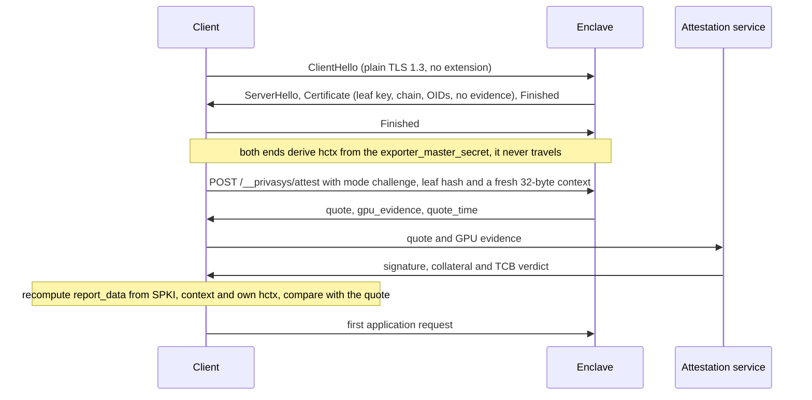

Two days ago we [published a proof](/blog/level-3-proven-attested-tls-inside-the-handshake) that our intra-handshake attested TLS reaches Level 3 of the researchers' binding hierarchy, with one precondition: the TLS stack on both ends has to be a compliant TLS 1.3 implementation. That precondition is not free. To compute a binder from the handshake secret at the moment the Certificate message is emitted, and to carry the client's challenge in a ClientHello extension, we maintained forks of [rustls](https://github.com/Privasys/rustls) and of the [Go standard library](https://github.com/Privasys/go). Every upstream release had to be merged, every security fix re-applied, and every SDK that wanted the challenge path had to build against our fork rather than the library its users already trusted. We said in July that we accepted that cost for the sake of compatibility with ordinary clients. This post describes RA-TLS v2, which gets the compatibility and the Level 3 binding at the same time, and retires both forks.

## Where the evidence lives now

In v1 the hardware quote travelled inside the X.509 certificate, so every client saw it, and a client that wanted a session-bound quote had to take part in the handshake in a way standard stacks do not support. In v2 the certificate is an identity document and nothing more. It carries the leaf key (ECDSA P-256, generated inside the enclave), a chain to the Privasys intermediate CA of its environment, and the Privasys extensions that describe what is running: runtime version hash, image profile, enclave instance id, configuration Merkle roots, workload app id, workload code digest, key source, attested dependency set. It carries no DCAP quote, no SEV-SNP report and no GPU evidence. A verifier that finds a v1 quote extension in a leaf treats it as v1 and fails closed.

For anyone who never asks for evidence the connection is an ordinary TLS 1.3 connection. `curl` with the Privasys CA sees a normal-sized chain, and so do a browser, a load balancer in passthrough mode, a Python `requests` session and a `.NET` `HttpClient`. None of them need to know that attestation exists, and the server records such connections as `attestation: none`.

A client that does want evidence asks for it on the same connection, after the handshake and before its first application byte. The runtime answers `POST /__privasys/attest` before any workload router sees the request, on the platform leaf and on every per-workload leaf. Legs that carry a non-HTTP protocol over RA-TLS (the KMIP gateway, the raft peer link) use the same two messages as a single length-prefixed frame in each direction. The request names the mode and the leaf the client received, so the server binds the evidence to the key the client actually saw even if it rotated the leaf for that name in the meantime.



## Two modes, one recipe each

The quote's `report_data` field is 64 bytes, and everything the binding proves is in how those bytes are computed. `SPKI_DER` is the DER `SubjectPublicKeyInfo` of the leaf the client received, the same structure whose SHA-256 a certificate viewer shows as "Public Key SHA-256".

```
Deterministic:
  report_data = SHA-512( SHA-256(SPKI_DER) || quote_time )

Challenge:
  hctx        = TLS-Exporter("EXPORTER-privasys-ratls-attest-v2", context, 32)
  report_data = SHA-512( SHA-256(SPKI_DER) || context || hctx )

With GPU evidence (both modes):
  report_data = SHA-512( SHA-256(SPKI_DER) || binding || SHA-256(gpu_evidence) )
```

Deterministic mode is the "trust the TEE" tier that v1 already had. The runtime mints one quote per leaf key, caches it for 24 hours, and serves it with the minute it was minted as a 17-byte ASCII `quote_time`. Any verifier can reproduce `report_data` from the certificate and that timestamp, so the mode is cheap and needs nothing from the TLS stack at all. It proves that the key was generated inside an enclave with the quoted measurements within the last day.

Challenge mode is where Level 3 comes from. The client draws a fresh 32-byte context and both ends compute `hctx` with the RFC 8446 section 7.5 exporter, keyed by this connection's `exporter_master_secret`, with the context as exporter context. The value never travels. The client computes its own `hctx`, its own expected `report_data`, and compares; a verifier never accepts a `report_data` it did not predict. Because `exporter_master_secret` is derived from the Master Secret and the transcript through the server's Finished, exactly as the application traffic secrets are, a quote that commits to `hctx` commits to the keys that encrypt application data on this connection. The handshake already proved possession of the leaf key through CertificateVerify, so the response carries no further signature.

The mutual leg, used app-to-vault, app-to-app and on the raft peer link, runs the same exchange in the other direction. The client presents a v2 client certificate in the handshake, the server's attest response carries `client_evidence: required` and a fresh `client_context`, and the client answers with a quote over its own SPKI bound with the label `EXPORTER-privasys-ratls-attest-v2-client`. The server verifies it exactly as a client verifies a server, and serves application traffic only afterwards. Long-lived connections (sealed WebSockets, the session relay, drive streams, vault sessions) repeat the challenge exchange every five minutes with a fresh context, and a failure or a change in the pinned extension values drops the connection. Every connection is tagged `X-Privasys-Attestation: none|deterministic|challenge` on the way into the workload, so an application that requires attested callers checks a header the runtime set rather than the caller's word.

## The proof, and the hypothesis it refuted

When we ran the researchers' ProVerif model against the intra-handshake binder, we also wrote to them with a prediction. The post-handshake design they recommend, we said, would fail Level 3 in the same weak world for the same reason, through a transcript collision that equalises the exporters of two connections. That was a hypothesis, and we then tested it, in the same model and with the same threat model, primitives and queries the researchers published.

The result is the opposite of what we predicted. We added two models to the [attested-tls-level3](https://github.com/Privasys/security/tree/main/attested-tls-level3) folder: G, the v2 challenge mode in the researchers' world, where the endpoints may still negotiate a weak Diffie-Hellman group, accept a bad element, negotiate a weak hash, and where every key-leak process runs; and H, the same with the four compliant TLS 1.3 guards we used for the intra-handshake result. Goals G1, G2 and G3 come back true in both. The reachability sanity queries confirm that a legitimate run exists, so the proofs are not vacuous. Model G ran in 80 seconds, model H in 31.

The reason is structural. The exporter binder and the application key are siblings: both are derived from the Master Secret and the transcript through server Finished. A client that accepts a quote only if its own exporter matches the one in `report_data` forces the Master Secret and the transcript to agree on both sides, and the application key follows. Nothing about the strength of the group, the hash or the leaked keys enters that argument. The intra-handshake binder gets G1 and G2 for free by the same sibling structure under the Handshake Secret, and needed the TLS 1.3 guards for G3 only because the application key also depends on messages that did not exist when the quote was minted. The collision scenario we had imagined cannot separate the two designs: a collision that equalised two exporters would equalise the two application keys by the same collision.

The model shows one more thing worth knowing when reading the hierarchy. In the weak world, G3 holds for the post-handshake binder while the attacker holds the application key: the trace negotiates a weak group with a bad element, the attacker computes every secret of the connection, relays the handshake verbatim, and the quote binds correctly to a key that three parties share. G1 to G3 are correlation goals. They say that the two endpoints derived the same key, and say nothing about who else has it. With compliant TLS 1.3 endpoints neither design leaves that trace, and both hold Level 3. **The post-handshake exporter binder reaches Level 3 by construction, and it needs nothing from the TLS stack beyond an exporter that upstream rustls and upstream Go already expose.** That removed the last argument for keeping the forks.

## What v2 removes

The `0xFFBB` ClientHello extension is gone, and so is the `privasys-ratls-binder-v1` derivation and the re-mint of the certificate at the Certificate-emit seam in both forks. The DCAP, SEV-SNP and GPU evidence certificate extensions are gone. The forks are retired and will be archived with a README pointing at the v2 specification once the runtime images have rolled, and every SDK in [ra-tls-clients](https://github.com/Privasys/ra-tls-clients) v0.9.0, in Rust, Go, TypeScript, Python and C#, builds on the upstream TLS library of its language: rustls, `crypto/tls`, Node's `tls`, Python's `ssl` and .NET's `SslStream`.

With evidence out of the certificate, the OID scheme was renumbered by category rather than by accretion. Scheme v2 has seven arcs under `1.3.6.1.4.1.65230`: platform identity, platform configuration, platform keys and state, workload identity, workload configuration, workload keys and state, and trust relationships, with an eighth arc naming evidence types that are never certificate extensions. One slot has one meaning on both editions, so an SGX enclave running WebAssembly and a TDX confidential VM running containers emit the same extensions with the same numbers, and a retired slot is never reused. The [OID document](https://github.com/Privasys/ra-tls-clients/blob/main/docs/oids.md) keeps a v1 column for reading old certificates and records, and the SDKs parse v2 only.

Using it from Go looks like this. Challenge mode is the zero value, shown for clarity.

```go
import "enclave-os-mini/clients/go/ratls"

client, err := ratls.Connect("10.0.0.5", 443, &ratls.Options{
    Attestation: ratls.AttestationChallenge,
    ServerName:  "my-app.apps.privasys.org",
})
if err != nil {
    // handshake, chain, evidence exchange or report_data binding failed
    log.Fatal(err)
}
info, err := client.VerifyCertificate(&ratls.VerificationPolicy{
    TEE:  ratls.TeeTypeTDX,
    MRTD: expectedMRTD,
    QuoteVerification: &ratls.QuoteVerificationConfig{
        Endpoint: "https://as.privasys.org",
    },
})
// info.Attestation is the mode the evidence was obtained in
```

`Connect` returns only after the evidence exchange has verified in the requested mode, and `VerifyCertificate` then checks the measurements and the extensions against the caller's policy and sends the quote to the attestation service. The Go CLI in the same repository does the same four steps with `go run . --host 10.0.0.5 --port 443`, and `privasys attest <host>` in the platform CLI prints the connection tag and the verified fields. The `tests/vectors/ratls-v2/` folder holds `report_data` and exporter vectors that every SDK checks in its test suite, so the exporter step is verified independently of any TLS stack.

## Limits

Python's `ssl` module and .NET's `SslStream` expose no TLS exporter, so those two SDKs connect in deterministic mode. They verify the same certificate, the same chain and the same quote, and only lack the per-connection binding. A Python or C# caller that needs challenge mode today should put a Go or Rust verifier in front of it.

Deterministic mode proves a recent quote for the key in the certificate, not this connection. It has no relay resistance beyond the certificate key, which is the same guarantee v1's deterministic tier gave and the same "trust the TEE" tier the researchers' hierarchy describes. Browser verification through the wallet reproduces `report_data` with an exporter value supplied by the verifying service, since a browser cannot read its own TLS key schedule, so what the wallet shows is a binding to that service's connection to the enclave.

v2 is not compatible with v1 clients. There is no dual-shape transition period: a v1 wallet or a v1 CLI against a v2 runtime fails closed, and a v2 client against a v1 leaf fails closed as well, so both must update. The runtime images that serve v2 leaves and the attest endpoint roll in a maintenance window, and the measurement change that comes with them is part of the cutover. The ProVerif result is a symbolic one in the researchers' own model, with its abstractions, and the implementation has not yet been independently audited.

## Closing

In July we stayed inside the handshake so that clients which know nothing about attestation could still reach the evidence, and the forks were the price of a session binding in that design. The post-handshake exporter binder turned out to need no assumption about the stack and nothing from it that upstream does not provide. RA-TLS v2 keeps the handshake standard, leaves the certificate as an identity document any client can check, and offers the Level 3 binding to any client that asks for it on the connection.

*RA-TLS v2 is specified in [docs/ratls-v2.md](https://github.com/Privasys/ra-tls-clients/blob/main/docs/ratls-v2.md) and implemented by the SDKs in [github.com/Privasys/ra-tls-clients](https://github.com/Privasys/ra-tls-clients) from v0.9.0, under the AGPL-3.0 licence. The ProVerif models, patches, expected results and the CI workflow that re-runs them against the researchers' pinned artefacts are in [github.com/Privasys/security](https://github.com/Privasys/security) under the Apache-2.0 licence.*
