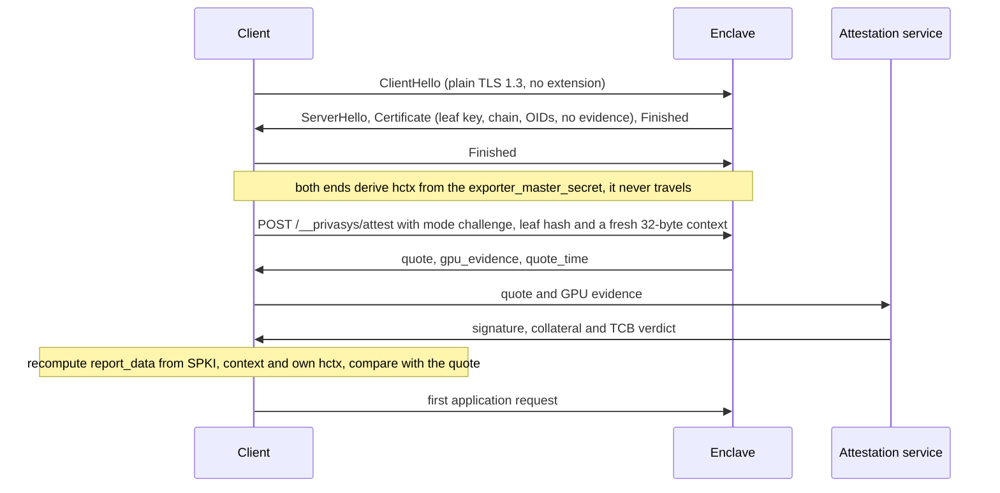

Two days ago we [published a proof](/blog/level-3-proven-attested-tls-inside-the-handshake) that our attested TLS reached Level 3 of the binding hierarchy the researchers behind [intra-handshake.fail](https://github.com/muhammad-usama-sardar/intra-handshake.fail) proposed, on one condition: both ends of the connection had to be compliant TLS 1.3 implementations. Meeting that condition meant maintaining forks of [rustls](https://github.com/Privasys/rustls) and of the [Go standard library](https://github.com/Privasys/go), because the binder was computed inside the handshake, at a point no standard library exposes. While we were finishing that proof we ran a second set of models on the design the researchers recommend instead, evidence exchanged after the handshake and bound through the TLS exporter. Those models reached the same level with no condition on the stack at all. We rebuilt the protocol around that result, called it RA-TLS v2, and rolled it out to the development fleet and then to production yesterday. The forks are archived. This post explains what changed, why, and what it means for anyone using a Privasys wallet, SDK or CLI.

## Why the evidence moved

The first reason is that the primitive was already there. RFC 8446 keying-material export is part of upstream rustls, of Go's `crypto/tls`, of Node's `tls` module and of Caddy, which terminates TLS in Enclave OS Virtual. A binder computed from the exporter asks nothing of those libraries that they do not already provide, whereas the intra-handshake binder asked them to change how the Certificate message is produced. Once the exporter turned out to give the same binding, keeping two forks of widely used TLS stacks had no remaining justification. Every upstream release had to be merged and every security fix re-applied, and every SDK on the challenge path had to build against our copies. A plain client could always connect and read the quote from a v1 certificate; only the session-bound tier needed a client built against our forks, and retiring them removes that requirement from anyone who wants it.

The move also changes what attestation can be. A certificate is minted once per handshake, so a binding that lives in the certificate is checked once and then trusted for as long as the connection lasts. A request on the connection can be repeated. Long-lived connections now re-run the challenge exchange every five minutes with a fresh context, and a changed measurement or a failed quote drops the connection at the next exchange rather than surviving until the peer happens to reconnect.

Two costs go down as well. A v1 leaf carried a DCAP quote of several kilobytes in every handshake, and on GPU hosts the GPU evidence on top, whether or not the peer would ever read it; a v2 chain is an ordinary ECDSA certificate with a few hundred bytes of extensions, and the evidence travels only to the client that asks for it. v1 challenge mode also minted a quote and re-signed the leaf inside the handshake, once per connection, at the moment the Certificate message was emitted. v2 signs the handshake once, in CertificateVerify, and fetches the quote afterwards, with deterministic quotes minted once per key and cached for a day. Fewer signing operations tied to the handshake clock leave less material for timing analysis.

The last reason is that the design can be checked by anyone. The ProVerif models for both binders, the patches against the researchers' pinned artefacts, the expected results and the CI workflow that re-runs them are in [github.com/Privasys/security](https://github.com/Privasys/security). Both pull requests we had opened against the researchers' repository, the [compliant-endpoint model of the intra-handshake binder](https://github.com/muhammad-usama-sardar/intra-handshake.fail/pull/6) and a [note on the precondition of the relay attacks](https://github.com/muhammad-usama-sardar/intra-handshake.fail/pull/7), have since been re-opened. We hope the post-handshake models are of some use to that work, and we are grateful for the models that made ours possible.

## What a v2 connection looks like

The certificate is an identity document. It carries the leaf key, an ECDSA P-256 key generated inside the enclave, a chain to the Privasys intermediate CA of its environment, and the extensions that describe what is running: runtime version hash, image profile, enclave instance id, configuration Merkle roots, workload app id, workload code digest, key source, attested dependency set. It carries no DCAP quote, no SEV-SNP report and no GPU evidence. A verifier that finds a v1 quote extension in a leaf treats it as v1 and fails closed.

For a client that never asks for evidence, the connection is an ordinary TLS 1.3 connection. `curl` with the Privasys CA sees a normal-sized chain, and so do a browser, a load balancer in passthrough mode, a Python `requests` session and a .NET `HttpClient`. None of them need to know that attestation exists, and the runtime records such connections as `attestation: none`.

A client that wants evidence asks for it on the same connection, after the handshake and before its first application byte. The runtime answers `POST /__privasys/attest` before any workload router sees the request, on the platform leaf and on every per-workload leaf. Legs that carry a non-HTTP protocol over RA-TLS (the KMIP gateway, the raft peer link) use the same two messages as a single length-prefixed frame in each direction. The request names the mode and the leaf the client received, so the server binds the evidence to the key the client actually saw even if it has rotated the leaf for that name in the meantime.



## Two modes, one recipe each

The quote's `report_data` field is 64 bytes, and everything the binding proves is in how those bytes are computed. `SPKI_DER` is the DER `SubjectPublicKeyInfo` of the leaf the client received, the same structure whose SHA-256 a certificate viewer shows as "Public Key SHA-256".

```
Deterministic:
  report_data = SHA-512( SHA-256(SPKI_DER) || quote_time )

Challenge:
  hctx        = TLS-Exporter("EXPORTER-privasys-ratls-attest-v2", context, 32)
  report_data = SHA-512( SHA-256(SPKI_DER) || context || hctx )

With GPU evidence (both modes):
  report_data = SHA-512( SHA-256(SPKI_DER) || binding || SHA-256(gpu_evidence) )
```

Deterministic mode is the "trust the TEE" tier that v1 already had. The runtime mints one quote per leaf key, caches it for 24 hours, and serves it with the minute it was minted as a 17-byte ASCII `quote_time`. Any verifier can reproduce `report_data` from the certificate and that timestamp, and the mode needs nothing from the TLS stack. It exists for latency: producing a quote is a round trip through the platform quoting enclave, and on a busy host it costs more than the handshake it accompanies, so a cached quote that any number of connections can share keeps attestation off the hot path. It proves that the key was generated inside an enclave with the quoted measurements within the last day.

Challenge mode is where Level 3 comes from. The client draws a fresh 32-byte context and both ends compute `hctx` with the RFC 8446 section 7.5 exporter, keyed by this connection's `exporter_master_secret`, with the context as exporter context. The value never travels. The client computes its own `hctx`, its own expected `report_data`, and compares; a verifier never accepts a `report_data` it did not predict. Because `exporter_master_secret` is derived from the Master Secret and the transcript through the server's Finished, exactly as the application traffic secrets are, a quote that commits to `hctx` commits to the keys that encrypt application data on this connection. The handshake already proved possession of the leaf key through CertificateVerify, so the response carries no further signature.

The mutual leg, used app-to-vault, app-to-app and on the raft peer link, runs the same exchange in the other direction. The client presents a v2 client certificate in the handshake, the server's attest response carries `client_evidence: required` and a fresh `client_context`, and the client answers with a quote over its own SPKI bound with the label `EXPORTER-privasys-ratls-attest-v2-client`. The server verifies it exactly as a client verifies a server, and serves application traffic only afterwards. A client certificate that carries no workload identity, such as the holder-of-key certificate the CLI presents when it creates a secret, is asked for nothing and receives no attested-peer status. Every connection is tagged `X-Privasys-Attestation: none|deterministic|challenge` on the way into the workload, so an application that requires attested callers checks a header the runtime set rather than the caller's word.

## What changed for you

The rollout happened yesterday, on the development fleet first and on production a few hours later, in one window each. v2 is a breaking change with no dual-shape transition: a v1 client finds no quote in a v2 certificate and fails closed, and a v2 client refuses a v1 leaf the same way.

For wallet users the practical consequence is that **the Privasys wallet must be updated to version 1.4.2** to connect to any Privasys application. The update is in the stores' review queues as this is published, and an older wallet fails at the attestation step rather than connecting unverified.

For developers, [ra-tls-clients](https://github.com/Privasys/ra-tls-clients) v0.9.1 carries the v2 SDKs in Rust, Go, TypeScript, Python and C#, each on the upstream TLS library of its language: rustls, `crypto/tls`, Node's `tls`, Python's `ssl` and .NET's `SslStream`. The platform CLI is v0.39.0. The Go path looks like this, with challenge mode written out although it is the default:

```go
import "enclave-os-mini/clients/go/ratls"

client, err := ratls.Connect("my-app.apps.privasys.org", 443, &ratls.Options{
    Attestation: ratls.AttestationChallenge,
    ServerName:  "my-app.apps.privasys.org",
})
if err != nil {
    // handshake, chain, evidence exchange or report_data binding failed
    log.Fatal(err)
}
info, err := client.VerifyCertificate(&ratls.VerificationPolicy{
    TEE: ratls.TeeTypeTDX,
    // The confidential VM: firmware, then the two registers the runtime
    // image extends at boot. MRTD alone names the firmware and nothing else.
    MRTD:  expectedMRTD,
    RTMR1: expectedRTMR1,
    RTMR2: expectedRTMR2,
    // The workload inside it: which app, and which build of it.
    ExpectedOids: []ratls.ExpectedOid{
        {OID: ratls.OidWorkloadAppID, ExpectedValue: appID},           // 16 bytes
        {OID: ratls.OidWorkloadCodeHash, ExpectedValue: imageDigest},  // sha256 of the image
        {OID: ratls.OidRuntimeVersionHash, ExpectedValue: runtimeHash}, // the Enclave OS release
    },
    // Production images only, and the quote checked by the attestation service.
    AllowDebugImages: false,
    QuoteVerification: &ratls.QuoteVerificationConfig{
        Endpoint: "https://as.privasys.org",
    },
})
// info.Attestation is the mode the evidence was obtained in
```

`Connect` returns only after the evidence exchange has verified in the requested mode, and `VerifyCertificate` then checks the policy and sends the quote to the attestation service. The policy is the point: a measurement of the confidential VM says which runtime booted, and only the workload extensions say which application is running inside it and which build of it, so a verifier that stops at the firmware measurement has verified the platform and not the app. `privasys attest <app>` in the platform CLI prints the connection tag and the verified fields. The `tests/vectors/ratls-v2/` folder holds `report_data` and exporter vectors that every SDK checks in its test suite, so the exporter step is verified independently of any TLS stack.

## Limits

Python's `ssl` module and .NET's `SslStream` expose no TLS exporter, so those two SDKs connect in deterministic mode. They verify the same certificate, the same chain and the same quote, and only lack the per-connection binding. A Python or C# caller that needs challenge mode today should put a Go or Rust verifier in front of it.

Deterministic mode proves a recent quote for the key in the certificate rather than for this connection. It has no relay resistance beyond the certificate key, which is the same guarantee v1's deterministic tier gave and the same "trust the TEE" tier the researchers' hierarchy describes. Browser verification through the wallet reproduces `report_data` with an exporter value supplied by the verifying service, since a browser cannot read its own TLS key schedule, so what the wallet shows is a binding to that service's connection to the enclave.

The ProVerif result is a symbolic one in the researchers' own model, with its abstractions, and it says nothing about the implementation. The implementation has not been independently audited. The rollout was a clean cut at a scale where that was acceptable, and we have described above what we will do differently next time.

## Closing

In July we kept the evidence inside the handshake so that clients which know nothing about attestation could still reach it, and two forks were the price of a session binding in that design. The researchers' critique sent us back to the models, and the models showed that the post-handshake exporter binder needs no assumption about the stack and nothing from it that upstream does not provide. RA-TLS v2 keeps the handshake standard, leaves the certificate as an identity document any client can check, and offers the Level 3 binding to any client that asks for it on the connection. With that settled, our attention goes back to the product.

*RA-TLS v2 is specified in [docs/ratls-v2.md](https://github.com/Privasys/ra-tls-clients/blob/main/docs/ratls-v2.md) and implemented by the SDKs in [github.com/Privasys/ra-tls-clients](https://github.com/Privasys/ra-tls-clients) from v0.9.1, under the AGPL-3.0 licence. The ProVerif models, patches, expected results and the CI workflow that re-runs them against the researchers' pinned artefacts are in [github.com/Privasys/security](https://github.com/Privasys/security) under the Apache-2.0 licence.*
