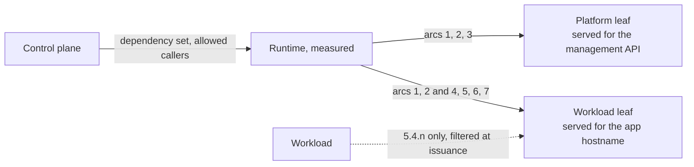

Last week's post on [RA-TLS v2](/blog/evidence-after-the-handshake-ra-tls-v2) said that the certificate an enclave presents is an identity document and nothing more, and left the contents of that document for another day. This is that day. The hardware quote proves that a key was generated inside a genuine enclave with certain measurements. Measurements say which runtime image booted, and on a confidential VM they say nothing about the container running inside it, or on an SGX enclave about the WebAssembly component it loaded. Everything a verifier needs beyond the measurements travels as X.509 extensions under the Privasys private arc, `1.3.6.1.4.1.65230`. This post describes what is in that arc, who is allowed to write each slot, how a verifier is expected to read them, and what changed when the scheme was renumbered with v2.

## What a measurement does not tell you

An Intel TDX quote carries MRTD, the measurement of the virtual firmware, and four runtime registers that the boot chain extends. Enclave OS Virtual extends RTMR1 and RTMR2 with the runtime image, so a verifier that pins MRTD and both registers knows exactly which Enclave OS release booted. The containers that the runtime then loads are not in any register. The same runtime image serves Drive on one host and the confidential AI fleet on another, and their quotes are identical up to the key they bind. An SGX quote has the mirror-image problem: MRENCLAVE measures the enclave binary, which for Enclave OS Mini is the WebAssembly runtime, and every component it loads shares that measurement.

The runtime is the measured party, so the runtime is the party that can say what it loaded. It generates the leaf key for each workload, mints the workload's certificate, and stamps into it the facts the measurement cannot express: which application this is, which build of it, what configuration it was given, where its keys come from, and which other enclaves it is pinned to. A verifier that trusts the measurement can trust those stamps for the same reason it trusts the rest of the certificate, and the runtime refuses to let a workload write any of them itself. That division of labour is the whole design, and the numbering just makes it legible.

## The rules before the numbers

Scheme v2 follows five rules. One slot has one meaning, on both editions: an SGX enclave running WebAssembly and a TDX confidential VM running containers emit the same OID for the same fact, so a verifier written against one edition reads the other without a translation table. Numbers are contiguous within an arc and the arcs are grouped by category rather than by the order in which we needed them. A retired slot is never reused, so an old certificate can never be misread as a new one. Evidence is never a certificate extension: quotes, SEV-SNP reports and GPU evidence have identifiers in the scheme so that the attest response can name them, and those identifiers never appear in a leaf. And the app-defined sub-arc root never carries a value, which keeps a workload's own claims visibly separate from the runtime's.



## Eight arcs

**Arc 1, platform identity.** `1.1` is the runtime version hash, the SHA-256 of the Wasmtime build on Mini or of the containerd build on Virtual. `1.2` is the image profile, the string `production` or `dev`, and a verifier that has not opted in to debug images refuses a leaf whose profile says `dev`. `1.3` is the enclave instance id, the UUID the control plane assigned when the enclave registered, which is what lets a record on the platform be tied to the exact instance that produced it. `1.4` is reserved for the platform's owner, the identifier an ownership endorsement attests, once Intel's Platform Ownership Endorsements have a distribution channel; the endorsement itself is a signed statement, so it will travel as evidence under `8.5`, never as an extension. The identity of the physical machine itself is not a slot at all. It travels in the evidence, in the Intel-issued PCK certificate embedded in every quote, and a verifier that wants to pin machines names them in its policy rather than reading an extension. How that works, and what it is for, is the subject of the next post.

**Arc 2, platform configuration.** These are the operator's inputs, hashed. `2.1` is the Merkle root over every configuration input of the platform, `2.2` the hash of the outbound trust-anchor bundle the enclave uses for egress, `2.3` the hash of the sorted list of attestation servers it will accept, and `2.4` a hash over the set of workloads currently loaded. A verifier rarely pins these individually, but the platform's own records do, and a change in any of them is visible in the certificate before it is visible anywhere else.

**Arc 3, platform keys and state.** `3.1` says where the platform's data-encryption key came from, `generated` or `byok:` followed by a fingerprint. `3.2` is the authenticated state root of Mini's persistent store, a Merkle root with a version counter, so that a client can detect a rollback of the enclave's state between two connections.

**Arc 4, workload identity.** This is the arc most verifiers care about. `4.1` is the workload's application id, the 16-byte UUID the control plane assigned when the app was created, stamped by the runtime and never by the app. `4.2` is the code digest: the SHA-256 of the WebAssembly bytecode on Mini, or of the OCI image manifest on Virtual, which is the digest a registry shows and a reproducible build reproduces. `4.3` is the image reference without its digest, on Virtual only, which is convenience for a human and carries no trust on its own. A policy that pins `4.1` and `4.2` alongside the measurements has named the runtime, the application and the build.

**Arc 5, workload configuration.** `5.1` is the Merkle root over the workload's configuration and `5.2` a runtime-stamped hash of the configuration it was handed. The sub-arc `5.4` belongs to the workload itself. An application may publish digests of its own under `5.4.n` through the SDK, and two of those have platform-wide meaning: `5.4.5` is the digest of the model an inference workload serves, and `5.4.7` the digest of the tool catalogue it exposes to an agent. The runtime confines a workload's declarations to that sub-arc and drops anything else at issuance, so an application cannot stamp its own app id or code digest, and the root `5.4` never carries a value.

**Arc 6, workload keys and state.** `6.1` is the workload's key source: `generated`, `byok:` with a fingerprint, or `vault:` with the path of the vault-backed key the runtime reconstructed for it. This is the slot that tells a user whether the data behind an application is protected by a key that lives in the platform's vaults or by one the operator supplied. `6.2` is reserved for a per-workload state root.

**Arc 7, trust relationships.** `7.1` is the attested dependency set, the subject of the next section. `7.2` is reserved for the allowed-callers set, which today is enforced from the control plane's records and not yet advertised in the leaf.

**Arc 8, evidence types.** `8.1` to `8.4` name the SGX quote, the TDX quote, the SEV-SNP report and NVIDIA GPU evidence, and `8.5` is reserved for a platform ownership endorsement. They are values in the attest response, never extensions, and their presence in the scheme is what stops anyone from ever putting evidence back into a certificate under a new number.

## The dependency set

When Drive indexes a document it calls the confidential AI fleet for embeddings, and a user who consents to Drive is consenting to that call. `7.1` makes the relationship visible and enforceable at once. It carries the workload's direct dependencies, each pinned by the same tuple any verifier uses for an app: measurements plus the required `4.1` and `4.2` values. The runtime writes the extension from the set the control plane handed it, the workload's egress client refuses any peer outside that set, and a verifier reading the leaf sees exactly the set that is being enforced, because both come from the same object.

Each entry also carries a folded identity, the SHA-256 of the dependency's measurements, its required extension values and the encoding of its own dependency set. A workload declares only its direct edges, but because each edge names a dependency by an identity that already folds in that dependency's own edges, the fold commits to the whole subtree. If something changes two hops away, the identity one hop away changes, the pin no longer matches, and the dependent fails closed until its owner re-approves. Nobody walks the chain, and nobody keeps a list of trusted measurements.

The encoding is deterministic, length-prefixed and sorted, so the same set produces the same bytes in every SDK, in the runtime and in the wallet, and a shared test vector keeps them byte-identical. The wallet decodes `7.1` to show a user which dependencies an application declares, and remembers which ones they already approved, so approving the AI fleet for Drive also counts for another application that pins the same fleet.

## Reading the arc as a verifier

The SDKs expose the extensions by name rather than number. A Go policy for a container on a confidential VM pins the VM through MRTD and the two runtime registers, then the workload through arc 4:

```go
info, err := client.VerifyCertificate(&ratls.VerificationPolicy{
    TEE:   ratls.TeeTypeTDX,
    MRTD:  expectedMRTD,
    RTMR1: expectedRTMR1,
    RTMR2: expectedRTMR2,
    ExpectedOids: []ratls.ExpectedOid{
        {OID: ratls.OidWorkloadAppID, ExpectedValue: appID},
        {OID: ratls.OidWorkloadCodeHash, ExpectedValue: imageDigest},
    },
    QuoteVerification: &ratls.QuoteVerificationConfig{Endpoint: "https://as.privasys.org"},
})
```

The comparison is on raw bytes: `4.1` is sixteen bytes and `4.2` thirty-two, and the most common mistake we have made ourselves is passing the hexadecimal text a registry displays where the verifier expects the bytes it encodes. The platform CLI prints every extension a leaf carries, decoded and labelled, with `privasys attest <app> --extensions`, and that output is the quickest way to learn what a given application exposes. Anything under the Privasys arc that the SDK does not recognise is returned as an unknown extension rather than dropped, so a newer runtime never hides a value from an older client. The same policy can also pin the physical machines the evidence may come from; that identity is read from the quote rather than from the arc, and the next post explains it.

## From v1 to v2

The first scheme grew by accretion. Slots were allocated as features arrived, the two editions disagreed on a few of them, hardware evidence lived in the arc next to configuration hashes, and by the time the dependency set arrived it landed at `6.1` because that was the next free top-level number. Renumbering was worth doing once and only once, and v2 was the moment, because the evidence extensions were leaving the certificate anyway and every client had to update.

The mapping is mechanical. The runtime version hash moved from `2.4` to `1.1`, the image profile from `2.8` to `1.2`, the configuration root from `1.1` to `2.1`, the app id from `3.6` to `4.1`, the code digest from `3.2` to `4.2`, the key source from `3.4` to `6.1` and the dependency set from `6.1` to `7.1`. The [OID document](https://github.com/Privasys/ra-tls-clients/blob/main/docs/oids.md) carries the full table with a v1 column, and it is generated from a single JSON description that also generates the constants in every SDK, so the five language bindings, the runtimes and the documentation cannot drift from one another. The one trap in the mapping is `6.1`, which meant the dependency set in v1 and means the key source in v2; a comment or a record that says `6.1` without saying which scheme is ambiguous, and we spent an afternoon removing such comments from our own code. Anyone who pinned an extension by number in a verifier of their own needs to move to the new numbers, and the SDKs parse v2 only.

## Limits

The arc is private. The numbers mean what our runtimes say they mean, and a verifier that is not using a Privasys SDK or the OID document has no way to discover that. The IETF's Entity Attestation Token and CoRIM work aim at a vendor-neutral vocabulary for the same facts, and if that vocabulary settles we would rather map onto it than keep a private one; nothing in the certificate format stands in the way, since each slot is a plain octet string with a documented encoding.

Two slots are reserved and empty. `1.4` waits on ownership endorsements before any claim about who owns the physical machine is made, and the endorsement that backs it will be evidence, not an extension. `7.2` means that the set of callers an application accepts is enforced but not yet advertised. A verifier cannot learn who is allowed to call an application from its certificate today, only what the application itself depends on.

The stamps are as trustworthy as the runtime that writes them. That is the point of measuring the runtime, and it is also the boundary: a runtime image with a defect in its issuance filter could let a workload write outside `5.4`, which is why that filter is part of the measured image and why the runtime's own version is the first slot in the arc.

## Closing

A measurement answers one question, which runtime booted. The certificate extensions answer the rest, in a fixed vocabulary that both editions share, written only by the party whose measurement the verifier already trusts. Scheme v2 groups that vocabulary by what each slot is about rather than by when it was added, keeps evidence out of the certificate for good, and gives a workload one clearly marked corner in which to make claims of its own.

*The scheme is documented in [docs/oids.md](https://github.com/Privasys/ra-tls-clients/blob/main/docs/oids.md) and generated from `oids.json` in [github.com/Privasys/ra-tls-clients](https://github.com/Privasys/ra-tls-clients), which also holds the SDKs that read it, under the AGPL-3.0 licence.*
