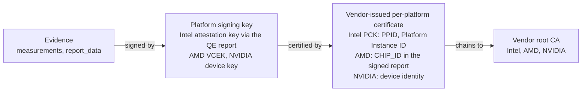

A quote that verifies proves that a genuine TEE, running the measured code, signed it. It does not say which machine did the signing. Any host of the same TEE family with a valid attestation key, Intel TDX or SGX, AMD SEV-SNP, an NVIDIA GPU in confidential mode, produces evidence that passes the same signature, chain, TCB and measurement checks, and measurements describe what runs, not where. Sardar, Moustafa and Aura describe this gap as the [identity crisis of confidential computing](https://www.researchgate.net/publication/398839141_Identity_Crisis_in_Confidential_Computing_Formal_Analysis_of_Attested_TLS). For a sovereign deployment, where the requirement is that data is processed on particular machines in a particular place, it is the gap that matters. This post is about the identifier that vendor's evidence already carries, how names the machine, how a relying party can now pin it, how revoked machines are kept out, and what Intel's Platform Ownership Endorsements will add once they can be distributed.

## Why attestation was built not to name the machine

The gap is a design choice with a history. Intel SGX shipped in 2015 on client processors, and the threat its attestation had to answer was the opposite of ours: a laptop attesting to a media service must not become trackable across the internet. Signing every quote with a key unique to the CPU would have turned attestation into a supercookie. Intel's answer was [EPID](https://www.intel.com/content/www/us/en/developer/articles/technical/intel-enhanced-privacy-id-epid-security-technology.html), a group signature scheme: a processor signs as an anonymous member of a large group of genuine SGX chips, and the verifier learns that the quote came from a genuine processor without learning which one. Its linkable mode gave a service a stable pseudonym for a chip, enough to count machines or cap licences, and still no identity. Every verifier written in that era inherited the assumption that attestation hides the machine.

The cloud reversed the requirement. In a data centre the platform belongs to an operator, and the workload owner wants to know whose rack it runs in. Intel's [DCAP](https://www.intel.com/content/www/us/en/developer/articles/technical/intel-sgx-data-center-attestation-primitives.html), introduced in 2018 and the only scheme TDX supports, replaced the group signature with an ECDSA attestation key certified per platform: Intel issues each platform a Provisioning Certification Key certificate, the certificate chains to the Intel SGX Root CA, and the verifier checks that chain without any Intel service in the loop. That certificate is the per-platform identity EPID was designed to avoid, and it carries identifiers. The schemes born in the data centre never had the anonymity requirement at all: AMD SEV-SNP certifies each chip with its own Versioned Chip Endorsement Key, and NVIDIA issues each H100 a device identity certificate. Verifiers, ours included, kept using these chains only to answer the old question, is this a genuine device, while the answer to the new one, which device, sat in the same certificate.

## Why the usual answers stop short

The familiar checks each answer a different question. The certificate chain to a fleet intermediate proves that provisioning admitted the enclave, and a machine admitted and later compromised still chains. The measurements prove which runtime image and which container are running, and the same image runs on every host in a fleet by design. Intel's TCB status proves that firmware and microcode are at a patched level, and every host at that level reports the same status. None of these distinguishes a rack in a customer's own data centre from an identical rack elsewhere.

The right long-term answer is for the platform to prove who owns it, and Intel has announced [Platform Ownership Endorsements](https://www.intel.com/content/www/us/en/developer/articles/technical/software-security-guidance/technical-documentation/platform-ownership-endorsements.html) for exactly that. Their distribution channel is still undecided and no cloud provider offers them today, so we needed something that works with the collateral Intel already ships.

## The identifier already in the evidence

Every SGX and TDX quote embeds the certificate chain of the platform's Provisioning Certification Key, the PCK. Its SGX extension (`1.2.840.113741.1.13.1`) carries three values that matter here. The PPID, at `.1`, is derived from the CPU package's provisioning key and identifies that package. The FMSPC, at `.4`, names the family, model, stepping and platform, reference data rather than an identity. On multi-package platforms, whose certificates come from the Intel SGX PCK Platform CA, `.6` carries the Platform Instance ID, assigned by Intel's registration service from the platform manifest and identifying the physical platform as a whole. An AMD SEV-SNP report carries a 64-byte `CHIP_ID` that identifies the die, and is signed by a key AMD certifies per chip. An NVIDIA GPU signs its attestation report with a device key whose certificate chains to NVIDIA's device identity root, so the certificate is the identity of the GPU.

What makes these values trustworthy is how they are bound to the signature the verifier already checks. On Intel the quote body is signed by the attestation key, the Quoting Enclave report that vouches for the attestation key is signed by the PCK private key, which the platform derives from fused secrets and never releases, and the PCK certificate chains to the Intel root. On AMD the report itself is signed by the per-chip key, and on NVIDIA by the device key, each certified by the vendor. In every case the identifier sits inside the signed structure or the certificate that signs it, so nobody, the enclave runtime and us included, can alter it without breaking the signature over the evidence.



## What we built

Our [attestation server](https://github.com/Privasys/attestation-server) already verified the QE report signature with the PCK leaf's key and the chain to the pinned Intel root. Since v0.5.1 it also reads the identifiers from that leaf, the one that actually certified the quote, and reports them in every response:

```json
{
  "success": true,
  "status": "OK",
  "mrtd": "feb74866...",
  "platform": {
    "ppid": "414afbe506e8ac361add41f3133aab6f",
    "platformInstanceId": "c055fc7b49bd4185dda796bf1795af32",
    "fmspc": "00806f050000"
  },
  "pckRevocationChecked": true
}
```

A request may carry `allowedPlatformIds`, a list of hex identifiers, and evidence from any other platform fails with the verdict `PLATFORM_NOT_ALLOWED`. The identifier of record is the Platform Instance ID when the certificate carries one, else the PPID, else the `CHIP_ID`.

The SDKs, in [ra-tls-clients](https://github.com/Privasys/ra-tls-clients) v0.11.0, expose the list on the verification policy in all five languages. A Go policy that pins the runtime, the workload and the machine reads:

```go
info, err := client.VerifyCertificate(&ratls.VerificationPolicy{
    TEE:                ratls.TeeTypeTDX,
    MRTD:               expectedMRTD,
    RTMR1:              expectedRTMR1,
    RTMR2:              expectedRTMR2,
    AllowedPlatformIDs: []string{"d4602590b11c770aa7b9ee404649e802"},
    QuoteVerification:  &ratls.QuoteVerificationConfig{Endpoint: "https://as.privasys.org"},
})
```

The check runs twice on purpose. The list travels with the verification request, so the server refuses evidence from an unlisted platform. Once the server has accepted the quote, the SDK reads the identity itself from the PCK certificate embedded in that quote, cross-checks it with what the server reported, and enforces the list on its own reading. The relying party depends on the server for the verdict on the quote and on nobody for the identity. A non-empty list requires quote verification, since the certificate inside an unverified quote proves nothing, and it fails closed when no identity is available.

## Keeping revoked machines out

Pinning a machine assumes that a machine whose certificate its vendor has revoked is refused. On the Intel path the attestation server checks every SGX and TDX quote against Intel's CRLs: the PCK leaf against the PCK CRL of its issuing CA, and the issuing CA against the Root CA CRL. The PCK CRL has to arrive with an issuer chain ending at the pinned Intel root and be signed by the CA that issued the leaf, matched by subject and by key. A CRL outside its validity window is refused. A revoked certificate, or a CRL that cannot be obtained, fails the verification. The CRLs are fetched through the same caching collateral client as the TCB information (24-hour grace window), so the steady state is a cache hit and the round trip to Intel happens once a day. Every response reports the outcome in `pckRevocationChecked`.

## What it helps with

An organisation that runs Enclave OS on its own hardware, or on a provider's dedicated hosts, can now write a policy that names those machines, and a workload deployed anywhere else is refused by every client that carries the list. A contractual promise about where data is processed becomes something a client checks on every connection. The same list makes host mobility visible: the identifier names the host, so a confidential VM that a cloud provider restarts on different hardware fails verification until the operator admits the new host, rather than moving silently. And it gives the operator a switch of their own: a machine suspected of tampering can be removed from the list on the next connection, before any CRL is published, with revocation as the backstop.

## How to use it

Read the identifier of a running app with the CLI, which prints it on its own row:

```text
$ privasys attest my-app
host          my-app.apps.privasys.org:443
quote type    TDX Quote
challenged    true
quote status  OK
platform      d4602590b11c770aa7b9ee404649e802 (instance id; ppid b8a2d1ca…)
✓ VERIFIED    hardware attestation matches the source
```

Then pin it:

```sh
privasys attest my-app --allowed-platform d4602590b11c770aa7b9ee404649e802
```

The list belongs with the rest of the policy, next to the measurements, and is maintained the same way: when a host is replaced, the new identifier is read once from a trusted attestation and added, and the old one removed. The identifier is not secret, since it travels in every quote, so it can live in configuration and in version control.

## Platform Ownership Endorsements

An allow-list is a list of machines. What a relying party actually wants to express is an owner: any platform this organisation has registered as its own. That is what Platform Ownership Endorsements provide, a statement signed by Intel binding a platform's identifiers to its owner, distributed with the other collateral. A policy then names the owner rather than enumerating hosts, and replacement machines are covered as soon as the owner registers them.

We have reserved a slot for this in our [certificate scheme](/blog/one-slot-one-meaning-the-privasys-certificate-extensions): extension `1.4` is held for the platform's owner as an endorsement attests it, and carries no value today. The endorsement itself is evidence, named by `8.5`, and will travel with the quote in the attest response rather than in the certificate. When endorsements have a distribution channel, the attestation server will verify them alongside the PCK chain, report the owner in the `platform` object, and accept an allowed owner in the policy next to the allowed platform list. The list stays for platforms without an endorsement, for AMD, and for operators who want to name individual machines.

## Limits

Pinning names machines, it does not prove that a machine is physically protected. The operator decides which machines belong on the list, and a listed machine that has been tampered with passes until it is removed or its key is revoked.

The SDKs read the identity from the quote but do not verify the PCK chain to Intel's root themselves; the attestation server's verdict is what makes the embedded certificate the one that certified the quote. A relying party trusts the server for that verdict, as it already does for the signature and TCB verdicts.

The identifier names the host, so a pinned deployment on a cloud provider needs an operator to admit a new host after a move. Production runs on Intel TDX today: for SEV-SNP the identifier is the `CHIP_ID` and we have not yet run the list against an AMD fleet, and the revocation check described above covers the Intel chain. The list names the CPU platform; a GPU's device certificate is verified but its identity is not on any list yet. None of this has been independently audited.

## Closing

The evidence proves what runs. The vendor-issued certificate bound to its signature, Intel's PCK certificate, AMD's per-chip key, NVIDIA's device identity, says which machine it runs on, and the attestation server now reads it, reports it and enforces a policy against it, with revoked machines refused on every path. An operator who knows their hardware can name it in one line of policy, and when platforms can prove their owner rather than their serial number, the same line will name the owner instead.

*The attestation server and the client SDKs are open source under the AGPL-3.0 licence: [github.com/Privasys/attestation-server](https://github.com/Privasys/attestation-server) and [github.com/Privasys/ra-tls-clients](https://github.com/Privasys/ra-tls-clients). Platform pinning is documented at [docs.privasys.org](https://docs.privasys.org/solutions/enclave-os/attestation/platform-pinning/).*
