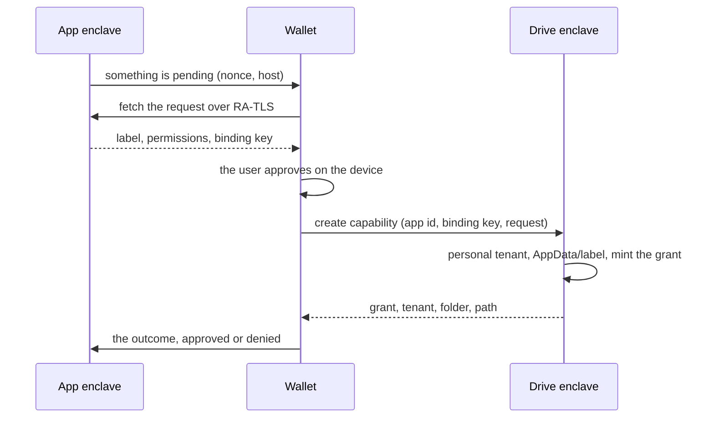

On the Privasys platform, each stateful confidential app keeps its state on an [encrypted volume](https://docs.privasys.org/solutions/enclave-os/enclave-os-virtual/disk-encryption/) of its own: sealed to the enclave, keyed through the vault constellation, preserved across upgrades and redeploys. That settles durability and confidentiality, and leaves a different question open: whose disk is it? An agent has session logs and a working tree, a chat has conversations, a verifier has records. The app's own interfaces make all of it reachable, with access and governance anyone can verify, but none of it sits on a disk the user controls, and building that control falls to each app developer.

We have written about Privasys Drive twice, [as a store only its owner can open](/blog/a-drive-only-you-can-open) and [as an assistant's memory](/blog/a-brain-you-own). This post covers its third role: the user's Drive as the disk every confidential app on the platform can use. An app asks for a folder, the user approves on their wallet, and the app gets a grant to that folder and nothing else. The folder behaves like a disk, a working tree fits in it as one item, and the user keeps one storage gauge, one list of apps with access, and the option to revoke at any time.

## Why a bucket or a shared folder falls short

A bucket is durable and cheap, and it is what the Drive itself uses underneath, but it has no notion of a person: an app holding the credential holds every user's data, and no user can see it or take it back. Asking the user to share a folder from their existing drive has the right shape, but the usual implementations get the details wrong: the app names the folder, the app renders the consent screen, the token works for whoever holds it, and revocation is a setting the user has to go looking for. We kept the shape and fixed the details.

## Consent, from the wallet

An app asks for storage with a label and the permissions it wants. It cannot name a folder, a tenant or a path: the Drive derives the boundary from the person who approves, and refuses any request that tries to name one.

A push notification only says that a request is pending and where. The wallet fetches the request itself, from the app over [RA-TLS](/blog/evidence-after-the-handshake-ra-tls-v2), so it has verified the app's code before it reads what is asked, including the app's binding key: an Ed25519 public key whose private half stays sealed in the app's enclave.



The wallet writes the approval screen itself, in the user's language, from the label and a fixed permission vocabulary, so an app cannot word its own consent. On approval the Drive creates `AppData/<label>/` in the user's personal Drive and mints the grant. The folder is bound to that app: another app asking for the same label gets its own, and a folder the user made is never handed over.

## What the grant is bound to

The grant is a signed token checked twice on every call. It names the app's binding key, so only the holder of the private half can use it, and the application the platform verifies on each attested call must match it. A leaked token presented from anywhere else is refused.

The grant names the app's platform identity rather than its code measurement, so a new release does not ask the user to approve the folder again; the platform checks on every connection that the code behind the identity is still that app's.

App developers get all of this from the platform. An app declares the resource in its manifest, one entry with a kind, a label and permissions, and the runtime brokers the exchange: it holds the binding key, reaches the wallet, answers the wallet's fetch and remembers the outcome. The app asks the runtime for its folder and receives the coordinates.

## A folder that behaves like a disk

Agents writing session logs, or enclaves editing the same file, need more than upload and download, and the granted folder gives them filesystem operations. Every file carries a revision, and a write against a stale one is refused before anything is written, with the current revision in the answer:

```http
PUT /v1/tenants/{t}/path?root={folder}&path=notes/today.md
X-Drive-Parents: create
If-Match: "7"

412 Precondition Failed
{"error": "stale", "rev": 9}
```

Files are addressed by path, with parent folders created on demand. An append sends only the new bytes, so adding a turn to a long session log costs only that turn. Range reads, a change feed, and `grep` and `glob` running inside the enclave over decrypted streams complete the set. A new instance of an app, on a fresh volume or another host, finds its folders again from the grants bound to its key, without asking the user.

## A working tree as one item

A checkout is tens of thousands of small files, too many to map one by one into anyone's drive, so the app keeps its working tree on its own volume, where builds run at local speed, and saves snapshots to the user's Drive: a manifest of paths and content hashes beside a folder of content-addressed blobs. Snapshots are taken at a session's end, a commit, a pause or a shutdown, upload only the blobs that changed, and restore on a new host by fetching what is missing. The Drive shows a snapshot as one item ("workspace, 340 MB, saved two minutes ago"), keeps it out of search, opens it read-only and exports it as a ZIP.

## What the user sees

An app with storage appears as an ordinary folder under `AppData/` that can be browsed, shared and deleted; deleting it wipes the app's data, and the app has to ask again. One gauge counts everything apps store against the user's single quota, 1 GB today, broken down by folder and by app. One list shows every app with access, its folder, permissions and expiry, and a Revoke button that leaves the files with the user and stops the app until it asks again.

## Already rolled out

The principle is the one [Privasys Harness](/blog/an-agent-you-can-verify-introducing-privasys-harness) was built on: an app keeps no user data on a disk it controls. The user's data lives in the user's Drive, sealed to an enclave they can attest, in a folder they approved on a device they hold, under a quota they can see, with a Revoke they can press.

*Privasys Drive is open source under the AGPL-3.0 licence: [github.com/Privasys/drive](https://github.com/Privasys/drive). The consent flow and the filesystem API are documented at [docs.privasys.org](https://docs.privasys.org/solutions/drive/apps-and-wallet).*
