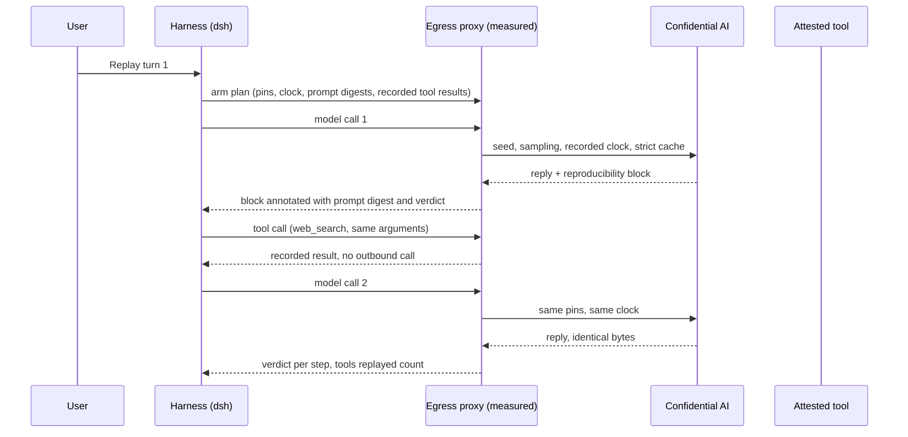

In June we wrote about [reproducible inference](/blog/reproducible-inference-and-the-accountability-gap): the same prompt, the same attested stack, the same bytes back, every time. That post was about a single model call. An agent is never a single model call. One turn of the [Privasys Harness](/blog/an-agent-you-can-verify-introducing-privasys-harness) is a sequence: the model reads the conversation and decides to search the web, the search returns, the model reads a page, the page returns, the model writes its answer. Three model calls, two tool calls, and a clock that moved between them. Reproducing the first call and calling the job done would be a fudge, because the second call's prompt contains whatever the web returned, and the web does not return the same thing twice.

Today the harness replays a whole turn, tool calls included, and reports on every step whether the prompt, the injected clock and the reply were identical to the record. We have run it on prod against turns that fetch live pages, and the replay comes back byte for byte. This post is about how that works, what it costs, what it does and does not prove, and why a confidential platform is the right place to keep such a record for a very long time.

## Why this matters more for agents than for chat

For everyday use, the randomness of an inference service is either a feature or an acceptable price for speed: sampling temperature gives variety, dynamic batching gives throughput, and nobody checks whether yesterday's answer would come back today. In finance, healthcare, legal work and the public sector the calculation is different. A system whose outputs cannot be reproduced is, for any practical purpose of oversight, a black box, and an agent that acts on a decision it cannot reconstruct puts the person in the loop in an impossible position.

The consequences we listed in June still hold, and they are sharper once the unit of work is a turn rather than a completion.

- **Accountability becomes defensible.** When an agent's decision is challenged, the operator reproduces it exactly and shows that the inputs, the model, the tools and the output were what the record says. The person in the loop defends themselves with evidence rather than with trust in the machine.
- **Disputes and regulation become tractable.** A regulator, an auditor or a counterparty re-runs the decision and gets the same answer. The obligation to show how an automated decision was reached, which the EU AI Act is making routine and which Article 22 of the GDPR and HIPAA audit expectations already impose in their own domains, becomes something you can satisfy with a replay rather than a narrative.
- **Incident response becomes engineering.** A bad output you can reproduce is a bug you can fix. A bad output you cannot reproduce is a ghost, and post-incident work turns into archaeology. Determinism moves model misbehaviour into the ordinary discipline of software quality assurance.
- **Composed agents stay auditable.** When one agent's output feeds another agent's tools, a cascade error can only be traced if every hop is reproducible and every hop is attested. The whole chain can then be reconstructed, not just the final answer.

## Why the common answers fall short

Logging the prompts and the answers is what most teams do, and it is worth doing. But a log of a tool-using turn is a log of three prompts, two of which contain text the agent fetched from outside. Running the turn again fetches different text, and the second prompt is already different before the model has said a word. The log records what happened; it cannot make it happen again.

Setting the temperature to zero is the next instinct, and it removes the visible randomness only. Under continuous batching the arithmetic inside the engine depends on which other requests share the kernel launch, so the same greedy request can produce different logits and, a few tokens later, a different sentence. We covered the mechanics in June; the short version is that determinism is decided by the order of floating-point reductions, and the fast paths of an inference engine reorder them for throughput.

Mocking the tools during replay is what a test suite would do, and it is the right idea with the wrong provenance. If the operator writes the mocks, the replay proves what the operator wanted the agent to have seen. The recorded tool results have to come from the original run, from code the operator did not get to edit, and the replay has to say when it used them.

## What we built

Everything starts with the record. The harness keeps an append-only log per session: every event of the turn in order, the model requests, the streamed replies, each tool call with its arguments and each tool result. The log is written inside the enclave by measured code and mirrored to the user's own Drive, under keys the platform operator does not hold ([how that consent works](/blog/the-disk-of-a-confidential-app-consent-from-the-wallet-a-filesystem-for-agents)). The record belongs to the person whose agent it was, and the code that wrote it is the code the attestation names.

Every model call in that log carries the reproducibility block that Confidential AI attaches to its answers: request id, seed, temperature, top-p, top-k, maximum tokens, the model and the digest of its weights, the vLLM and CUDA versions, the GPU, the TEE type, the container image digest, the KV-cache mode and whether batch invariance was on. The egress proxy inside the harness enclave, the small Go component that owns every outbound connection, folds its own annotation into the same block: the digest of the prompt it saw leave, the sampling pins it applied, and, on a replay, the verdict for that step.

Pinning is the second piece. The harness lets you pin the seed, the temperature, top-p, top-k and the token budget for a session, so every model call of every turn carries them. The clock is pinned too: our Confidential AI stamps the current date and time into the prompt so the agent knows when "tomorrow" is, and the block records exactly what it stamped. On replay the harness hands the recorded clock back and the model is told the same time it was told the first time. The harness itself decides nothing by chance: tool-call identifiers, which the engine would otherwise draw at random and which end up in the next prompt, are derived from the prompt digest, the seed and the call's position.

The third piece is the engine. Confidential AI runs vLLM with batch invariance on for every request, so a pinned call answers the same bytes whether it ran alone or in a batch of thirty-two. Pinned calls also run in strict cache mode: the prefix cache gets a single-use salt, so the answer cannot depend on what an earlier request left in the cache. We measured, on the way here, that a replay hitting a warm cache while the original ran cold was enough to change a reply, and that a clock a few seconds apart changed a whole answer, so both are part of the record and both are held equal on replay.

The fourth piece is the non-deterministic tools. When you replay a turn, the harness lifts the tool results out of the record and arms a replay plan: for each recorded step, the pins, the clock and the prompt digest, and for each recorded tool call, the server, the tool name, a digest of the canonical arguments, and the result. When the replayed agent calls a tool with the same server, name and arguments, the proxy serves the recorded result and makes no outbound call. The reproducibility panel then reveals the number of tool calls hooked and results replayed from the record, and if any call went out live.

The panel above a replayed turn reads: replay of turn 1, step 3, prompt identical, injected clock identical, reply identical, 2 tool results replayed from the record. Each of those four words is a comparison the proxy made, not a promise.

## What it costs

Batch invariance is the expensive part. The kernels that make the gated delta-net attention of Qwen3.6 batch-invariant come from the vLLM community, and we run them with a small patch of our own that keeps CUDA graph capture on; without graphs the same kernels cost sixteen times the throughput. Both are public, in our fork of vLLM and in the Confidential AI repository.

Measured on the same H100 with Qwen3.6-35B-A3B-FP8, twelve probes across batch sizes of two, eight and thirty-two, the serving path came out as follows. Determinism costs about 1.45 times, and that is what runs on our production engine today.

| Configuration | Bit-identical probes | Throughput | Time per output token |
| --- | --- | --- | --- |
| No batch invariance | 0 of 12 | 926 tok/s | 13.2 ms |
| Batch invariance | 12 of 12 | 638 tok/s | 18.0 ms |

Two limits of the engine are worth stating. Batch invariance in vLLM is a process-wide switch: it cannot yet be turned on for one request and off for the next, so our whole engine pays the 1.45 for everyone, and per-request invariance would be a deep change across dozens of kernels. And this is not yet a finished feature of the engine we use. It is the product of a large community effort that has been landing piece by piece for months, one that has since taken up part of our patch, and we are running ahead of the release on its strength while contributing our part back.

Strict cache mode has a cost of its own: a pinned call runs cache-cold, so a long conversation that would normally reuse its prefix pays full prefill on every pinned turn. That is why pinning is per session and off by default. You pay for reproducibility on the sessions where a decision will be defended.

## Same output is not correct output

Reproducibility guarantees auditability. It does not guarantee safety or truth, and the two are easy to conflate in a governance document.

An agent can be entirely reproducible and consistently wrong. Replaying a biased decision yields the same biased decision, with a signed record proving that the bias was faithfully applied. A hallucinated citation replays as the same hallucinated citation. What determinism gives you is the ability to show how and why the failure happened: which prompt, which tool result, which sampling, which weights, and at which step the reasoning left the rails. It moves the failure out of legal and governance uncertainty, where the available statement was "we cannot say what the system did", into classical software quality assurance, where a defect has a reproduction, a root cause and a fix.

That is a large move, and it is the whole of the claim. Evaluation, guardrails and human review are still needed to make the decision good. Reproducibility is what makes them possible to test.

## Reproducible in five years

A legal audit rarely arrives the week after a decision. It arrives years later, and the question is whether the decision can still be reproduced then. That is where a confidential platform earns its place, because reproducing an inference in five years needs far more than the prompt.

It needs the exact weights, and the record carries their digest, which is the root hash of the dm-verity disk the model was served from and part of the enclave's attested certificate. It needs the exact container image, whose digest is in the block and measured into the quote. It needs the inference engine, the CUDA runtime and the driver versions, all recorded. It needs the machine configuration inside the TEE, and that is what the measurement registers pin: we [publish the measurements every image will produce before it boots](/blog/know-your-rtmrs-before-you-boot-predicted-measurements-for-every-cvm-image-release), so the configuration of the enclave that made the decision is a value you can compare, not a description you have to believe. And it needs the GPU inside the trust boundary, which is what the [H100 ceremony](/blog/confidential-ai-on-h100-the-tdx-gpu-ceremony) established.

Every one of those layers is open source: the [enclave operating system](https://github.com/Privasys/enclave-os-virtual), [Confidential AI](https://github.com/Privasys/confidential-ai), the [harness](https://github.com/Privasys/harness), the [attested transport](https://github.com/Privasys/ra-tls-clients) and the [Drive](https://github.com/Privasys/drive) the record lives on. The builds are reproducible from source and the release carries the measurements they produce, so a future auditor does not need our copy of anything: they can rebuild the image, confirm its registers against the record, load the weights whose digest the record names, and replay the turn against a machine of the same class. The tools the agent used are part of the record too, so the web page that has since changed, or the search index that no longer returns the same results, are not obstacles: the replay serves what the agent saw at the time.

The remaining condition is hardware. Reproducibility holds for the same measured stack on the same class of GPU, and a decision made on an H100 is replayed on an H100. Keeping that class available is an operational commitment rather than a cryptographic one, and it is one a regulated operator will have to plan for, the way they already plan for retaining systems that can read old records.

## The principle

An agent that acts in a regulated process should be able to answer, in full and on demand, "show me exactly what you did". The June post made that true for one model call. Today it is true for a turn: the model calls, the tools they invoked, the clock they were told, and the answer they gave, reproduced from a record written by attested code and kept under the user's own keys. Same turn, same answer, and a proof of which machine produced it.

*The Privasys Harness is open source under the AGPL-3.0 licence: [github.com/Privasys/harness](https://github.com/Privasys/harness). The batch-invariance patches we run are in [github.com/Privasys/confidential-ai](https://github.com/Privasys/confidential-ai) and our fork of vLLM at [github.com/bfoing/vllm](https://github.com/bfoing/vllm).*
