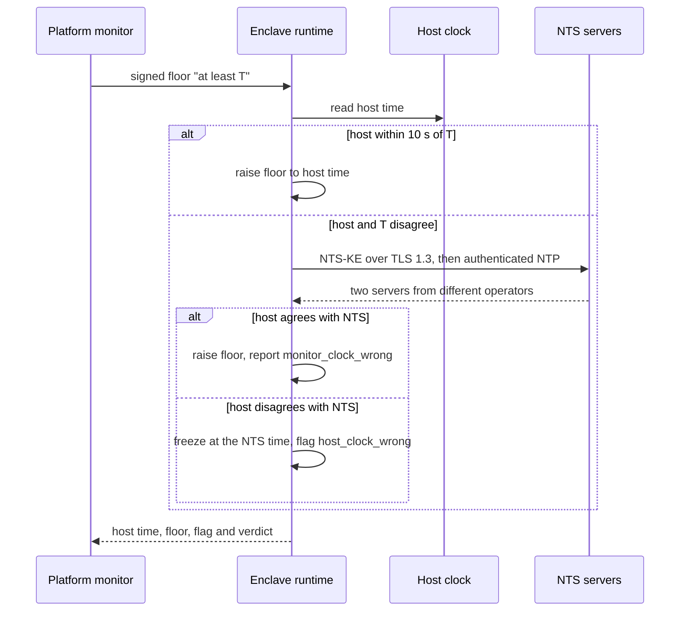

A confidential computing enclave keeps its memory away from the machine it runs on. It still asks that machine what time it is. Almost every security decision an enclave makes depends on the answer: whether an attestation quote is fresh, whether a certificate is inside its validity window, whether a token or a voucher has expired, whether a peer's verdict is still recent enough to reuse. A host that rolls its clock back by a day can make a credential that expired yesterday look valid again, and nothing in the memory encryption notices.

This post explains how our two runtimes, [Enclave OS (Mini)](https://github.com/Privasys/enclave-os-mini) on Intel SGX and [Enclave OS (Virtual)](https://github.com/Privasys/enclave-os-virtual) on Intel TDX, now check the time they are given, what the design guarantees, and where its bounds lie.

## Where an enclave's time comes from

On SGX there is no clock inside the enclave. Intel's early trusted-time service was retired years ago, so an SGX enclave that wants the time asks the host through an ocall, and the host answers with whatever its own clock says. On TDX the guest has a kernel and a wall clock of its own, but that clock is steered by the host: the guest's paravirtual clock source is provided by the hypervisor, and a typical cloud image takes its NTP servers from the host's DHCP. In both cases the time is chosen by the party the enclave is meant to be protected from.

## Why NTP alone is not enough

The first answer everyone reaches for is to ask the internet. Run NTP inside the enclave, and the host's clock no longer matters.

The difficulty is that every packet the enclave sends or receives passes through the host. Plain NTP carries no authentication, so the host can answer the enclave's query itself, from any address, with any time it likes. The enclave has no way to tell a reply from a stratum 1 server in Stockholm from one forged on the same machine.

[Network Time Security](https://www.rfc-editor.org/rfc/rfc8915) (NTS, RFC 8915) closes that gap. The client first runs a TLS 1.3 key exchange with a named server on TCP port 4460 and checks its certificate, then sends NTP packets over UDP that are authenticated with keys exported from that TLS session. The host still carries every byte, but it can no longer alter them or answer in the server's place.

What the host can still do is delay. It can hold a reply for a few seconds before handing it over, and an enclave with no clock of its own cannot measure how long it waited. An authenticated time therefore tells the enclave that the time is at least the value in the reply. It is a lower bound, and a good one, and the rest of the design is built around using lower bounds carefully.

NTS on every time read would also be far too slow and far too dependent on a handful of public servers. The enclave needs its host's clock for everyday reads, and a way to find out quickly when that clock is wrong.

## A floor from outside, and NTS to settle disagreements

We run a platform monitor: an attested instance of our [monitoring app](https://github.com/Privasys/container-app-service-monitoring), in its own enclave, on its own host. Every five minutes it sends each enclave's runtime a signed statement for that enclave, "the time is at least T". The runtime compares T with its host's clock.

When the two agree within ten seconds, the host time is confirmed and the runtime raises its **floor**, the highest time it has trusted, to that value. When they disagree, one of them is wrong, and the runtime has no reason to believe the monitor over the host: the monitor runs on a host too, and a monitor can be misconfigured or compromised like anything else. So the runtime asks NTS to break the tie.



The runtime picks two servers at random from ten pinned European NTS servers, one per operator, and requires them to agree within two seconds. If they do not, or one does not answer, it asks a third and takes the majority. The ten are run by national metrology institutes, internet exchanges, a registry, universities and companies:

| Server | Operator | Country |
|---|---|---|
| `nts.netnod.se` | Netnod | Sweden |
| `ptbtime1.ptb.de` | PTB, the national metrology institute | Germany |
| `nts.time.nl` | TimeNL (SIDN) | Netherlands |
| `time.cloudflare.com` | Cloudflare | Europe-wide anycast |
| `ntp3.fau.de` | FAU Erlangen-Nürnberg | Germany |
| `ntp1.cam.ac.uk` | University of Cambridge | UK |
| `nts2.ntp.hr` | University of Zagreb | Croatia |
| `paris.time.system76.com` | System76 | France |
| `ntp1.rdem-systems.com` | RDEM Systems | France |
| `nts.teambelgium.net` | Team Belgium | Belgium |

The list is compiled into each runtime, so it is part of the measurement a verifier checks, and changing it is a new runtime release. Delivering it as configuration would have been more convenient, but whoever can edit the list can point an enclave at servers they run, and a valid TLS certificate for a domain one controls is easy to obtain.

Those certificates raise a question of their own: checked against which time? Checking them against the host's clock would let the host decide which expired certificates are still valid, the very thing we are defending against. The runtime checks NTS certificates against its floor instead, and the floor never starts below a minimum compiled into the build, so a freshly booted enclave never accepts a time earlier than its own release.

The monitor's signature authenticates the floor, and its answer can only ever trigger an NTS check. A monitor that is wrong, or lies, causes an NTS fetch and an alert about the monitor. It cannot give an enclave a wrong trusted time.

## Frozen time, never an offset

When NTS confirms that the host is wrong, the runtime has to keep answering time reads until the host is fixed. The natural approach is to compute an offset, the NTS time minus the host time, and keep adding it to the host clock. We rejected it. An offset still moves at the host's pace, so a host that changes its clock twice, or simply runs it slowly, can produce a sequence of believable times of its choosing.

The runtime **freezes** instead: trusted time stays at the NTS time from the moment of the fetch, the clock is flagged with its reason, and the runtime refetches NTS in the background. The flag clears once the host is back at or above the floor and within ten seconds of a fresh NTS reading. Frozen time falls behind real time until the next poll brings a fresh fetch, so a credential that expires just after the freeze is treated as valid for a few more minutes. In exchange, nothing the host does to its clock can move trusted time at all, and that trade is what gives the bound described below.

A few rules keep the floor sound. A time read never returns less than the previous one. The floor is only ever raised from a host time that was confirmed, by the monitor or by NTS, so a host that jumps forward cannot drag the floor into the future. An in-sync poll raises it by at most an hour, and on TDX by no more than the monotonic time elapsed since the last raise plus ten seconds; a larger jump needs NTS to confirm it. The floor is sealed so that it survives a restart, and at boot the runtime completes one NTS fetch before its first time-sensitive decision, so a host that restores an older sealed state gains nothing but a lower floor that the boot fetch immediately corrects.

## Report, quarantine, keep serving

A host with a wrong clock is a platform incident, and an enclave that shuts itself down whenever it sees one would hand every host an easy way to take enclaves offline. So the runtime reports rather than stops. A problem found during a poll goes back in the poll's reply. A problem found between polls, such as a host clock that falls more than a second behind the floor, is sent to the monitor as an incident, and the runtime waits up to five seconds for the monitor's signed receipt before carrying on.

The monitor acts on what it finds. It records every reading in its ledger, which gives us a fleet view of every host's time and its drift, and when an enclave's host is wrong it asks our control plane to **quarantine** that enclave at the gateways. The gateways pick up the change within about five seconds and answer requests for the enclave's apps with a 503 and a `Retry-After`, so users are not handed results computed on a frozen clock. The gateways run on their own machines, out of the host's reach. The enclave's manager route stays open, so the monitor can keep polling, and once a poll shows the host back in sync, the monitor lifts the quarantine it placed.

The control plane accepts these requests only from an attested app holding a specific platform right, and it accepts the monitor's key only if its SHA-256 matches the hash the monitor commits in its own attested certificate, at OID `1.3.6.1.4.1.65230.5.4.3`. The key the runtimes pin is therefore one that only the measured monitor build can hold. The floor itself is a small, plain structure:

```json
{ "enclave_id": "…", "t_ms": 1789000000000, "seq": 42, "key_id": "…", "sig": "…" }
```

signed with Ed25519 over the domain `privasys-clock-floor/v1`, the enclave id, the time and a sequence number that never repeats. The runtime's reply needs no signature of its own: the monitor reaches the runtime over [RA-TLS](/blog/binding-attestation-to-the-tls-session) and verifies a quote bound to that very connection before it believes a word of the answer.

Failing closed is reserved for the decisions that actually depend on time. When the runtime has no trusted time at all (NTS unreachable, no majority, no receipt), verifying a quote, a token, a voucher or a peer's certificate returns an error and the request is refused. A trusted-time read never returns zero, since a zero time would make every expiry look far away. Serving, on the other hand, never waits on the clock: the runtime keeps presenting its certificate and completing handshakes, stamped with its floor, so the enclave stays reachable for the very poll that lets it recover.

A host can also try the quiet route: drop the monitor's polls and hold its clock just above the floor. The runtime cannot tell that a poll is late, since measuring the gap would need the trusted clock it is waiting for. The monitor can, so it quarantines any enclave that misses two polls in a row, whatever that enclave said last.

## What we learned building it

**Pure Go where it counts.** Our TDX runtime and the monitor are written in Go, and use an established NTS library. In testing, one of the pinned servers negotiated AES-128-GCM-SIV, and the assembly implementation of SIV in a dependency crashed the process. Offering only the other cipher was not an option, since another pinned server then stopped answering. We vendored a pure-Go implementation of the cipher into both repositories, and every server on the list now completes its exchange.

**Every stage of boot needs a clock.** Enclave OS (Virtual) unlocks its encrypted data disk very early, with a key it fetches from our vault over RA-TLS, before the manager and its sealed floor are available. The first build routed that step through trusted time too, found no clock installed yet, and failed closed exactly as designed, which kept the disk locked. The boot step now brings its own short-lived clock, fed by an NTS quorum, and waits for it before it unlocks anything.

**Leave the policing to the party that can see.** An earlier build had the runtimes check themselves between polls, refetching NTS after a number of time reads or an elapsed interval. It looked thorough, and on a busy enclave it scaled with load: a heavily used SGX enclave went back to NTS every few seconds. The runtimes now do the cheap comparison with the floor, and detecting silence, the one thing a runtime cannot measure, is the monitor's job.

## Lying to it on purpose

Trusted time runs today across our development and production fleets, on both runtimes and in our vaults. Before rolling it out we attacked it the way a host would: we moved clocks back on purpose.

On a TDX machine we set the guest clock back ten minutes. The next time-sensitive decision noticed that the host had gone behind the floor, reported the incident, got the monitor's receipt and froze on the NTS time. The monitor polled at once, saw an enclave serving a frozen time, and had the enclave quarantined within half a second of the report. When the clock was put right, the next poll found the host in sync again and the monitor lifted the quarantine.

On an SGX machine we shifted the clock of the enclave's host process only, again by ten minutes, and restarted the enclave. At boot it compared its host with NTS, found a gap of about six hundred seconds, and started on the NTS time with the host flagged. Once we restored the clock, the next poll came back in sync, 251 milliseconds apart, and the quarantine was lifted.

Both runs found something to fix, which is why we ran them. The SGX runtime's incident report offered only the RA-TLS marker during its handshake, and the monitor's TLS server, which does not list that marker, refused it: no receipt came back and the enclave failed closed. And the monitor presented its own attested identity on every poll, which a runtime without trusted time cannot verify, so the enclaves that most needed a poll were the ones it could not reach. Both are fixed, and both runs are now part of how we roll out a runtime.

## The bounds

The design protects a clearly stated window. Between two polls a host can move its clock back, but never below the floor, and after the next poll it is caught. With a poll every five minutes, an expired credential can be accepted for at most about one poll interval, around five minutes. Tokens, quotes and vouchers that live for minutes to hours keep their meaning.

On SGX the enclave still cannot time a round trip, so a host can hold an NTS reply for a few seconds and roll its clock back by the same amount to match. The error it can hide is the ten-second tolerance plus whatever delay it can add without tripping a timeout. On TDX the guest's timestamp counter is one the host cannot change, so the runtime measures each NTS round trip and refuses replies slower than two seconds.

The design also relies on the monitor's receipts. If the monitor is down at the moment a host clock goes wrong, the runtime fails closed on verification until it can reach the monitor again. We chose downtime over accepting a time nobody has checked.

Two paths are still being moved onto trusted time: the virtual runtime's outbound TLS to identity providers, and the freshness checks in our client SDKs.

## The principle

An enclave's guarantees are only as current as its idea of the time. Memory encryption keeps the host out of the enclave's data, and trusted time keeps the host out of its decisions about what is still valid. Each enclave checks the host's clock against an attested monitor and settles any disagreement with authenticated time from ten independent operators, so no single party, host or monitor, decides what time it is.

*Enclave OS (Mini) and Enclave OS (Virtual) are open source under the AGPL-3.0 licence: [github.com/Privasys/enclave-os-mini](https://github.com/Privasys/enclave-os-mini) and [github.com/Privasys/enclave-os-virtual](https://github.com/Privasys/enclave-os-virtual). The monitor is part of [github.com/Privasys/container-app-service-monitoring](https://github.com/Privasys/container-app-service-monitoring).*
