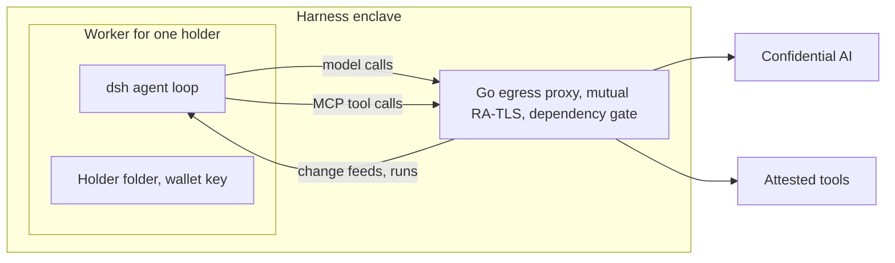
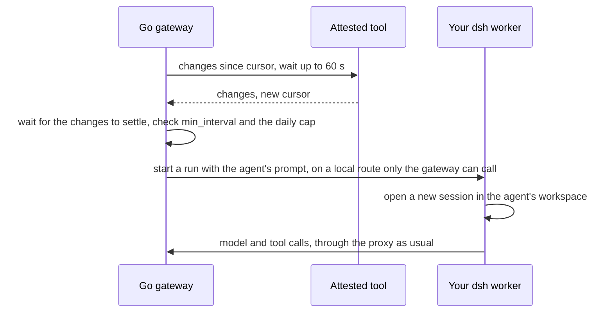

In most products an agent is either an object inside someone else's service, defined in a vendor's interface and stored on the vendor's servers, or a piece of software you write, package and deploy. The first is quick to create and impossible to inspect or take elsewhere. The second is inspectable and portable, and every agent becomes an application with its own hosting, updates and security surface. Privasys Harness separates the two concerns: the runtime is one attested image that nobody can change quietly, and an agent is a few text files in a folder that belongs to you.

This post describes that design, from the runtime at the bottom to the files at the top. It follows [the introduction of Privasys Harness](/blog/an-agent-you-can-verify-introducing-privasys-harness) at the end of August, which covered the enclave, the attested egress and the sealed transport.

## Why the common answers fall short

Hosted assistants let you define an agent with a name, instructions and a few tools in minutes, and they run it well. The definition lives in the vendor's account system, the tools it may call are whatever the vendor integrates, and what actually executes your instructions is not something you can verify. Exporting an agent to run somewhere else is rarely possible, and never with its history.

Agent frameworks take the opposite approach. An agent is code: a graph, a chain or a class, with its prompts in string literals and its tools as functions. That is powerful and fully inspectable, and it turns every agent into a deployment. Changing the agent's instructions means a commit and a release, and running it unattended means operating a server that holds its credentials. The distance between "I want an assistant that triages my inbox" and a running agent is a software project.

Privasys Harness makes an agent as quick to create as the hosted products do, keeps it as inspectable and portable as code, and runs it on a runtime a third party can check.

## The runtime: dsh and Cordis

[DeepSeek Harness](https://github.com/deepseek-ai/deepseek-harness) (dsh), which Privasys Harness hosts, is built on [Cordis](https://github.com/cordiverse/cordis), a plugin framework whose design is described in [_A Programming Paradigm for Spatiotemporal Composability_](https://arxiv.org/abs/2608.25512). In dsh everything is a plugin: the agent loop, the model adapters, the tools, the session log, the command registry and the web interface. Each plugin declares the services it needs, contributes services, tools and user interface to the part of the system it was loaded into, and has those contributions removed when that part ends.

This scoping in space and time is what "spatiotemporal" refers to. A contribution made in the scope of one agent, such as a tool, a prompt section or a restriction on which tools it may call, exists only for that agent and is unwound when the agent is disposed. Nothing leaks into the next session. The same mechanism makes a whole deployment a tree that can be written down.

The tree is written in YAML. A profile names a bundle, the bundle lists plugin rows, and patches add, replace or disable rows over it:

```yaml
- id: session-persistence-jsonl
  name: "@deepseek-ai/dsh-session-persistence-jsonl"
  config:
    root: /dev/shm/privasys-sessions
```

`dsh --dump-config` prints the fully composed tree. A composition that can be printed can be checked at build time and measured into the image, so the attested identity of the harness covers what runs inside it, down to each plugin and its configuration.

## Cleaned to the bone

dsh's default bundle composes 93 plugin rows. Ours is an allow-list of 79, generated from the pinned upstream bundle and reviewed on every re-pin, so a plugin DeepSeek adds by default reaches our deployment only when we admit it. The rows we leave out fall into five groups:

- **Public web access.** DeepSeek's cloud search and the plain HTTP fetch tool. The agent's only way out of the enclave is the attested tool fleet behind our egress proxy.
- **Other model routes.** The DeepSeek account route and the generic external-provider adapter. The one model leg is [Confidential AI](/blog/ai-tools-that-charge-by-the-call), attested on every request.
- **Reporting.** Session-log upload to DeepSeek, plugin inventory metadata in model requests, and session telemetry.
- **Runtime installation.** The plugin manager and its tool. The composition is the measured identity, so nothing may add a plugin to it after the build, whether a person or the model asks.
- **Dead weight.** The tool-result pruner, which rewrites earlier tool results in place and would invalidate the confidential backend's prefix cache on every turn, and the Windows shell tools.

The image build enforces all of this. It clones dsh at an exact commit, applies a short queue of anchored edits (a moved anchor fails the build, which is our signal to rebase), builds, and then composes each profile and asserts the result: the agent core must be present, and none of the excluded rows may reappear. Finally it deletes every agent-facing file DeepSeek authored for its own contributors, such as `AGENTS.md` and `CLAUDE.md`, so the model reads our instructions and yours, and nothing else.

## The agent loop, and where attestation lives

A turn in dsh is the familiar loop. The model receives the conversation and the available tools, proposes text or tool calls, the tools run, their results are appended, and the model continues until it answers. The session log is an append-only record of every event, and everything the interface shows, from the transcript to the current permission mode, is folded from that log.

Which tools, prompts and permissions a session gets is decided by its preset, a named composition inside the bundle. In our presets each attested tool is one MCP client row pointing at a local endpoint of the Go egress proxy, which dials the tool's enclave over mutual RA-TLS and checks it against the harness's pinned dependency set before any data moves. Calls to the model go through the same proxy. dsh itself never checks an attestation and holds none of the keys those checks use: every call it makes leaves through the proxy, and the attestation panels in the interface only display the proxy's results. A plugin, a patch or a model that misbehaves inside dsh therefore cannot relax the checks, because they are made in a separate, smaller program that is part of the same measured image.



Each signed-in person gets their own dsh process, running under its own operating-system user, with its own home and sessions. Its files live in that person's folder on the harness volume, which the kernel encrypts with a key [supplied by their wallet](/blog/the-disk-of-a-confidential-app-consent-from-the-wallet-a-filesystem-for-agents): the folder opens when their worker starts, under a consent they gave once, and locks when it stops.

## An agent is a folder of text

Inside that folder, an agent is a directory:

- **`agent.md`** is the persona and the standing instructions, in plain prose.
- **`agent.yaml`** says when the agent runs and what an unattended run is asked to do.
- **`.agents/skills/`** holds the agent's own skills, each a folder with a `SKILL.md` describing a procedure the model can load when it needs it.
- **`state/` and `runs/`** are where the agent's runs write what they produce.

```yaml
prompt: Triage what arrived since the last run.
trigger:
  on: mail.changes   # or every: 2h, or at: "0 17 * * FRI"
debounce: 2m
min_interval: 10m
paused: false
```

Your general skills sit beside your agents, seeded once from the public [Privasys/agent-skills](https://github.com/Privasys/agent-skills) repository and yours from then on: edit one and the next session follows the edit, with no deploy. Each agent is a dsh workspace, so the sidebar is the list of your agents and each agent's runs appear under it as ordinary sessions you can open and read.

You do not write these files by hand, although you can. You describe the agent in a conversation ("an agent that triages my inbox as mail arrives, labels everything and drafts replies only where one is expected"), and the chat, following a reference skill, agrees the definition with you, writes it through the harness's own `agents` tool server, which validates the YAML before anything is written, and asks for any access the agent will need. The definition files are read-only from the agent's side: a run can write its outputs, and cannot rewrite its own instructions. Changing an agent is another conversation, and removing one is deleting its folder, from the harness or from your Drive's "App folders" view.

Copying the folder copies the agent, and handing it to a colleague gives them the same behaviour in their own harness, under their own approvals.

## Events and runs

dsh has no scheduler and nothing that wakes a cold session, so the Go gateway owns the clock and the events. A trigger names exactly one of three sources. `every` is a timer, `at` is a cron schedule read in UTC, and `on` names a call on any mounted tool that answers the change-feed contract:

```
call   <tool>.<call>  {"since": "<cursor or empty>", "wait_seconds": 60}
reply                 {"changes": [...], "cursor": "<opaque>"}
```

The gateway makes that call on your behalf and keeps it open, and the tool answers only when something has changed, for example when new mail arrives. Because the gateway always starts the call, the tool never needs a way into the harness, and the gateway does not need to understand what the changes are.

When changes arrive, the gateway waits for them to settle (two minutes by default), so a burst of new mail starts one run rather than ten. It also leaves at least `min_interval` between two runs of the same agent, so one run always finishes before the next begins. If the tool reports that it needs you, for example to approve access again, the gateway asks your phone once and waits for your answer.

To start a run, the gateway hands the agent's prompt to your dsh process through a local route that only the gateway can call. dsh opens a new session in the agent's workspace, and the run proceeds like any conversation.



Runs use a composition of their own, the `routine` preset: the attested tools, file reading and search, the skills and compaction. It has no shell, no subagents and no tool for asking questions, and its permissions keep writes inside the agent's workspace and refuse any request for more. The build checks both. A policy caps unattended runs per agent per day, and if the model service refuses a run for payment, every agent pauses and writes why into its folder.

## Current limits

Two limits shape how agents are used today. dsh is a developer preview that changes quickly, and we follow its releases: each one becomes a new measured image, rebuilt and re-checked against our allow-list and edits before it ships. And an unattended run cannot come back to you with a question, so an agent works best when it prepares work for you to confirm, drafting a reply or proposing a meeting, rather than taking a decision that depends on your judgement.

## A fixed runtime, and behaviour you own

Everything that must be trusted, from the loop and the plugin roster to the egress rules and the attestation checks, is in one image whose composition is printed, asserted and measured at build. Everything that makes the agent yours, its instructions, its skills, its schedule and its outputs, is a folder you can read, edit, copy and delete, encrypted with a key from your own wallet.

*Privasys Harness is open source under the AGPL-3.0 licence at [github.com/Privasys/harness](https://github.com/Privasys/harness), building on the MIT-licensed [DeepSeek Harness](https://github.com/deepseek-ai/deepseek-harness). The reference skills, including the one that builds agents, are at [github.com/Privasys/agent-skills](https://github.com/Privasys/agent-skills).*
