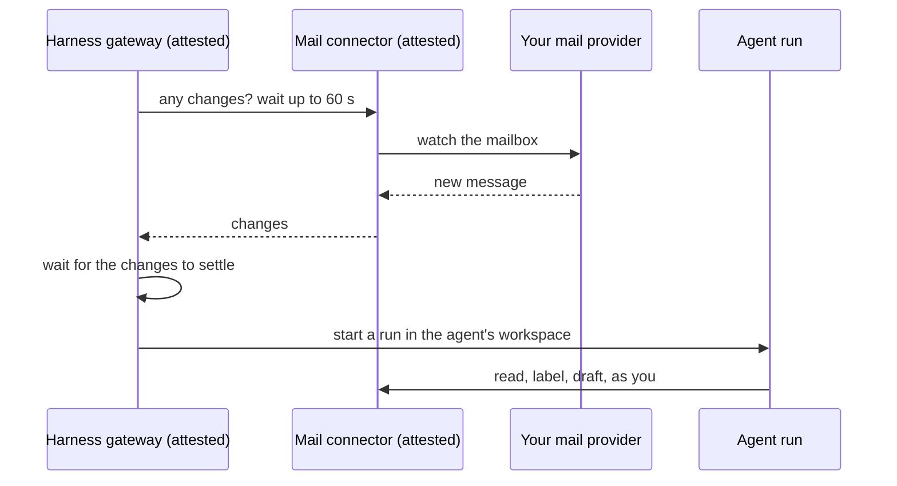

Much of what an AI agent is useful for happens while you are doing something else: triaging the mail that arrived overnight, noticing that tomorrow's first meeting moved, filing a transcript before its provider's retention deletes it. An agent that does this without you needs two things. It needs standing access to your accounts, which in practice means a credential for your mailbox, your calendar and your files, usable when you are not there to approve each call. And it needs somewhere to keep its instructions, its working files and its memory between runs. In the products available today, both end up on infrastructure the user neither controls nor can inspect.

This post explains how Privasys Harness gives an agent both while the credentials and the data stay with the user. It builds on [the harness itself](/blog/an-agent-you-can-verify-introducing-privasys-harness) and on [agents defined as a folder of text](/blog/an-agent-is-a-folder-of-text-agent-as-a-config-in-privasys-harness), and focuses on three design decisions: where the keys to your accounts live, who decides what an agent may reach, and how an agent is woken when something happens.

## Why the common answers fall short

The hosted assistants make connecting an account a single step. You click "Connect Gmail", sign in once, and the assistant can read your mail from then on, whenever it runs. The refresh token that opens your mailbox sits on the provider's infrastructure indefinitely, beside every other customer's, under a policy you can read and cannot check. The agent's memory and the history of what it did accumulate in the same place. If the vendor changes its terms, is breached, or is compelled to hand data over, the keys to your correspondence are part of what is exposed.

Running an agent on your own laptop keeps the keys at home, and stops working when the lid closes. Moving it to a server you rent keeps it running, and makes you the operator of a machine that holds long-lived credentials to your accounts, with its patching, backups and exposure to whoever else can reach it. Nobody else can verify what that machine runs either, which matters as soon as the agent works for a team or a client.

Privasys Harness connects an account in one step, as the hosted products do, keeps credentials and data under the user's control, as self-hosting does, and runs every component on attested code that anyone can check.

## Decision one: no stored keys

The most sensitive thing an agent platform can hold is the collection of refresh tokens that open its users' mail, calendars and files. A token at rest in a database can be copied by an attacker, by an insider or under a court order, and it keeps working until someone notices. We decided that our platform would not have such a collection at all.

Your accounts are reached through Privasys Connectors, one confidential app per kind of account: mail (Gmail, Outlook and any IMAP server), calendars, cloud files (Google Drive and OneDrive) and meeting transcripts (Zoom and Teams). When you connect an account, you sign in at the provider on your phone, and the connector completes the exchange inside its enclave. From then on the credential exists in exactly two places. One is the memory of the connector, which never writes it to disk, never logs it and never shows it to the agent. The other is your phone, which keeps what it needs to reconnect in the device's secure storage.

This has three consequences for you.

- **Nothing to steal at rest.** A copy of our disks, or of the connector's, contains no credential for your accounts. The connector is also attested: before your wallet approves anything, it checks that the connector runs published, measured code, so the code that keeps the credential in memory is code you can inspect.
- **The agent never holds your keys.** The model sees tool results such as message summaries, never tokens. The connector also removes one-time codes, password-reset links and login links from content before the agent reads it, so a message crafted to trick the model into forwarding a code has nothing to forward.
- **Disconnecting is final.** Because the only durable copy is on your phone, disconnecting an account in your wallet leaves nothing behind that could keep working. The connector drops its copy at once.

The cost is that a connector keeps nothing across a restart: it asks your phone for what it needs, which takes one tap, and agents waiting on that account resume as soon as you give it.

## Decision two: you approve each assistant, for each account

A credential that any part of a platform can use is a credential with no boundary. We made the boundary your own consent, and we made the connector, not the agent, enforce it.

When an agent first needs your mailbox, it asks for access and your phone receives the request. Your wallet verifies both the assistant and the connector, writes the approval screen itself from a fixed vocabulary (so neither side can describe itself however it likes), and records a grant for that one assistant on that one account. A personal and a work mailbox are two accounts and two approvals. On every call, the connector checks that the calling assistant holds a live grant for the account it is about to open, before contacting the provider.

Enforcing this in the connector matters because the connector is the one party that holds the credential. An agent that is confused, or that has been manipulated by the content it reads, cannot reach an account you did not approve for it, because it never holds the key and the connector will not use the key on its behalf. The same applies between accounts: if you approved an agent for multiple mailboxes and a request does not say which one it means, the connector refuses to guess and returns the list of accounts, and the agent has to ask you.

Your wallet is the one place where all of this is visible and reversible. Its Access tab shows each provider, each of your accounts there, the products connected on each and the assistants using them, and lets you disconnect any one of them. Inside the harness, a Connectors menu in the composer lets you narrow things further for a single conversation: a connector switched off there has its tools removed from that conversation, so the model is never offered them.

What an agent does with the access you grant is also yours to decide. An agent's instructions are a text file you write with it in the chat, and they say whether it should prepare drafts for you to review or act on its own. Today the connectors stop at drafts and tentative calendar proposals. Sending will arrive as a separate permission you grant per account, so an agent can only send on your behalf when you have approved exactly that, on your phone, for that account.

## Decision three: the agent pulls, nothing pushes

An agent that reacts to new mail has to learn that mail arrived. The usual design is a webhook: the mail service, or a vendor in the middle, calls into the agent's host whenever something happens. That gives the host an inbound door on the internet, which has to be exposed, authenticated and defended, and which becomes a way in for anyone who can forge a call.

The harness has no such door. Every connector offers a `changes` tool that waits, for up to a minute, until the account changes, and returns what changed. The harness's gateway calls it on your behalf and keeps the call open; when it returns, the gateway calls again. Every event therefore reaches the agent over a connection the harness opened, towards a connector whose code it has verified, and no outside service can start a run of your agent.

When changes arrive, the gateway waits a couple of minutes for them to settle, so a burst of mail starts one run, and starts it in the agent's own workspace, where it appears in your sidebar like any conversation. A run has the attested tools and no shell, and it pays for the model from your own credits under a monthly cap you approved in your wallet. If a run is refused for payment, every agent pauses and says so, rather than retrying into a bill.

For the harness to open your agent's folder while your phone is off, it needs the folder's key without you. You grant that explicitly: the folder approval in your wallet says that this assistant works while you are away, and the harness then keeps a locked copy of the key, usable only inside its attested enclave. Revoking the folder in your wallet removes it. This copy is the one exception to the rule that only your phone can open your data, which is why the wallet asks for it separately.

## Where your data ends up

Put together, each kind of data has one home, and each home is under your control.

- **Your conversations** are written to your Privasys Drive as they happen, under keys only you hold, where they form a memory later sessions and agents can search.
- **Your agents, their skills and their outputs** live in a folder the harness keeps for you, encrypted by the kernel with a key from your wallet, which you can browse, download or delete from outside the harness.
- **The credentials for your accounts** live in connector memory and on your phone.

The connectors are live on our test environment; production is next.

## Ownership, all the way down

An agent that works around the clock needs your keys and a place for its work. In the harness, the keys are in your wallet and in enclaves whose code anyone can verify, the work is in a folder encrypted with a key from that same wallet, and the memory is in a Drive only you can open. Each service the agent uses is approved one account at a time and can be disconnected from the wallet at once.

*Privasys Harness is open source under the AGPL-3.0 licence at [github.com/Privasys/harness](https://github.com/Privasys/harness), and Privasys Connectors at [github.com/Privasys/connectors](https://github.com/Privasys/connectors) (the connector SDK under Apache-2.0). How connectors work, and how to write one, is documented at [docs.privasys.org](https://docs.privasys.org/solutions/ai/connectors/).*
