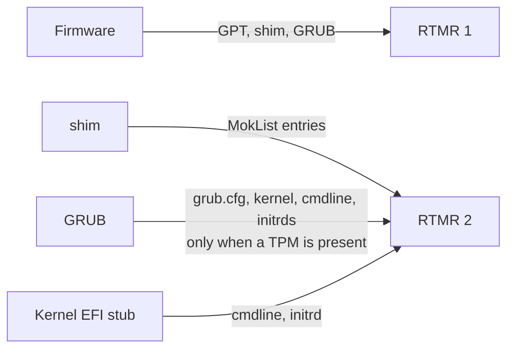

Until this week every Confidential AI enclave we ran lived on a cloud virtual machine: Intel TDX for the CPU, an NVIDIA H100 in confidential-computing mode for the GPU, and the cloud provider's firmware underneath both. We described that stack in [Confidential AI on H100: the CPU/GPU ceremony](/blog/confidential-ai-on-h100-the-tdx-gpu-ceremony) and the measured image it boots in [CVM base images](/blog/cvm-base-images-what-we-build-and-why). This week we installed the same enclave on a bare-metal server, with QEMU/KVM as the hypervisor and firmware we chose ourselves. The image booted on the first attempt. The platform then refused to let it in...

Three problems stood between that first boot and a working, attested instance. None of them is specific to our machine: they sit in the firmware, the boot loader and the hypervisor that a team running a TDX guest with a GPU on its own hardware will take from the same open-source shelves. Here they are, with the fixes.

## What the platform checks first

Intel TDX runs a virtual machine inside memory the host cannot read, and lets that machine produce a signed statement, a quote, about what booted inside it. The quote carries four runtime measurement registers, RTMR[0] to RTMR[3]. Each stage of the boot chain hashes the next stage into a register before starting it, so the final values summarise the chain. Our build pipeline predicts two of them from the image alone and publishes the values with each release. RTMR[1] is written by the firmware and covers the boot path: the disk's partition table, shim (the first-stage loader Linux distributions ship) and GRUB (the boot loader shim starts). RTMR[2] covers what GRUB loads: its configuration, the kernel, the kernel command line, which carries the dm-verity root hash of the root filesystem, and the initial ramdisks.

The disk an enclave keeps its state on is encrypted, and the key is held by a vault outside the enclave. At first boot the enclave sends its quote; the vault compares RTMR[1] and RTMR[2] with the published prediction and hands over the disk key only on a match. A guest whose registers differ gets a 403 and stays locked out of its own storage.

## Problem one: GRUB measured nothing

The first boot used Ubuntu's TDX firmware package, `ovmf-inteltdx`: OVMF is the open-source UEFI firmware for virtual machines, built from the edk2 project, and this package is its `IntelTdxX64` configuration, trimmed for TDX guests. RTMR[1] matched the prediction exactly. RTMR[2] did not.

The guest's boot event log showed why. The prediction expects GRUB's configuration file, its commands, the kernel, the command line and both initrds. The log held only shim's three MokList entries (its record of its own key database), followed by two entries from the kernel's EFI stub: the command line and the initrd. GRUB had recorded nothing.

The cause is a single condition in Ubuntu's GRUB. It only enables its measurement code when the firmware offers a TPM, the Trusted Platform Module, through the `EFI_TCG2_PROTOCOL` interface. With a TPM present, GRUB writes each measurement twice: into the TPM and into the TDX registers through the separate confidential-computing measurement interface. Without one it writes neither. The `IntelTdxX64` firmware provides the TDX measurement interface and no TPM, so GRUB loaded our kernel unmeasured. The kernel's own stub then recorded its command line and initrd into RTMR[2], which is why the register was wrong rather than empty.



On the cloud the condition never shows: the provider's firmware includes a virtual TPM. On bare metal with the trimmed firmware, the kernel, the one component whose hash ties the chain to the dm-verity root, went unmeasured, and the refusal said exactly that.

The fix is a TDX firmware that also exposes a TPM, backed by `swtpm`, the software TPM emulator, on the host. Approving the observed value was never an option: a chain that skips the kernel is weaker than the one the release promises, whatever number the register holds.

## Problem two: the firmware that has both crashed

edk2's full configuration, `OvmfPkgX64`, supports TDX guests and can be built with TPM support. Built from edk2-stable202511 it crashed at once inside the guest with an invalid-opcode exception. The faulting module was `CpuMpPei`, which brings up the other processor cores, and the faulting instruction was a trap the compiler had inserted in its memory-type-range setup, code a TDX guest may not run. The same configuration built from edk2-stable202411 boots with no source changes, so this is a regression in the newer release. We used the older one and did not chase the exact commit.

The build is routine once the compiler is pinned. Ubuntu's current GCC rejects parts of edk2's own tooling, so we built in an Ubuntu 22.04 container:

```bash
podman run --rm -v "$PWD":/edk2 -w /edk2 docker.io/library/ubuntu:22.04 bash -c '
  apt-get update -qq && apt-get install -y -qq build-essential uuid-dev iasl nasm python3 python-is-python3 git
  make -C BaseTools && . ./edksetup.sh &&
  build -p OvmfPkg/OvmfPkgX64.dsc -a X64 -t GCC -b RELEASE \
        -D TPM2_ENABLE=TRUE -D SECURE_BOOT_ENABLE=FALSE'
```

Secure Boot is off on purpose. Our kernel carries our own patches and no distribution signs it, so a firmware with the Microsoft keys enrolled stops at shim with `bad shim signature`. Our chain relies on measured boot, where the attestation proves the exact bytes that ran; the base-images post explains the choice.

## Problem three: QEMU's TPM device broke the TDX guest

With the new firmware and `swtpm` attached, QEMU aborted before the guest ran:

```
Convert non guest_memfd backed memory region (0xfed45000+0x1000) to private
```

The address is the TPM's physical-presence page, a pre-boot interface through which a person at the keyboard confirms sensitive TPM operations. QEMU's `tpm-crb` device maps that page as ordinary RAM; the TDX firmware asks for it to become private guest memory, which QEMU cannot do for a region of that kind. Measurement never uses the page, so it can go:

```
-device tpm-crb,tpmdev=tpm0,ppi=off
```

With all three fixed, the event log reads as predicted, GRUB's entries included, and both registers replay to the published values:

```
RTMR[1] = a2903f19…cbac4e08   (predicted: a2903f19…cbac4e08)
RTMR[2] = 8f1c576b…3fef52ae   (predicted: 8f1c576b…3fef52ae)
```

The vault released the disk key and the enclave came up. The rest of the QEMU command line held no surprises: `-object tdx-guest` with the socket of the host's quote-generation service, `-bios` with the combined firmware image, the H100 passed through with VFIO and switched to confidential mode with NVIDIA's `gpu-admin-tools`, a large 64-bit MMIO window for the card, and the boot disk first in the boot order with no option ROM on the network card, so that no extra boot attempt adds an event to RTMR[1].

## What changed, and what did not

Two registers did change, and they are the two the platform does not pin. MRTD measures the firmware itself and RTMR[0] its configuration, so both differ between a cloud provider's firmware and one we built. The prediction covers RTMR[1] and RTMR[2], which depend on the image and on nothing else, together with the hash of the application the enclave serves. Pinning MRTD would tie an image to one firmware build, and through it to one hypervisor and one operator.

The GPU side of the attestation did not change. The enclave presents the H100's attestation report alongside the TDX quote, and our verifier checks it against NVIDIA's signed reference values for the driver and firmware versions it knows. A new GPU model or driver pairing needs its reference set extracted and reviewed first; until then the GPU part verifies as a genuine device in confidential mode with firmware measurements still unverified, and the attestation view says so.

The firmware requirement is now part of the documented measured-boot contract: the predicted registers are only reachable with a firmware that exposes a TPM to GRUB, and we will ship a known-good build for hosts outside the cloud. The check that refused the first boot said, accurately, that the kernel had gone unmeasured. The fix was to make the measurement happen rather than to lower the bar.

*Enclave OS (Virtual) and the CVM base images are open source under the AGPL-3.0 licence: [github.com/Privasys/enclave-os-virtual](https://github.com/Privasys/enclave-os-virtual) and [github.com/Privasys/cvm-images](https://github.com/Privasys/cvm-images). The measurement prediction used above is `predict-measurements.py` in the second repository.*
