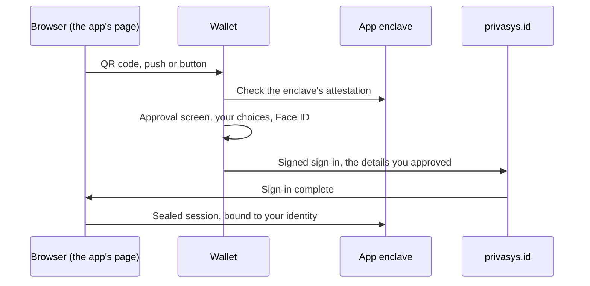

Signing in to an online service asks you to trust two things you cannot see: the server you are about to hand your details to, and the identity provider standing between you and it. The first decides what happens to your data once it arrives. The second sees every service you use, and usually keeps a profile of you to do its job.

Privasys Wallet is our answer to both. It checks the service before you share anything, asks you before anything leaves your phone, and keeps your details on the device rather than with us. We introduced it in March as [an authenticator for attested enclaves](/blog/fido2-for-attested-enclaves-two-way-trust-between-your-phone-and-the-cloud), and in June as the home of [Privasys ID](/blog/prove-it-without-giving-it-away). Much has changed since, so this post describes the wallet as it is today: how a sign-in works for the person holding the phone and for the developer integrating it, how consent is asked for, and which party in the chain knows what.

The wallet is on the [App Store](https://apps.apple.com/app/privasys-wallet/id6761209489) and [Google Play](https://play.google.com/store/apps/details?id=org.privasys.wallet). It is how people sign in to [Privasys Drive](/solutions/drive) and [Privasys AI](/solutions/ai), and to the applications our platform's adopters run in enclaves. It speaks 25 languages: every official language of the European Union, plus Welsh.

## A sign-in, from both sides

For a developer, the integration is one frame on the page and one call. The [Privasys Auth SDK](https://docs.privasys.org/solutions/privasys-id/auth-sdk/) draws the sign-in where the page asks for it, and the result is a [sealed session](/blog/bringing-attestation-to-the-browser-the-session-relay-pattern): an end-to-end encrypted channel from the browser into the application's enclave, carrying the identity of the person who approved it. The page never handles a password, a key or a token.

For the person signing in, the frame shows a QR code on a computer, or a button that opens the wallet on a phone. A returning user whose wallet is already paired gets a notification instead. A return visit to a site they are already signed in to needs nothing at all.

Between the scan and the sign-in, the wallet does its main job. Before it asks you anything, it connects to the application and checks its attestation: the proof, signed by the processor, of exactly which code is running inside the enclave, as described in [binding attestation to the TLS session](/blog/binding-attestation-to-the-tls-session). Only then does it show you the approval screen. Your approval is signed by a passkey held in your phone's secure hardware, behind Face ID or a fingerprint, so there is no password to steal and no shared secret on our side to leak.

## The evidence on the approval screen

The approval screen puts the result of that check in front of you before you decide. It names the application and what it does, and the publisher, taken from the application's public listing. It shows the exact code the enclave is running and links to the published release that code was built from, so the claim "this is the open-source version" is something you can follow to its source. If the application relies on other enclaves, such as a storage service or an inference service, they are listed too, each with its own name and whether it is published.

Checking a digital service before trusting it is a new step for users, so the first time the wallet is asked to trust an application, it shows a short explainer. It walks through what was just checked and what to look for.

## Consent, asked every time it matters

Nothing leaves the wallet without a decision you made on the screen in front of you. That covers four things.

**Your details.** An application declares what it needs. The approval screen lists each detail with the exact value that will be sent, whether it is required, and whether the application receives the value itself or only a proof about it, such as being over 18 without a date of birth. You can untick anything optional.

**What counts as true.** The wallet stores what you entered yourself, what a third-party identity provider supplied (Google, Microsoft, LinkedIn or GitHub), and what an identity document proved. These are handled as separate attributes, and an application asks for one or the other. A government-backed attribute gives an application strong assurance about who you are: it comes only from [our identity verification](/blog/prove-it-without-giving-it-away), which reads your passport or ID card chip and checks it in an enclave, and it can never be typed in by hand. Some attributes must be verified before any application receives them. An email address, for example, is either imported from Google, Microsoft, GitHub or LinkedIn and carries that provider's confirmation, or is verified by Privasys ID with a code sent to it.

**Access to what you own.** An application can ask for limited, revocable access to something of yours, such as [a folder in your Drive](/blog/the-disk-of-a-confidential-app-consent-from-the-wallet-a-filesystem-for-agents). The wallet describes the grant in its own words, from a fixed vocabulary it controls, so that an application cannot dress up a broad request in friendly language. The screen shows both the application asking and the service holding the data, and both are attested.

**Spending.** Some services are billed. Before an application spends on your behalf, the wallet asks, with a monthly cap you set.

Everything you have granted is listed on the wallet's Access tab: open sessions, access granted to applications, and accounts you have connected to a service. Each entry has a way to end it, and anything waiting on your decision sits at the top.

## Your data stays yours

The wallet keeps your details on your phone, in its encrypted storage. Your keys live in the phone's secure hardware and never leave it. Each application you sign in to, our own included, knows you by its own identifier that no other application sees, so two applications cannot match their records to find you. When one application needs something another holds for you, such as an AI assistant reading the files you made available to it in your Drive, it does not get there through a shared identifier: it asks, and you grant that access from the wallet. Your identities are derived from your recovery secret, so they come back after a recovery. The wallet can also live on up to five of your phones: each holds its own keys, a change made on one reaches the others sealed end to end, and any of them can remove another.

This is what self-sovereign means in practice. There is no central account holding your profile for us to lose, sell or hand over, and no master record of where you have been. The phone matters, so the wallet is built to be replaced: [adding, moving and recovering it](/blog/privasys-wallet-across-your-phones-adding-moving-and-recovering) has a post of its own.

## Who knows what

A sign-in passes through several parties. Each sees only what its job requires.

- **Your wallet** knows everything about you that you have given it, and nothing leaves it without your approval.
- **The application** receives its own identifier for you and the details you approved for that sign-in. It runs in an enclave whose code you saw before approving.
- **privasys.id**, our identity service, knows your account as a random value, the passkeys that sign for it (one per phone, each marked so your phones can be told apart without relating your identifiers), and which identifier each application has for you, so that what an application sends you reaches you. It carries the details you approve into the token the application receives, in memory, for the length of the sign-in, and stores none of them. While a session is open it holds the session's renewal token, which ties that application's identifier to the session; signing out removes it. It never holds your name, your email address or any other attribute.
- **Our attestation service** checks the enclave evidence the wallet sends it. It learns that a genuine copy of the wallet asked, and never which person or which identifier.
- **Apple and Google** deliver notifications. They see the name of the application that sent one and a fixed sentence such as "You have a new notification". Anything specific is either sealed to a key held by your wallet or fetched by the wallet directly from the application.

To verify an email address, privasys.id has to know it, since it sends the code. It holds the address in memory while the code is valid, fifteen minutes at most, and forgets it once the code is used, expires or runs out of attempts. What survives is a signed receipt, kept by your wallet, which is how an application can be told the address was verified without us keeping a list of addresses.

To deliver a notification, privasys.id has to know where your phone is: it keeps a push token for each identifier on each of your phones. A phone has one push token, so the same token sits under each identifier on that phone. That is the one place where our records could connect your identifiers to each other. The token is used for delivery and nothing else, and when privasys.id moves into an enclave, that record will be readable only by its published code. What a notification says is already sealed per identifier: each identifier has its own key, so the sealed contents relate no identifier to another.

## How an application reaches you

Applications need to tell you things: [an AI agent](/blog/an-agent-you-can-verify-introducing-privasys-harness) needing confirmation, a request for access to a file you shared, a decision on a request you made, a question that needs your answer. Any application running on Privasys can send one to a person it knows, using the identifier it knows that person by.

The platform accepts a notification only from the application's attested identity, so the name on the banner is the verified name of the enclave that sent it, and cannot be borrowed by another application. The specific content (who is asking, for which file) is sealed to your wallet's key before it leaves our servers, which carry it in memory and keep none of it. Each of your phones shows a generic banner; the wallet opens the content and shows it in full.

You decide which applications may reach you. Every application has a switch in its details, "Notifications from this app". Turning it off mutes the application's updates and news. Two kinds of message still arrive, because each asks you a question only you can answer: an application asking for access to something you own, and someone asking for access to a file you shared. Muting those would leave the other side waiting on a request you could not see. The application is not told that you muted it. On our side, the choice is stored as a keyed fingerprint of the pair of identifier and application, which records the setting and reveals neither half of it.

## What it adds up to

The wallet's job is to make the safe choice the easy one. Checking the code before trusting it, asking before sharing, and keeping data where its owner is take one scan and one glance at your phone. The checks happen in the same place every time, in the same words, in your language.

*Privasys Wallet is available on the [App Store](https://apps.apple.com/app/privasys-wallet/id6761209489) and [Google Play](https://play.google.com/store/apps/details?id=org.privasys.wallet), and its source is open under the AGPL-3.0 licence at [github.com/Privasys/identity-platform](https://github.com/Privasys/identity-platform). To add it to your own application, start with the [Auth SDK documentation](https://docs.privasys.org/solutions/privasys-id/auth-sdk/).*
