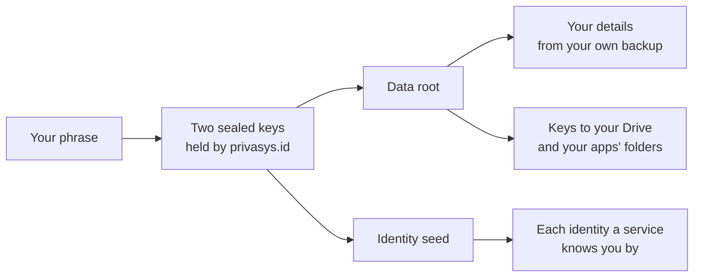

Phones get upgraded, replaced, broken and lost. The [Privasys Wallet](/blog/privasys-wallet-sign-in-consent-and-who-knows-what) keeps your identity on your phone rather than with us, so it has to follow you from one phone to the next. Our recent release makes that much easier. The wallet can now live on several phones at once, a new phone can take over from an old one without a recovery phrase, and a recovery brings back everything you had, while shutting a lost phone out.

This post walks through each situation, explains why the way back is always in your hands, and covers what you can set up today so that losing a phone costs you nothing more than the phone. If you are reading it because a phone has just gone missing, the section on losing a phone is the one to start with.

## One wallet on several phones

You can now use the same wallet on up to five phones. Each phone holds its own keys in its own secure hardware, and all of them sign in as you, receive your notifications and open your data. A change you make on one, such as a new address in your details, reaches the others, sealed so that only your phones can read it.

Adding a phone takes a minute. Install Privasys Wallet on the new phone and choose "I already use Privasys Wallet on another phone". It shows a code. On the phone you already use, go to Access, tap the QR code button and scan it, then confirm with Face ID or your fingerprint. Your wallet travels to the new phone encrypted so that only that phone can open it, and both phones then show the same six digits. When they match, you confirm on the new phone and it is ready, with your details, your sign-ins and your keys. You do not need your recovery phrase for any of this.

Once you have more than one phone, a Devices section appears in Settings. It lists your phones, and from any of them you can remove another at any time.

## Moving to a new phone

To move, add the new phone as above, check that everything is there, then remove the old one from Devices on the new phone, or choose "Remove this phone" on the old one, which also clears it. A removed phone can no longer sign in as you, receives none of your notifications, and the keys that prove your identities are replaced, so the copy of the wallet left on it opens nothing.

The phone's own transfer tools, such as Quick Start on an iPhone, no longer copy the wallet's secrets. They used to carry part of the wallet across without the keys held in the old phone's secure hardware, which left a wallet that looked complete and was not. The wallet's own transfer above moves everything, or nothing.

## If your phone is lost

Losing a phone is stressful, and losing the wallet on it can feel worse. If you set up any one of the recovery methods below, you will get everything back, and whoever finds the lost phone will not be able to use it as you.

**If you still have another phone with the wallet**, open Settings, then Devices, and remove the lost one. That is all it takes: the lost phone is shut out of every sign-in at once, and you carry on with the phone in your hand.

**If you have your recovery phrase**, install Privasys Wallet on your new phone and choose "Recover an existing account". The wallet shows you which account the phrase belongs to before anything changes. Once you confirm, your sign-ins come back on the new phone straight away, the lost phone is shut out of all of them, and your details return from your own backup. A phone restored from its iCloud or Google backup already has that file; otherwise you can open the copy you saved. The new phone then gives you a new phrase to write down, and the old one stops working.

**If you named guardians**, they are asked to approve your recovery from their own wallet, and the recovery waits for them.

If none of these is available, we cannot restore the wallet, and the next section explains why. You can start a new wallet straight away, and set up the protections below so that the next phone change is a formality.

## Why the way back is in your hands

The wallet is built so that your data belongs to you alone. Your details live on your phone, your files are encrypted under keys only your wallet holds, and privasys.id, our identity service, never sees either. That is the promise, and it has a consequence: since we cannot read your data, we cannot hand it back to you either. The way back has to be something you keep.

We offer several, and you only need one. The most common is the 24-word recovery phrase, the same kind of phrase that crypto wallets have used for years to protect assets worth billions, so many people already know how to keep one. A second phone is the easiest, guardians are the most personal, and the encrypted backup of your details means your name, addresses and verified documents come back too.

What we keep for recovery is small, and none of it is readable by us: a fingerprint of your phrase, so that privasys.id recognises it when you type it; two keys sealed under your phrase, from which the wallet derives everything else; a public key for each identity, enough to check that a recovering wallet is the one that created it; and the list of your identities and phones, encrypted under a key derived from your data. None of your details and none of your files are on that list.

## Protect your wallet today

We have tried to make each of these a single step. Any one of them is enough, and each one you add makes the next phone change easier:

- **Write down your recovery phrase.** The wallet shows it when you set up, and reminds you until you confirm you have saved it. Keep it somewhere safe, away from the phone.
- **Add a second phone**, if you have one, such as an old phone at home or a work phone.
- **Name a guardian.** Scan the code their wallet shows, or send them an invitation that opens in their wallet.
- **Keep the encrypted backup of your details on.** It travels with your phone's own backup by default. From Backup and export, you can also save a copy wherever you like, or keep one in your Privasys Drive.

## What comes next

Two further ways back are in preparation. Guardians will each hold a share of your recovery key, so that people you trust can bring your wallet back even without the phrase. And for those who have verified an identity document in the wallet, we are designing recovery based on that passport or ID card, so that the document itself can stand in for the phrase.

## Check it yourself

Everything described here is open source, and you do not have to take our word for any of it. The wallet's code shows what it seals, how each key is derived, and exactly what it sends to privasys.id; since nothing leaves your phone except what that code sends, reading it tells you what we can ever receive. The code of privasys.id shows what it keeps, as listed above, and the same goes for adding and removing a phone. When privasys.id moves into an enclave, attestation will also prove that the published code is the code that runs.

Privasys Wallet is provided as is, without guarantees or warranties, as set out in our [terms](/legal/terms). Keeping a way back to your wallet is part of what owning your data means, and we will keep making it easier.

*Privasys Wallet is available on the [App Store](https://apps.apple.com/app/privasys-wallet/id6761209489) and [Google Play](https://play.google.com/store/apps/details?id=org.privasys.wallet). Its source, including recovery and the multi-phone features, is open under the AGPL-3.0 licence at [github.com/Privasys/identity-platform](https://github.com/Privasys/identity-platform).*
